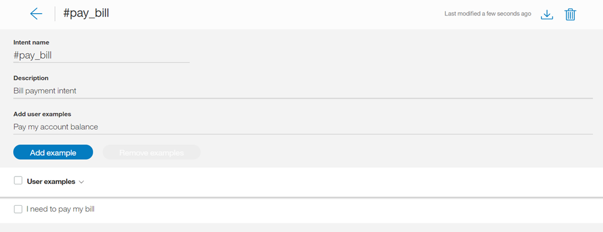
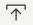

---

copyright:
  years: 2015, 2018
lastupdated: "2018-01-30"

---

{:shortdesc: .shortdesc}
{:new_window: target="_blank"}
{:tip: .tip}
{:pre: .pre}
{:codeblock: .codeblock}
{:screen: .screen}
{:javascript: .ph data-hd-programlang='javascript'}
{:java: .ph data-hd-programlang='java'}
{:python: .ph data-hd-programlang='python'}
{:swift: .ph data-hd-programlang='swift'}

# 定義目的

***目的*** 是以客戶輸入表示的用途或目標，例如回答問題或處理帳單付款。藉由辨識以客戶輸入表示的目的，{{site.data.keyword.conversationshort}} 服務可以選擇正確的對話流程來回應它。
{: shortdesc}

<iframe class="embed-responsive-item" id="youtubeplayer" type="text/html" width="640" height="390" src="https://www.youtube.com/embed/6HAZpBHqX8M" frameborder="0" webkitallowfullscreen mozallowfullscreen allowfullscreen> </iframe>

## 目的限制
{: #intent-limits}

您可以建立的目的及範例數目，取決於您的 {{site.data.keyword.conversationshort}} 服務方案：

| 服務方案         | 每個工作區的目的數      | 每個工作區的範例數       |
|------------------|----------------------:|-----------------------:|
| 標準/進階        |                 2,000 |                 25,000 |
| 精簡             |                   100 |                 25,000 |

## 建立目的
{: #creating-intents}

使用 {{site.data.keyword.conversationshort}} 工具來建立目的。

1.  在 {{site.data.keyword.conversationshort}} 工具中，開啟工作區，然後選取導覽列中的**目的**標籤。如果看不到**目的**，請使用  功能表來開啟頁面。

1.  選取**建立新的項目**。

1.  在**目的名稱**欄位中，鍵入目的的名稱。
    - 目的名稱可以包含字母（Unicode 形式）、數字、底線、連字號及句點。
    - 名稱不得包含 `..` 或任何只有句點的其他字串。
    - 目的名稱不得包含空格，且不得超過 128 個字元。下列是目的名稱的範例：
        - `#weather_conditions`
        - `#pay_bill`
        - `#escalate_to_agent`

    工具會自動在目的名稱中併入 `#` 字元，因此您不需要新增它。
    {: tip}

    在**說明**欄位中，新增目的說明。

1.  選取**建立目的**，以儲存目的名稱。

    

1.  接下來，在**新增使用者範例**欄位中，鍵入目的的使用者範例文字。範例可以是任何字串，長度最多為 1024 個字元。下列是 `#pay_bill` 目的範例：
    - `I need to pay my bill.`
    - `Pay my account balance`
    - `make a payment`

    **將實體及同義字參照為目的範例**

    如果您已定義或計劃要定義對應至此目的的實體，請參照部分範例中的實體或其關聯的同義字。這麼做有助於建立目的與實體之間的關係。

    
    {: #entity-as-example}

    *重要事項*：

      - 目的範例資料應該是一般使用者將提供的具代表性及一般資料。範例可能收集自實際使用者資料或特定領域的專家。具代表性且精確的資料本質十分重要。
      - 訓練及測試資料（僅適用於評估）應該反映目的在實際使用時的分佈。一般而言，較常使用的目的相對會有較多的範例，而且回應涵蓋面較佳。
      - 您可以在範例文字中包含標點符號，只要標點符號是自然地出現。如果您認為部分使用者會以包含標點符號的範例來表示其目的，但部分使用者不會，則請包含兩種版本。一般而言，涵蓋的型樣類型愈多，回應就愈佳。

    **將 @Entity 直接參照為目的範例**

    您也可能選擇直接參照目的範例中的實體。例如，假設您的實體稱為 `@PhoneModelName`，其包含值 *Galaxy S8*、*Moto Z2*、*LG G6* 及 *Google Pixel 2*。當您建立目的（例如 `#order_phone`）時，就可以提供訓練資料，如下所示：
    - 我可以取得 `@PhoneModelName` 嗎？
    - 協助我訂購 `@PhoneModelName`。
    - `@PhoneModelName` 有現貨嗎？
    - 將 `@PhoneModelName` 新增至我的訂單。

    
    **附註**：目前，只能直接參照您所定義的已關閉實體（將忽略型樣值）。您不可以使用[系統實體](system-entities.html)。

    如果您選擇在訓練資料的*任何位置* 將實體參照為目的範例（例如，`@PhoneModelName`），則會抵消在目的範例的其他位置使用直接參照的值（例如，*Galaxy S8*）。然後，所有目的都會使用「實體作為目的範例」方式；您無法選取此方法只用於特定目的。

    實際上，這表示如果您先前根據直接參照 (*Galaxy S8*) 訓練過大部分目的，而且現在只將實體參照 (`@PhoneModelName`) 用於一個目的，則這樣會影響所有先前的訓練。如果您選擇使用 `@Entity` 參照，則將所有先前的直接參照取代為 `@Entity` 參照時請小心。

    **附註**：定義 `@Entity` 已定義 10 個值的一個範例目的，**不**等於指定該範例目的 10 次。{{site.data.keyword.conversationshort}} 服務不會將那麼多的負擔加到這一個範例目的語法上。

    **重要事項**：當應用程式與服務互動時，可以在 URL 中公開目的名稱及範例文字。請不要在這些構件中包含機密或個人資訊。

    按**新增範例**，以儲存範例。

1.  重複相同的處理程序來新增其他範例。您可以按 Tab 鍵在每一個範例之間移動。針對每一個目的，至少提供 5 個範例。您提供的範例越多，應用程式就可以越精確。

1.  在完成新增範例時，請選取 ，以完成建立目的。

### 結果

您建立的目的即會新增至「目的」標籤，而且系統會開始對新資料訓練它自己。

## 編輯目的

您可以選取清單中的任何目的，以開啟它來進行編輯。您可以進行下列變更：

- 重新命名目的。
- 刪除目的。
- 新增、編輯或刪除範例。
- 將範例移至不同的目的。

您可以按 Tab 鍵從目的名稱移至每一個範例，並在選擇時編輯範例。

若要移動或刪除範例，請藉由選取此勾選框來選取範例，然後選取**移動**或**刪除**。

  

## 搜尋目的

使用「搜尋」特性，尋找使用者範例、目的名稱及說明。

1.  選取導覽列中的**目的**標籤。

    

1.  選取「搜尋」圖示：

1.  輸入搜尋詞彙或詞組。

    

    **附註**：第一次搜尋時，會建立索引；在編製內容索引時，您可能會看到一則等待訊息。

### 結果

顯示包含搜尋詞彙及對應範例的目的。選取任何結果，以開啟它進行編輯。

  

## 匯入目的及範例

如果您有大量目的，則可能會發現從逗點區隔值 (CSV) 檔案匯入它們更為容易，而不需要在 {{site.data.keyword.conversationshort}} 工具中逐一定義它們。

1.  將目的及實體收集到 CSV 檔案，或將它們從試算表匯出至 CSV 檔案。檔案中每一行的必要格式如下：

    ```
    <example>,<intent>
    ```
    {: screen}

    其中 `<example>` 是使用者範例的文字，而 `<intent>` 是您要範例比對的目的名稱。例如：

    ```
    Tell me the current weather conditions.,weather_conditions
    Is it raining?,weather_conditions
    What's the temperature?,weather_conditions
    Where is your nearest location?,find_location
    Do you have a store in Raleigh?,find_location
    ```
    {: screen}

    > **重要事項：**儲存含 UTF-8 編碼且沒有位元組順序標記 (BOM) 的 CSV 檔案。

1.  在 {{site.data.keyword.conversationshort}} 工具中，開啟工作區，然後選取導覽列中的**目的**標籤。如果看不到**目的**，請使用  功能表來開啟頁面。

1.  選取*匯入* 圖示 。然後，拖曳檔案，或瀏覽以從電腦中選取檔案。檔案會進行驗證並匯入，而且系統會開始對新資料訓練它自己。

    

    > **重要事項：**CSV 檔案大小上限為 10MB。如果您的 CSV 檔案較大，請考慮將它分割為多個檔案，並分別進行匯入。

### 結果

您可以在**目的**標籤上檢視匯入的目的及對應的範例。您可能需要重新整理頁面才能看到新的目的及範例。

## 匯出目的
{: #export_intents}

您可以將若干目的匯出至 CSV 檔案，然後針對另一個 {{site.data.keyword.conversationshort}} 應用程式匯入及重複使用它們。

1.  在「目的」標籤上，從清單中選取您要的目的，然後選擇*匯出*。

    

## 刪除目的
{: #delete_intents}

您可以選取一些要刪除的目的。

**重要事項**：藉由刪除目的，您也會刪除所有關聯的範例，稍後無法擷取這些項目。所有參照這些目的的對話節點都必須手動更新成不再參照已刪除的內容。

1.  在「目的」標籤上，從清單中選取您要的目的，然後選擇*刪除*。

    

## 測試目的
{: #testing-your-intents}

完成建立新的目的之後，您就可以測試系統來查看它是否如預期辨識您的目的。

1.  在 {{site.data.keyword.conversationshort}} 工具中，選取  圖示。

1.  在*試用* 窗格中，輸入問題或其他字串，然後按 Enter 鍵，查看已辨識的目的。如果辨識到錯誤的目的，您可以將此文字當作範例新增至正確的目的，來改善模型。

    如果您最近在工作區中進行變更，可能會看到一則訊息，指出仍在重新訓練系統。如果您看到此訊息，請等到訓練完成之後再進行測試：
    {: tip}

    

    回應指出從您的輸入中辨識到的目的。

    

1.  如果系統無法辨識正確的目的，您可以更正它。若要更正辨識到的目的，請選取顯示的目的，然後從清單中選取正確的目的。提交更正之後，系統會自動重新訓練自己以納入新資料。

    

1.  如果輸入與您的應用程式無關，則可以指出這個事實。選取顯示的目的，然後選擇**標示為不相關**。

    

如果未正確地辨識您的目的，請考量進行下列類型的變更：

- 將無法辨識的文字當作範例新增至正確的目的。
- 將現有範例從某個目的移至另一個目的。
- 請考量您的目的是否太類似，並視情況重新定義。

## 絕對評分及標示為不相關

自 2017 年 2 月開始，評分目的信任及傳回目的有新的演算法。您也可以將輸入標示為*不相關*。這些變更可能需要您[升級至工作區 ](upgrading.html){: new_window}。

### 絕對評分

{{site.data.keyword.conversationshort}} 服務現在會對每一個目的本身的信任進行評分，而不是相對於其他目的。這樣容許彈性地傳回多個目的。這也表示系統可能根本不傳回目的。如果最高目的無法確認全部目的都與使用者的輸入有關（小於 0.2），則 API 仍然會將它內含在 intents 陣列輸出中，但設定該 #intent 的條件將會傳回 false。如果您要偵測「偵測不到任何有良好信任的目的」的狀況，則可以設定 `irrelevant` 的條件。

隨著目的信任評分的變更，您的對話可能需要重組。例如，如果您使用現在信任度很低的目的來設定對話的條件，則系統的回應將不再正確。

### 標示為不相關
{: #mark-irrelevant}

請參閱[支援的語言](lang-support.html)，以取得這個特性的可用性。

升級工作區之後，您可以在*試用* 窗格中[測試輸入](#testing-your-intents)，來查看變更。您可以使用**標示為不相關**，指出輸入與應用程式不相關。

如果您有一個針對那些超出範圍或脫離主題之輸入的目的（例如 #off_topic），請藉由將輸入標示為不相關，來刪除目的以及測試工作區。

**重要事項**：標示為不相關的輸入會儲存在工作區中，並且併入為訓練資料的一部分。請確定您要進行此變更。

- 稍後無法在工具中存取或變更輸入。
- 移除**不相關**標籤的唯一方法是在*試用* 窗格中使用相同的輸入，然後變更目的。
