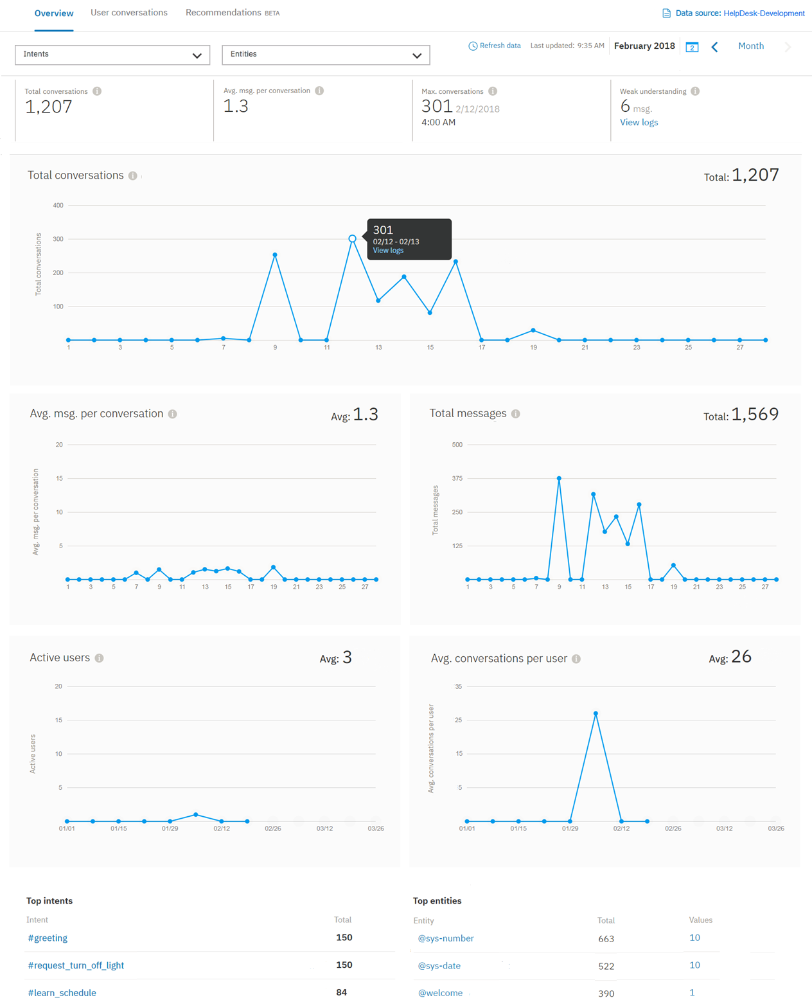

---

copyright:
  years: 2015, 2019
lastupdated: "2019-02-21"

subcollection: assistant

---

{:shortdesc: .shortdesc}
{:new_window: target="_blank"}
{:deprecated: .deprecated}
{:important: .important}
{:note: .note}
{:tip: .tip}
{:pre: .pre}
{:codeblock: .codeblock}
{:screen: .screen}
{:javascript: .ph data-hd-programlang='javascript'}
{:java: .ph data-hd-programlang='java'}
{:python: .ph data-hd-programlang='python'}
{:swift: .ph data-hd-programlang='swift'}

# 度量概觀
{: #logs-overview}

「概觀」頁面提供使用者與助理之間的互動摘要。您可以檢視給定時段的資料流量，以及使用者交談中最常辨識到的目的及實體。
{: shortdesc}

使用度量來回答如下的問題：

* 上個月哪幾天的交談次數最多或最少？
* 上個月每週的平均交談次數為何？
* 上週最常出現哪些目的？
* 在二月期間辨識最多次的是哪些實體值？

若要查看度量資訊，請在導覽列中選取**概觀**。

  

## 控制項
{: #logs-overview-controls}

您可以使用下列控制項來過濾資訊：

- *目的* 和*實體* 過濾器 - 使用下列其中一個下拉過濾器，以顯示您技能中特定目的或實體的資料。

  **重要事項** - 目的和實體過濾器會移入***技能*** 中的目的和實體，而不是資料來源中的內容。如果您[已選取資料來源](/docs/services/assistant?topic=assistant-logs#logs-deploy-id)而不是技能，您可能不會看到資料來源日誌中的目的或實體成為過濾器中的一個選項，除非那些目的和實體也在技能中。

- *重新整理資料* - 容許您立即重新整理「概觀」頁面統計資料。「概觀」頁面顯示前次更新其顯示資料的時間。如果您認為有較新的資料可用，則可以選取**重新整理資料**。

  這些統計資料代表與助理互動的外部資料流量（使用者或 API 呼叫）；它們不包含來自工具的*試用* 窗格中的互動。

- *時段控制項* - 使用此控制項來選擇要顯示資料的期間。此控制項會影響該頁面上顯示的所有資料：不只是圖形中顯示的交談次數，還會影響與圖形一起顯示的統計資料，以及前幾個目的及實體的清單。

  統計資料涵蓋的時段可以比保留交談日誌的時段更長。
  {: note}

  

  您可以選擇是要檢視一天、一週、一個月還是一季的資料。在每一種情況下，圖形上的資料點都會調整為適當的測量期間。例如，檢視一天的圖形時，會以小時值呈現資料，但是檢視一週的圖形時，則會依日來顯示資料。一週一律是指從星期日運行到星期六。您無法建立自訂時段，例如從星期四運行到下星期三的一週，或是從第一天以外的任何日期開始的一個月。

  例如，如果您選擇檢視一天，則針對每個交談所顯示的時間將本地化，以反映瀏覽器的時區。如果您透過 API 呼叫檢閱相同的交談日誌，這可能與所顯示的時間戳記不同；API 日誌呼叫一律以 UTC 顯示。

    

## 圖形及統計資料
{: #logs-overview-graphs}

有數個統計計分卡可為您的應用程式提供日誌資料：

* *交談總數* - 在選取時段內，作用中使用者與應用程式之間的交談總數，如相對應的圖形所示。

  單一交談是一組訊息，包含作用中使用者傳送至應用程式的訊息，以及應用程式回應的訊息。

  **重要事項**：「交談」被視為應用程式/機器人所傳送或接收的*任何* 一組訊息，因此，如果該服務一開始說 "Hi, how can I help you?"，但使用者關閉其瀏覽器而未做任何回應，則該訊息會計入交談總數。

* *每次交談的平均訊息數* - 將選取時段內接收到的訊息總數除以選取時段內的交談總數，如相對應的圖形所示。
* *交談次數上限* - 選取時段內單一資料點的交談次數上限。
* *不太理解* - 不太理解的個別訊息數。這些訊息不是依目的分類，而且不包含任何已知實體。這些可能有助於識別潛在的對話問題。

詳細圖形提供其他資訊：

* *交談總數* - 在選取時段內，作用中使用者與應用程式之間的交談總數。

  檢視***交談*** 圖形時，您可以按一下個別資料點來查看數值，如下所示：

  

* *每次交談的平均訊息數* - 將選取時段內接收到的訊息總數除以選取時段內的交談總數。
* *訊息總數* - 選取時段內從作用中使用者接收到的訊息總數。
* *作用中使用者* - 在選取時段內，與您的應用程式互動的唯一使用者數目。
* *每位使用者的平均交談數* - 將選取時段內的交談總數除以選取時段內的唯一使用者總數。

  *作用中使用者* 和*每位使用者的平均交談數* 的統計資料需要唯一的 `user_id` 參數。如需相關資訊，請參閱[啟用使用者度量](/docs/services/assistant?topic=assistant-logs-resources#logs-resources-user-id)。
  {: important}

## 前幾個目的和前幾個實體
{: #logs-overview-tops}

您也可以檢視在指定時段期間最常辨識到的目的及實體。

* *前幾個目的* - 以簡式清單顯示目的。除了查看已辨識目的的次數之外，您還可以選取目的來開啟**使用者交談**頁面，過濾日期範圍以符合您要檢視的資料，並且過濾目的以符合選取的目的。

* *前幾個實體* 也顯示在清單中。對於每個實體，您可以從**值**直欄中選取，以查看此實體在該時段內所識別的最常用值清單。您也可以選取實體來開啟**使用者交談**頁面，過濾日期範圍以符合您要檢視的資料，並且過濾實體以符合選取的實體。

請參閱[從交談中學習](/docs/services/assistant?topic=assistant-logs)的提示，瞭解如何根據您藉由檢閱該服務所辨識之目的和實體而進行的探索來編輯目的和實體。
