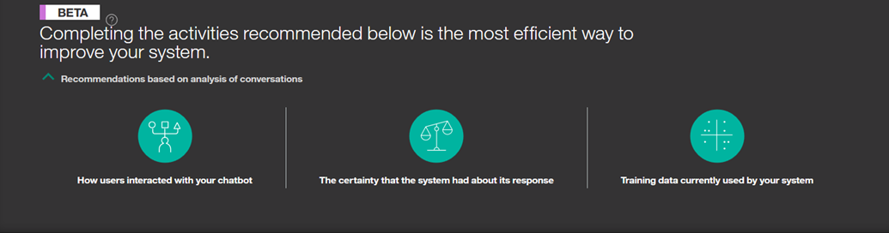

---

copyright:
  years: 2015, 2018
lastupdated: "2018-02-13"

---

{:shortdesc: .shortdesc}
{:new_window: target="_blank"}
{:tip: .tip}
{:pre: .pre}
{:codeblock: .codeblock}
{:screen: .screen}
{:javascript: .ph data-hd-programlang='javascript'}
{:java: .ph data-hd-programlang='java'}
{:python: .ph data-hd-programlang='python'}
{:swift: .ph data-hd-programlang='swift'}

# 建議
此頁面呈現系統改善方式的建議。
{: shortdesc}

此特性僅為測試版。
{: tip}

此特性僅適用於「進階」使用者。
{: tip}

藉由分析使用者與工作區的交談，並考慮系統的現行訓練資料及回應確定性，您會看到可以採取的動作，以輕鬆且有效率地改善工作區。

<iframe class="embed-responsive-item" id="youtubeplayer" type="text/html" width="640" height="390" src="https://www.youtube.com/embed/scMu66AvZtY" frameborder="0" webkitallowfullscreen mozallowfullscreen allowfullscreen> </iframe>

建議在晚上產生，並且需要大量使用者訊息（例如，超過 50 則）。
{: tip}

## 改善現有目的
此建議包含取得由使用者輸入但系統無法辨識的個別詞組，然後將它們呈現給您，以選取每一個詞組的目的。這有助於工作區更充分地瞭解使用者所說的內容。

按一下**開始**，以開始識別目的。

在進入或退出**改善現有目的**時，進度列會顯示在現行階段作業（該日剩餘的詞組總數）中已處理多少個詞組。請注意，如果您退出並重新進入，則進度列會重新從`空白`開始，但不表示您先前的工作已遺失，它只是不計入現行階段作業的進度。

從提供的清單中選取詞組的最佳目的，或選取*標示為不相關*。只要按一下**儲存**，就會將詞組新增至目的作為範例（新增為訓練資料）。

*跳至下一步* 按鈕容許您跳過現行詞組，並移至下一個詞組。如果您在同一天退出並重新進入**改善現有目的**，則不再顯示已跳過的詞組，但它可能會在後續日子中再次出現。

