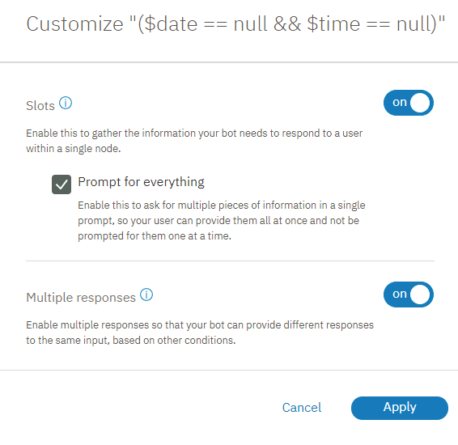

---

copyright:
  years: 2015, 2019
lastupdated: "2019-02-21"

subcollection: assistant

---

{:shortdesc: .shortdesc}
{:new_window: target="_blank"}
{:deprecated: .deprecated}
{:important: .important}
{:note: .note}
{:tip: .tip}
{:pre: .pre}
{:codeblock: .codeblock}
{:screen: .screen}
{:javascript: .ph data-hd-programlang='javascript'}
{:java: .ph data-hd-programlang='java'}
{:python: .ph data-hd-programlang='python'}
{:swift: .ph data-hd-programlang='swift'}

# 指導教學：改善含空位的節點
{: #tutorial-slots-complex}

在本指導教學中，您將加強含空位的簡單節點，用於收集預約餐廳所需的資訊。
{: shortdesc}

## 學習目標
{: #tutorial-slots-complex-objectives}

在完成本指導教學時，您將瞭解如何執行下列動作：

- 測試含空位的節點
- 新增用於處理一般使用者互動的空位回應條件
- 預期及處理無關的使用者輸入
- 處理非預期的使用者回應

### 持續期間
{: #tutorial-slots-complex-duration}

本指導教學大約需要 2 到 3 個小時才能完成。

### 必要條件
{: #tutorial-slots-complex-prereqs}

開始之前，請先完成[將含空位的節點新增至對話](/docs/services/assistant?topic=assistant-tutorial-slots)。您必須先完成第一個空位指導教學，然後再開始本指導教學，因為您將根據第一個指導教學中所建立之含空位的節點來進行建置。

## 步驟 1：改善回應的格式
{: #tutorial-slots-complex-fix-format}

儲存日期和時間系統實體值時，它們會轉換為標準化格式。此標準化格式適用於執行值的計算，但您可能不想要向使用者公開這項重新格式化。在此步驟中，您將重新格式化對話所參照的日期 (`2017-12-29`) 及時間 (`17:00:00`) 值。

1.  若要重新格式化 $date 環境定義變數值，請按一下 @sys-date 空位的**編輯回應**  圖示。

1.  從**其他**  功能表中，選取**開啟 JSON 編輯器**，然後編輯定義該環境定義變數的 JSON。新增方法來重新格式化日期，以將 `2017-12-29` 值轉換為全字拼出的星期幾，後面接著全字拼出的月份和日期。請編輯 JSON，如下所示：

    ```json
    {
      "context": {
   "date": "<? @sys-date.reformatDateTime('EEEE, MMMM d') ?>"
      }
    }
    ```
    {: codeblock}

    EEEE 指出您要拼出星期幾。例如，如果您使用 3 個 E (EEE)，則星期幾將會縮短為 Fri，而不是 Friday。MMMM 指出您要拼出月份。同樣地，如果您只使用 3 個 M (MMM)，則月份會縮短為 Dec，而非 December。

1.  按一下**儲存**。

1.  若要將 $time 環境定義變數中用來儲存時間值的格式變更為使用小時、分鐘並指出 AM 或 PM，請按一下 @sys-time 空位的**編輯回應**  圖示。

1.  從**其他**  功能表中，選取**開啟 JSON 編輯器**，然後編輯定義該環境定義變數的JSON，讓它變成下面這樣：

    ```json
    {
      "context": {
   "time": "<? @sys-time.reformatDateTime('h:mm a') ?>"
      }
    }
    ```
    {: codeblock}

1.  按一下**儲存**。

1.  重新測試節點。開啟「試用」窗格，然後按一下**清除**，以刪除您在先前測試含空位的節點時所指定的空位環境定義變數值。若要查看所做變更的影響，請使用下列 Script：

    <table>
    <caption>Script 詳細資料</caption>
    <tr>
      <th>說話者</th>
      <th>詞語</th>
    </tr>
    <tr>
      <td>您</td>
      <td>i want to make a reservation</td>
    </tr>
    <tr>
      <td>Watson</td>
      <td>What day would you like to come in?</td>
    </tr>
    <tr>
      <td>您</td>
      <td>Friday</td>
    </tr>
    <tr>
      <td>Watson</td>
      <td>What time do you want the reservation to be made for?</td>
    </tr>
    <tr>
      <td>您</td>
      <td>5pm</td>
    </tr>
    <tr>
      <td>Watson</td>
      <td>How many people will be dining?</td>
    </tr>
    <tr>
      <td>您</td>
      <td>6</td>
    </tr>
    </table>

    Watson 這次會回應 `OK. I am making you a reservation for 6 on Friday, December 29 at 5:00 PM.`

您已成功改善對話在參照其回應中的環境定義變數值時所使用的格式。對話現在會使用 `Friday, December 29`，而非較技術性的格式：`2017-12-29`。而且它會使用 `5:00 PM`，而非 `17:00:00`。若要瞭解可與日期和時間值搭配使用的其他 SpEL 方法，請參閱[處理值的方法](/docs/services/assistant?topic=assistant-dialog-methods#dialog-methods-date-time)。

## 步驟 2：一次詢問所有資訊
{: #tutorial-slots-complex-ask-for-everything}

您已多次測試對話，可能已注意到必須一次回答一個空位提示是十分惱人的。為了避免使用者一次只能提供一個資訊片段，您可以事先詢問所需要的每個資訊片段。這樣做可讓使用者有機會在單一輸入中提供所有資訊或部分資訊。

含空位的節點是設計用來尋找並儲存使用者在處理現行節點時，所提供的任何及所有空位值。您可以讓使用者知道要指定哪些值，以協助使用者善加利用此設計。

在此步驟中，您將瞭解如何一次提示輸入所有資訊。

1.  從含空位的主要節點中，按一下**自訂**。

1.  選取**提示輸入所有資訊**勾選框以啟用起始提示，然後按一下**套用**。

   

1.  回到節點編輯視圖，向下捲動至剛剛新增的**如果未預先填入任何空位，請先詢問此資訊**欄位。為節點新增下列起始提示：`I can make a reservation for you. Just tell me the day and time of the reservation, and how many people it is for.`

1.  按一下 ，以關閉節點編輯視圖。

1.  從「試用」窗格中，測試這項變更。開啟此窗格，然後按一下**清除**，讓前一個測試中的空位環境定義變數值失效。

1.  輸入 `i'd like to make a reservation.`

    對話現在會回應 `I can make a reservation for you. Just tell me the day and time of the reservation, and how many people it is for.`

1.  輸入 `it's for Saturday. There will be 2 of us coming in at 8pm`

    對話回應 `OK. I am making you a reservation for 2 on Saturday at 8:00 PM.`

    

如果使用者在其起始輸入中提供任何一個空位值，則不會顯示詢問所有資訊的提示。例如，使用者的起始輸入可能是 `I want to make a reservation for this Friday night.`。在此情況下，會跳過起始提示，因為您不想要詢問使用者已提供的資訊；在此範例中為日期 (`Friday`)。對話會改為顯示下一個空位的提示。
{: note}

## 步驟 3：正確處理零
{: #tutorial-slots-complex-recognize-zero}

當您在空位條件中使用 `sys-number` 系統實體時，它不會正確處理零。該服務會將環境定義變數設為 false，而不是將您對空位定義的環境定義變數設為 0。因此，該空位不會認為它已滿，而會一再提示使用者輸入數字，直到使用者指定零以外的數字為止。

1.  測試節點，以更充分瞭解問題。開啟「試用」窗格，然後按一下**清除**，以刪除您在先前測試含空位的節點時所指定的空位環境定義變數值。請使用下列 Script：

    <table>
    <caption>Script 詳細資料</caption>
    <tr>
      <th>說話者</th>
      <th>詞語</th>
    </tr>
    <tr>
      <td>您</td>
      <td>i want to make a reservation</td>
    </tr>
    <tr>
      <td>Watson</td>
      <td>I can make a reservation for you. Just tell me the day and time of the reservation, and how many people it is for.</td>
    </tr>
    <tr>
      <td>您</td>
      <td>We want to dine May 23 at 8pm. There will be 0 guests.</td>
    </tr>
    <tr>
      <td>Watson</td>
      <td>How many people will be dining?</td>
    </tr>
    <tr>
      <td>您</td>
      <td>0 </td>
    </tr>
    <tr>
      <td>Watson</td>
      <td>How many people will be dining?</td>
    </tr>
    </table>

    您將卡在此迴圈中，直到您指定 0 以外的數字為止。

1.  為了確保空位能正確處理零，請將空位條件從 `@sys-number` 變更為 `@sys-number ||@sys-number:0`。

1.  按一下空位的**編輯回應**  圖示。

1.  建立環境定義變數時，它會自動使用針對空位條件指定的相同表示式。不過，環境定義變數只能儲存一個數字。請編輯已儲存作為環境定義變數的值，從其中移除 `OR` 運算子。從**其他**  功能表中，選取**開啟 JSON 編輯器**，然後編輯定義該環境定義變數的 JSON。將變數從 `"guests":"@sys-number || @sys-number:0"` 變更為使用下列語法：

    ```json
    {
      "context": {
   "guests": "@sys-number"
      }
    }
    ```
    {: codeblock}

1.  按一下**儲存**。

1.  重新測試節點。開啟「試用」窗格，然後按一下**清除**，以刪除您在先前測試含空位的節點時所指定的空位環境定義變數值。若要查看所做變更的影響，請使用下列 Script：

    <table>
    <caption>Script 詳細資料</caption>
    <tr>
      <th>說話者</th>
      <th>詞語</th>
    </tr>
    <tr>
      <td>您</td>
      <td>i want to make a reservation</td>
    </tr>
    <tr>
      <td>Watson</td>
      <td>I can make a reservation for you. Just tell me the day and time of the reservation, and how many people it is for.</td>
    </tr>
    <tr>
      <td>您</td>
      <td>We want to dine May 23 at 8pm. There will be 0 guests.</td>
    </tr>
    </table>

    這次 Watson 回應 `OK. I am making you a reservation for 0 on Wednesday, May 23 at 8:00 PM.`

您已順利將數字空位格式化，使其能正確處理零。當然，您可能不希望節點接受零作為來賓的有效數字。您將在下一步學會如何驗證使用者指定的值。

## 步驟 4：驗證使用者輸入
{: #tutorial-slots-complex-slot-conditions}

到目前為止，我們假設使用者將提供空位的適當值類型。但實際上不一定是這樣。您可以將條件式回應新增至空位，以說明使用者可能提供無效值的時間。在此步驟中，您將使用條件式空位回應來執行下列作業：

- 確定所要求的日期不是過去的日期。
- 檢查所要求的預約時間是否落在入座時間範圍內。
- 確認使用者的輸入。
- 請確定所提供的來賓數目大於零。
- 指出您將某個值取代為另一個值。

若要驗證使用者輸入，請完成下列步驟：

1.  從含空位的節點的編輯視圖中，按一下 `@sys-date` 空位的**編輯空位**  圖示。

1.  從*配置空位 1* 標頭的**選項**  功能表中，選取**啟用條件式回應**。

1.  在**找到**區段中，按一下**編輯回應**  圖示來新增條件式回應。

1.  新增下列條件及回應，以檢查使用者所指定的日期是否落在今天之前：

    <table>
    <caption>空位 1 條件式回應 1 詳細資料</caption>
    <tr>
      <th>條件</th>
      <th>回應</th>
      <th>動作</th>
    </tr>
    <tr>
      <td>`@sys-date.before(now())`</td>
      <td>You cannot make a reservation for a day in the past.</td>
      <td>清除空位並重新提示</td>
    </tr>
    </table>

1.  新增第二個條件式回應，以便在使用者提供有效日期時顯示。這類型的簡單確認可讓使用者知道對話已瞭解她的回應。

    <table>
    <caption>空位 1 條件式回應 2 詳細資料</caption>
    <tr>
      <th>條件</th>
      <th>回應</th>
      <th>動作</th>
    </tr>
    <tr>
      <td>`true`</td>
      <td>$date it is</td>
      <td>繼續</td>
    </tr>
    </table>

1.  從含空位的節點的編輯視圖中，按一下 `@sys-time` 空位的**編輯空位**  圖示。

1.  從*配置空位 2* 標頭的**選項**  功能表中，選取**啟用條件式回應**。

1.  在**找到**區段中，按一下**編輯回應**  圖示來新增條件式回應。

1.  新增下列條件及回應，以檢查使用者所指定的時間是否落在容許的時間範圍內：

    <table>
    <caption>空位 2 條件式回應詳細資料</caption>
    <tr>
      <th>條件</th>
      <th>回應</th>
      <th>動作</th>
    </tr>
    <tr>
      <td>`@sys-time.after('21:00:00')`</td>
      <td>Our last seating is at 9 PM.</td>
      <td>清除空位並重新提示</td>
    </tr>
    <tr>
      <td>`@sys-time.before('09:00:00')`</td>
      <td>Our first seating is at 9 AM.</td>
      <td>清除空位並重新提示</td>
    </tr>
    </table>

1.  新增第三個條件式回應，以便在使用者提供落在時間範圍內的有效時間時顯示。這類型的簡單確認可讓使用者知道對話已瞭解她的回應。

    <table>
    <caption>空位 2 條件式回應 3 詳細資料</caption>
    <tr>
      <th>條件</th>
      <th>回應</th>
      <th>動作</th>
    </tr>
    <tr>
      <td>`true`</td>
      <td>Ok, the reservation is for $time.</td>
      <td>繼續</td>
    </tr>
    </table>

1.  編輯 @sys-number 空位，以下列方式驗證使用者提供的值：

    - 請確認指定的來賓數目大於零。
    - 預測及處理使用者變更來賓數目的情況。

      在處理含空位的節點時的任何時間點，如果使用者變更空位值，則會更新對應的空位環境定義變數值。不過，讓使用者知道該值已被取代很有幫助，不僅可提供清楚的回饋給使用者，也能讓使用者可以在變更不是她想要結果的時候加以更正。 

1.  從含空位的節點的編輯視圖中，按一下 `@sys-number` 空位的**編輯空位**  圖示。

1.  從*配置空位 3* 標頭的**選項**  功能表中，選取**啟用條件式回應**。

1.  在**找到**區段中，按一下  圖示來新增條件式回應，然後新增下列條件及回應：

    <table>
    <caption>空位 3 條件式回應詳細資料</caption>
    <tr>
      <th>條件</th>
      <th>回應</th>
      <th>動作</th>
    </tr>
    <tr>
      <td>`entities['sys-number']?.value == 0`</td>
      <td>請指定大於 0 的數字。</td>
      <td>清除空位並重新提示</td>
    </tr>
    <tr>
      <td>`(event.previous_value != null) && (event.previous_value != event.current_value)`</td>
      <td>確定，將來賓數目從 `<? event.previous_value ?>` 更新為 `<? event.current_value ?>`。</td>
      <td>繼續</td>
    </tr>
    <tr>
      <td>`true`</td>
      <td>確定，預約 $guests 位來賓。</td>
      <td>繼續</td>
    </tr>
    </table>

## 步驟 5：新增確認空位
{: #tutorial-slots-complex-confirmation-slot}

您可能想要將對話設計成呼叫外部預約系統，並在該系統中實際為使用者進行預約。在應用程式採取此動作之前，您可能想要向使用者確認，對話已正確地瞭解預約的詳細資料。作法是將確認空位新增至節點。

1.  確認空位會預期使用者回答 Yes 或 No。您必須先教導對話可以辨識使用者輸入中的 Yes 或 No 目的。

1.  按一下**目的**標籤，以回到「目的」頁面。請新增下列目的及範例詞語。

- `#yes`

   ```json
   Yes
   Sure
   I'd like that
   Please do
   Yes please.
   Ok
   That sounds good.
   ```
   {: screen}

   

- `#no`

   ```json
   No
   No thanks.
   Please don't.
   Please do not!
   That's not what I want at all
   Absolutely not.
   No way
   ```
   {: screen}

   

1.  回到**對話**標籤，然後按一下以編輯含空位的節點。按一下**新增空位**以新增第四個空位，然後為它指定下列值：

    <table>
    <caption>確認空位詳細資料</caption>
    <tr>
      <th>檢查</th>
      <th>儲存為</th>
      <th>如果不存在，請詢問</th>
    </tr>
    <tr>
      <td>`(#yes || #no) && slot_in_focus`</td>
      <td>$confirmation</td>
      <td>I'm going to reserve you a table for $guests on $date at $time. Should I go ahead?</td>
    </tr>
    </table>

    此條件會檢查任一答案。您將使用條件式空位回應，根據使用者回答 Yes 還是 No 來指定接下來會發生什麼情況。`slot_in_focus` 內容會強制此條件的範圍只適用於現行空位。此設定可避免隨機陳述觸發此空位，隨機陳述可能會符合使用者可能提出的 `#yes` 或 `#no` 目的。

    例如，使用者可能會回答訪客數空位，並說出 `Yes, there will be 5 of us.` 這類陳述。您不想要在此回應中包含 `Yes`，以致意外填入確認空位。藉由將 `slot_in_focus` 內容新增至條件，只有在使用者具體回答此空位的提示時，才會將使用者所表示的 Yes 或 No 套用至此空位。

1.  按一下**編輯空位**  圖示。從*配置空位 4* 標頭的**選項**  功能表中，選取**啟用條件式回應**。

1.  在**找到**提示中，新增條件以檢查 No 回應 (`#no`)。請使用此回應 `Alright. Let's start over. I'll try to keep up this time.` 否則，您可以假設使用者已確認預約詳細資料，並繼續進行預約。

    發現 `#no` 目的時，您也必須將先前儲存的環境定義變數重設為空值，以便重新詢問資訊。您可以使用 JSON 編輯器來重設環境定義變數值。按一下剛剛新增之條件式回應的**編輯回應**  圖示。從**選項**  功能表中，按一下**開啟 JSON 編輯器**。新增將空位環境定義變數設為 `null` 的 `context` 區塊，如下所示。

    ```json
    {
      "output":{
    "text": {
     "values": [
       "Alright. Let's start over. I'll try to keep up this time."
          ]
        }
      },
  "context":{
    "date": null,
        "time": null,
        "guests": null
      }
    }
    ```
    {: codeblock}

1.  按**上一步**，然後按一下**儲存**。

1.  再按一次確認空位的**編輯空位**  圖示。在**找不到**提示中，澄清您預期使用者提供 Yes 或 No 的答案。新增具有下列值的回應。

    <table>
    <caption>找不到回應詳細資料</caption>
    <tr>
      <th>條件</th>
      <th>回應</th>
    </tr>
    <tr>
      <td>`true`</td>
      <td>回應 Yes 表示要依現狀進行預約，或回應 No 表示不進行預約。</td>
    </tr>
    </table>

1.  按一下**儲存**。

1.  既然您有空位值的確認回應，並一次詢問所有資訊，則可能會注意到在顯示確認空位回應之前會顯示個別空位回應，這可能會重複向使用者顯示。編輯空位找到回應，以避免在特定情況下顯示它們。

1.  將 @sys-date 空位中最後一個條件式回應的 JSON Snippet 中所指定的 `true` 條件取代為 `!($time && $guests)`。例如：

    <table>
    <caption>空位 1 條件式回應 2 詳細資料</caption>
    <tr>
      <th>條件</th>
      <th>回應</th>
      <th>動作</th>
    </tr>
    <tr>
      <td>`!($time && $guests)`</td>
      <td>$date it is</td>
      <td>繼續</td>
    </tr>
    </table>

1.  將 @sys-time 空位中最後一個條件式回應的 JSON Snippet 中所指定的 `true` 條件取代為 `!($date && $guests)`。例如：

    <table>
    <caption>空位 2 條件式回應 3 詳細資料</caption>
    <tr>
      <th>條件</th>
      <th>回應</th>
      <th>動作</th>
    </tr>
    <tr>
      <td>`!($date && $guests)`</td>
      <td>Ok, the reservation is for $time.</td>
      <td>繼續</td>
    </tr>
    </table>

1.  將 @sys-number 空位中最後一個條件式回應的 JSON Snippet 中所指定的 `true` 條件取代為 `!($date && $time)`。例如：

    <table>
    <caption>空位 3 條件式回應 2 詳細資料</caption>
    <tr>
      <th>條件</th>
      <th>回應</th>
      <th>動作</th>
    </tr>
    <tr>
      <td>`!($date && $time)`</td>
      <td>Ok. The reservation is for $guests guests.</td>
      <td>繼續</td>
    </tr>
    </table>

如果您稍後新增其他空位，則必須編輯這些條件來說明其他空位的關聯環境定義變數。如果您未包含確認空位，則只能指定 `!all_slots_filled`，而且會保持有效，不論稍後新增多少空位。

## 步驟 6：重設空位環境定義變數值
{: #tutorial-slots-complex-reset-variables}

您可能注意到，在每一次測試之前，您都必須清除在前一次測試期間建立的環境定義變數值。您必須這樣做，因為含空位的節點只會提示使用者輸入被視為遺漏的資訊。如果空位環境定義變數全部都已填入有效值，則不會顯示任何提示。這適用於執行時期的對話。您必須建置對話機制，而透過此機制，可以將空位環境定義變數重設為空值，讓下一位使用者可以重新填入空位。若要這樣做，請將母節點新增至將環境定義變數設為空值的含空位的節點。

1.  從對話的樹狀結構視圖中，按一下含空位的節點上的**其他**  圖示，然後選取**新增上方的節點**。

1.  指定 `#reservation` 作為新節點的條件。（這是含空位的節點所使用的相同條件，但您稍後在此程序中將變更含空位的節點的條件。）

1.  按一下節點回應旁的**選項**  圖示，然後按一下**開啟 JSON 編輯器**。為在含空位的節點中所指定的每一個空位環境定義變數新增一個項目，並將它設為等於 `null`。

    ```json
    {
      "context": {
   "date": null,
        "time": null,
        "guests": null,
        "confirmation": null
      },
      "output": {}
    }
    ```
    {: codeblock}

    

1.  按一下以編輯其他 #reservation 節點、先前建立的節點以及已新增空位的節點。

1.  將節點條件從 `#reservation` 變更為 `($date == null && $time == null)`，然後按一下  來關閉節點編輯視圖。

1.  按一下含空位的節點上的**其他**  圖示，然後選取**移動**。

    

1.  選取 `#reservation` 節點作為移至位置目標，然後從功能表中選擇**作為子節點**。

1.  按一下以編輯 `#reservation` 節點。在*最後* 區段中，將動作從*等待使用者輸入* 變更為**跳過使用者輸入**。

    

    使用者輸入符合 `#reservation` 目的時，即會觸發此節點。空位環境定義變數全部都會設為空值，而對話接著會直接跳至含空位的節點來進行處理。

## 步驟 7：為使用者提供結束處理程序的方法
{: #tutorial-slots-complex-handler}

新增含空位的節點是十分強大的，因為它透過提供對使用者提供有意義的回應或代表他們執行動作所需的資訊，讓使用者能夠正常運作。不過，有時使用者正在提供預約詳細資料，但決定不要進行預約。您必須讓使用者可以正常地結束處理程序。作法是新增空位處理程式，以偵測使用者想要結束處理程序，以及結束節點而不儲存任何收集到的值。

1.  您必須先教導對話可以辨識使用者輸入中的 #exit 目的。

1.  按一下**目的**標籤，以回到「目的」頁面。請使用下列範例詞語來新增 #exit 目的。

    ```json
    I want to stop
    Exit!
    Cancel this process
    I changed my mind. I don't want to make a reservation.
    Stop the reservation
    Wait, cancel this.
    Nevermind.
    ```
    {: screen}

    

1.  按一下**對話**標籤，以回到對話。按一下以開啟含空位的節點，然後按一下**管理處理程式**。

    

1.  將下列值新增至欄位。

    <table>
    <caption>節點層次處理程式詳細資料</caption>
    <tr>
      <th>條件</th>
      <th>回應</th>
      <th>動作</th>
    </tr>
    <tr>
      <td>`#exit`</td>
      <td>Ok, we'll stop there. No reservation will be made.</td>
      <td>跳到回應</td>
    </tr>
    </table>

    **跳到回應**動作會直接跳至節點層次回應，而不顯示與任何其餘未填入空位相關聯的提示。

1.  按**上一步**，然後按一下**儲存**。

1.  現在，您需要編輯節點層次回應，讓它辨識使用者想要結束處理程序而不進行預約。新增節點的條件式回應。

    從含空位的節點的編輯視圖中，按一下**自訂**，按一下**多個回應**切換開關予以**開啟**，然後按一下**套用**。

    

1.  向下捲動至含空位的節點的回應區段，然後按一下**新增回應**。

1.  將下列值新增至欄位。

    <table>
    <caption>節點層次條件式回應詳細資料</caption>
    <tr>
      <th>條件</th>
      <th>回應</th>
    </tr>
    <tr>
      <td>`has_skipped_slots`</td>
      <td>I look forward to helping you with your next reservation. Have a good day.</td>
    </tr>
    </table>

    `has_skipped_slots` 條件會檢查空位節點的內容，以查看是否跳過任何空位。`#exit` 處理程式會跳過所有其餘空位，直接移至節點回應。因此，存在 `has_skipped_slots` 內容時，您知道已觸發 `#exit` 目的，而且對話可以顯示替代回應。

    如果您配置多個空位來跳過其他空位，或配置另一個節點層次事件處理程式來跳過空位，則必須使用不同的方式來檢查是否已觸發 #exit 目的。請參閱[處理結束處理程序的要求](/docs/services/assistant?topic=assistant-dialog-slots#dialog-slots-node-level-handler)，以取得這樣做的替代方式。
    {: note}

1.  您想要服務先檢查 `has_skipped_slots` 內容，再顯示標準節點層次回應。將 `has_skipped_slots` 條件式回應上移，以在原始條件式回應之前處理它，或永遠不予觸發。若要這樣做，請按一下您剛才新增的回應，使用**上移鍵**將它上移，然後按一下**儲存**。

1.  在「試用」窗格中使用下列 Script 來測試這項變更。

    <table>
    <caption>Script 詳細資料</caption>
    <tr>
      <th>說話者</th>
      <th>詞語</th>
    </tr>
    <tr>
      <td>您</td>
      <td>i want to make a reservation</td>
    </tr>
    <tr>
      <td>Watson</td>
      <td>I can make a reservation for you. Just tell me the day and time of the reservation, and how many people it is for.</td>
    </tr>
    <tr>
      <td>您</td>
      <td>it's for 5 people</td>
    </tr>
    <tr>
      <td>Watson</td>
      <td>Ok. The reservation is for 5 guests.  What day would you like to come in?</td>
    </tr>
    <tr>
      <td>您</td>
      <td>Nevermind</td>
    </tr>
    <tr>
      <td>Watson</td>
      <td>Ok, we'll stop there. No reservation will be made.  I look forward to helping you with your next reservation. Have a good day.</td>
    </tr>
    </table>

## 步驟 8：使用者在數次嘗試之後仍無法提供一個值時即套用有效值

在某些情況下，使用者可能不瞭解您要求的資訊。他們可能會反覆回應錯誤類型的值。若要規劃這項可能性，您可以將計數器新增至空位，而且在使用者嘗試 3 次失敗之後提供有效值，您可以代表使用者將值套用至空位，並繼續進行。

針對 $time 資訊，您將定義使用者未提供有效值時所顯示的後續陳述。

1.  建立環境定義變數，以追蹤使用者提供多少次不符合空位所預期之值類型的值。您想要在處理含空位的節點之前起始設定環境定義變數並設為 0，因此，請將它新增至 `#reservation` 母節點。

1.  按一下以編輯 `#reservation` 節點。開啟與節點回應相關聯的 JSON 編輯器，方法是按一下回應區段中的**選項**  圖示，然後選擇**開啟 JSON 編輯器**。將稱為 `counter` 的環境定義變數新增至現有 `"context"` 區塊底端的 `confirmation` 變數下方。將 `counter` 變數設為等於 `0`。

       ```json
       {
         "context": {
   "date": null,
           "time": null,
           "guests": null,
           "confirmation": null,
           "counter": 0
         },
         "output": {}
       }
       ```
       {: codeblock}

1.  從樹狀結構視圖中，展開 `#reservation` 節點，然後按一下以編輯含空位的節點。 

1.  按一下 `@sys-time` 空位的**編輯空位**  圖示。

1.  從*配置空位 2* 標頭的**選項**  功能表中，選取**啟用條件式回應**。

1.  在**找不到**區段中，新增條件式回應。

    <table>
    <caption>找不到回應詳細資料</caption>
    <tr>
      <th>條件</th>
      <th>回應</th>
    </tr>
    <tr>
      <td>`true`</td>
      <td>Please specify the time that you want to eat. The restaurant seats people between 9AM and 9PM.</td>
    </tr>
    </table>

1.  每次觸發此回應時，都會將 `counter` 變數加 1。請記住，只有在使用者未提供有效的時間值時，才會觸發此回應。按一下**編輯回應**  圖示。

1.  按一下**選項**  圖示，然後選取**開啟 JSON 編輯器**。請新增下列環境定義變數定義。

    ```json
    {
      "output": {
    "text": {
     "values": [
       "Please specify the time that you want to eat.
              The restaurant seats people between 9AM and 9PM."
          ]
        }
      },
"context": {
   "counter": "<? context['counter'] + 1 ?>"
      }
    }
    ```
    {: codeblock}

    此表示式會將現行計數器計數加 1。

1.  按**上一步**，然後按一下**儲存**。

1.  按一下**編輯空位**  圖示，以重新開啟 @sys-time 空位。

    您會將第二個條件式回應新增至**找不到**區段，以檢查計數器是否大於 1，這表示使用者先前已提供無效回應 3 次。在此情況下，對話會代表使用者將時間值指派為熱門晚餐預約時間 8 PM。不用擔心；使用者可以在觸發確認空位時變更時間值。按一下**新增回應**。

1.  新增下列條件及回應。

    <table>
    <caption>找不到回應詳細資料</caption>
    <tr>
      <th>條件</th>
      <th>回應</th>
    </tr>
    <tr>
      <td>`$counter > 1`</td>
      <td>You seem to be having trouble choosing a time. I will make the reservation at 8PM for you.</td>
    </tr>
    </table>

    您必須將 $time 變數設為 8PM，因此，請按一下**編輯回應**  圖示。選取**開啟 JSON 編輯器**，新增下列環境定義變數定義，然後按**上一步**。

    ```json
    {
      "output": {
    "text": {
     "values": [
       "You seem to be having trouble choosing a time.
              I will make the reservation at 8 PM for you."
          ]
        }
      },
"context": {
   "time": "<? '20:00:00'.reformatDateTime('h:mm a') ?>"
      }
    }
    ```
    {: codeblock}

1.  您剛才新增的條件式回應的條件會比第一個條件式回應所使用的 true 條件更為精確。您必須移動此回應，讓它在原始條件式回應之前，或永遠不予觸發。按一下您剛才新增的回應，使用上移鍵將它上移，然後按一下**儲存**。

1.  使用下列 Script 來測試變更。

|說話者|詞語      |
|---------|-----------|
|您      |i want to make a reservation |
|Watson  |I can make a reservation for you. Just tell me the day and time of the reservation, and how many people it is for. |
|您      |tomorrow|
|Watson  |Friday, December 29 it is.  What time do you want the reservation to be made for? |
|您      |orange |
|Watson  |Please specify the time that you want to eat. The restaurant seats people between 9AM and 9PM. |
|您      |pink |
|Watson  |Please specify the time that you want to eat. The restaurant seats people between 9AM and 9PM. |
|您      |purple |
|Watson  |You seem to be having trouble choosing a time. I will make the reservation at 8PM for you.  How many people will be dining? |

## 步驟 9：連接至外部服務
{: #tutorial-slots-complex-action}

既然您的對話可以收集及確認使用者的預約詳細資料，您就可以呼叫外部服務或透過多餐廳線上預約服務，在餐廳系統中實際進行訂位。如需詳細資料，請參閱[從對話節點進行程式化呼叫](/docs/services/assistant?topic=assistant-dialog-actions)。

在呼叫預約服務的邏輯中，請務必檢查 `has_skipped_slots`，而且不要繼續進行已存在的預約。

### 摘要
{: #tutorial-slots-complex-summary}

在本指導教學中，您已測試含空位的節點，並進行變更，以最佳化其與實際使用者的互動方式。如需此主題的相關資訊，請參閱[使用空位收集資訊](/docs/services/assistant?topic=assistant-dialog-slots)。

## 後續步驟
{: #tutorial-slots-complex-deploy}

藉由先將對話技能連接至助理，然後部署助理，來部署對話技能。您可以利用數種方式來執行此動作。如需詳細資料，請參閱[新增整合](/docs/services/assistant?topic=assistant-deploy-integration-add)。
