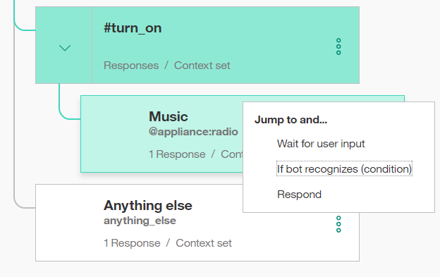

---

copyright:
  years: 2015, 2018
lastupdated: "2018-01-24"

---

{:shortdesc: .shortdesc}
{:new_window: target="_blank"}
{:tip: .tip}
{:pre: .pre}
{:codeblock: .codeblock}
{:screen: .screen}
{:javascript: .ph data-hd-programlang='javascript'}
{:java: .ph data-hd-programlang='java'}
{:python: .ph data-hd-programlang='python'}
{:swift: .ph data-hd-programlang='swift'}

# 指導教學：建置複雜對話
{: #tutorial}

在本指導教學中，您將使用 {{site.data.keyword.conversationshort}} 服務來建立對話，以協助使用者與智能汽車儀表板互動。
{: shortdesc}

## 學習目標

在完成本指導教學之後，您將瞭解如何執行下列動作：

- 定義實體
- 計劃對話
- 在對話中使用節點及回應條件

### 持續期間
本指導教學大約需要 2 到 3 個小時才能完成。

### 必要條件

開始之前，請完成[入門指導教學](getting-started.html)。 

您將使用所建立的 {{site.data.keyword.conversationshort}} tutorial 工作區，並將節點新增至您在開始使用練習期間所建置的簡單對話。

## 步驟 1：新增目的及範例
{: #intents}

請在「目的」標籤上新增目的。目的是使用者輸入中表示的用途或目標。

1.  在 {{site.data.keyword.conversationshort}} tutorial 工作區的「目的」頁面上，按一下**新增目的**。
1.  新增下列目的名稱，然後按一下**建立目的**：

    ```
    turn_on
    ```
    {: codeblock}

    `#` 會附加到所指定的目的名稱前面。`#turn_on` 目的指出使用者要打開設備（例如收音機、雨刷或車前大燈）。
1.  在**新增使用者範例**欄位中，鍵入下列詞語，然後按一下**新增範例**：

    ```
    I need lights
    ```
    {: codeblock}

1.  新增下列 5 個以上的範例，協助 Watson 辨識 `#turn_on` 目的。

    ```
    Play some tunes
    Turn on the radio
    turn on
    Air on please
    Crank up the AC
    Turn on the headlights
    ```
    {: codeblock}

1.  按一下**關閉**  圖示，以完成新增 `#turn_on` 目的。

您現在已有三個目的：您剛才新增的 `#turn_on` 目的，以及在完成作為必備步驟的*入門指導教學* 中新增的 `#hello` 及 `#goodbye` 目的。每一個目的都有一組範例詞語，可協助訓練 Watson 辨識使用者輸入中的目的。

## 步驟 2：新增實體
{: #entities}

實體定義包含一組實體*值*，可用來觸發不同的回應。每一個實體值都可以有多個*同義字*，以定義在使用者輸入中指定相同值的不同方式。

建立可能出現在具有 #turn_on 目的之使用者輸入中的實體，以代表使用者要打開的項目。

1.  按一下**實體**標籤，以開啟「實體」頁面。
1.  按一下**新增實體**。
1.  新增下列實體名稱，然後按 Enter 鍵：

    ```
    appliance
    ```
    {: codeblock}

    `@` 會附加到所指定的實體名稱前面。`@appliance` 實體代表汽車中使用者想要打開的設備。
1.  將下列值新增至**值名稱**欄位：

    ```
    radio
    ```
    {: codeblock}

    此值代表使用者想要打開的特定設備。
1.  在**同義字**欄位中，新增其他方式來指定收音機設備實體。按 **Tab** 鍵來指定欄位焦點，然後輸入下列同義字。在每一個同義字後面按 **Enter** 鍵。

    ```
    music
    tunes
    ```
    {: codeblock}

1.  按一下**新增值**，以完成定義 `@appliance` 實體的 `radio` 值。
1.  新增其他類型的應用裝置。

    - 值：`headlights`。同義字：`lights`。
    - 值：`air conditioning`。同義字：`air` 及 `AC`。

1.  按一下切換開關，以**開啟** `@appliance` 實體的模糊符合。
    此設定可協助服務辨識使用者輸入中實體的參照，即使指定實體的方法不完全符合您在這裡使用的語法。
1.  按一下**關閉**  圖示，以完成新增 `@appliance` 實體。
1.  重複步驟 2-8，建立開啟模糊符合的 `@genre` 實體，以及下列值及同義字：

    - 值：`classical`。同義字：`symphonic`。
    - 值：`rhythm and blues`。同義字：`r&b`。
    - 值：`rock`。同義字：`rock & roll`、`rock and roll` 及 `pop`。

您已定義兩個實體：`@appliance`（代表機器人可打開的設備）及 `@genre`（代表使用者可選擇要收聽的音樂種類）。

收到使用者輸入時，{{site.data.keyword.conversationshort}} 服務會同時識別目的及實體。您現在可以定義一個使用目的及實體來選擇正確回應的對話。

## 步驟 3：建立複雜對話
{: #complex-dialog}

在此複雜對話中，您將建立對話分支來處理先前定義的 #turne_on 目的。

### 新增 #turn_on 的根節點
請建立對話分支，以回應 #turn_on 目的。從建立根節點開始：

1.  按一下 **#hello** 節點上的「其他」圖示 ，然後選取**新增下面的節點**。
1.  在條件欄位中開始鍵入 `#turn_on`，然後從清單中進行選取。
    任何符合 #turn_on 目的的輸入都會觸發此條件。
1.  不要在此節點中輸入回應。按一下 ，以關閉節點編輯視圖。

### 情境
對話需要判斷使用者想要打開的設備。若要處理此作業，請根據其他條件來建立多個回應。

根據您定義的目的及實體，有三種可能的情境：

**情境 1**：使用者想要打開音樂，在此情況下，機器人必須詢問種類。

**情境 2**：使用者想要打開任何其他有效的設備，在此情況下，機器人會在指出正在打開所要求設備的訊息中回應該設備的名稱。

**情境 3**：使用者未指定可辨識的設備名稱，在此情況下，機器人必須要求確認。

新增以此順序檢查這些情境條件的節點，讓對話先評估最具體的條件。

### 處理情境 1

新增用於處理情境 1 的節點，在此情境中，使用者想要打開音樂。在回應中，機器人必須詢問音樂種類。

#### 新增用於檢查設備類型是否為音樂的子節點

1.  按一下 **#turn_on** 節點上的「其他」圖示 ，然後選取**新增子節點**。
1.  在條件欄位中，輸入 `@appliance:radio`。
    如果 @appliance 實體的值是 `radio` 或它的其中一個同義字（如「實體」標籤上所定義），則此條件為 true。
1.  在回應欄位中，輸入 `What kind of music would you like to hear?`
1.  將節點命名為 `Music`。
1.  按一下 ，以關閉節點編輯視圖。

#### 新增從 #turn_on 節點跳至 Music 節點

請直接從 `#turn on` 節點跳至 `Music` 節點，而不詢問任何其他使用者輸入。若要這麼做，您可以使用**跳至**動作。

1.  按一下 **#turn_on** 節點上的「其他」圖示 ，然後選取**跳至**。
1.  選取 **Music** 子節點，然後選取**如果機器人辨識（條件）**，指出您想要處理 Music 節點的條件。



請注意，您必須先建立目標節點（要跳至的節點），然後再新增**跳至**動作。

在您建立「跳至」關係之後，就會在樹狀結構中看到新項目：


#### 新增用於檢查音樂種類的子節點

現在，請新增一個節點來處理使用者所要求的音樂類型。

1.  按一下 **Music** 節點上的「其他」圖示 ，然後選取**新增子節點**。
    只有在使用者回應有關他們想要收聽之音樂類型的問題之後，才會評估這個子節點。因為在此節點之前我們需要使用者輸入，所以不需要使用**跳至**動作。
1.  將 `@genre` 新增至條件欄位。只要偵測到有效的 @genre 實體值，此條件就是 true。
1.  輸入 `OK! Playing @genre.` 作為回應。此回應會重申使用者提供的種類值。

#### 新增用於處理使用者回應中無法辨識種類類型的節點

請新增一個節點，在使用者未指定 @genre 的可辨識值時回應該節點。

1.  按一下 *@genre* 節點上的「其他」圖示 ，然後選取**新增下面的節點**以建立對等節點。
1.  在條件欄位中，輸入 `true`。
    true 條件是特殊條件。它指定在對話流程到達此節點時，應該一律評估為 true。（如果使用者指定有效的 @genre 值，則永遠不會到達此節點。）
1.  輸入 `I'm sorry, I don't understand. I can play classical, rhythm and blues, or rock music.` 作為回應。

這考慮到使用者要求打開音樂的所有情況。

#### 測試音樂的對話

1.  選取  圖示，以開啟聊天窗格。
1.  鍵入 `Play music`。
    機器人會辨識 #turn_on 目的及 @appliance:music 實體，並且以詢問音樂種類作為回應。

1.  鍵入有效的 @genre 值（例如，`rock`）。
    機器人會辨識 @genre 實體，並適當地回應。

    

1.  再次鍵入 `Play music`，但這次指定無效的種類回應。機器人會回應它不瞭解。

### 處理情境 2

我們將新增用於處理情境 2 的節點，在此情境中，使用者想要打開另一個有效的設備。在此情況下，機器人會在指出正在打開所要求設備的訊息中回應該設備的名稱。

#### 新增用於檢查任何設備的子節點

請新增一個節點，在使用者提供 @appliance 的任何其他有效值時觸發該節點。
針對其他 @appliance 值，機器人不需要詢問任何其他輸入。它只會傳回正向回應。

1.  按一下 **Music** 節點上的「其他」圖示 ，然後選取**新增下面的節點**，以建立要在評估 @appliance:music 條件之後評估的對等節點。
1.  輸入 `@appliance` 作為節點條件。
    如果使用者輸入包含音樂以外的 @appliance 實體的任何可辨識值，則會觸發此條件。
1.  輸入 `OK! Turning on the @appliance.` 作為回應。
    此回應會重申使用者已提供的設備值。

#### 測試與其他設備的對話

1.  選取  圖示，以開啟聊天窗格。
1.  鍵入 `lights on`。

    機器人會辨識 #turn_on 目的及 @appliance:headlights 實體，並且回應 `OK, turning on the headlights`。

    

1.  鍵入 `turn on the air`。

    機器人會辨識 #turn_on 目的及 @appliance:(air conditioning) 實體，並且回應 `OK, turning on the air conditioning.`

1.  根據定義的範例詞語及實體同義字，對所有支援的指令嘗試變異。

### 處理情境 3

現在，請新增一個對等節點，在使用者未指定有效的設備類型時觸發該對等節點。

1.  按一下 **@appliance** 節點上的「其他」圖示 ，然後選取**新增下面的節點**，以建立要在評估 @appliance 條件之後評估的對等節點。
1.  在條件欄位中，輸入 `true`。
    （如果使用者指定有效的 @appliance 值，則永遠不會到達此節點。）
1.  輸入 `I'm sorry, I'm not sure I understood you. I can turn on music, headlights, or air conditioning.` 作為回應。

#### 進一步測試

1.  嘗試其他詞語變化來測試對話。

    如果機器人無法辨識正確的目的，您可以直接從聊天視窗重新進行訓練。請選取不正確目的旁的箭頭，然後從清單中選擇正確的目的。

    

您可以選擇性地檢閱 **Car Dashboard - 範例**工作區，查看這個已充實細節的相同使用案例，甚至具有更詳細的對話及其他功能。

1.  從導覽功能表中，按一下**回到工作區**按鈕 。

1.  在 **Car Dashboard - 範例**磚上，按一下**編輯範例**。

## 後續步驟
{: #deploy}

您現在已建置並測試過工作區，因此可以藉由將它連接至使用者介面來進行部署。您可以利用數種方式來執行此動作。

### 在 Slack 中測試

只要幾個步驟，您就可以使用測試部署工具來[部署工作區](test-deploy.html)作為 Slack 頻道中的聊天機器人。此選項是部署工作區來進行測試的最快速且最簡單的方式，但有一些限制。

### 建置自己的前端應用程式

您可以使用 Watson SDK 來[建置自己的前端應用程式](develop-app.html)，以使用 {{site.data.keyword.conversationshort}} REST API 連接至您的工作區。

### 部署至社交媒體或傳訊頻道

您可以使用 [Botkit 架構](integrations.html)來建置可與社交媒體及傳訊頻道（例如 Slack、Facebook 及 Twilio）整合的機器人應用程式。
