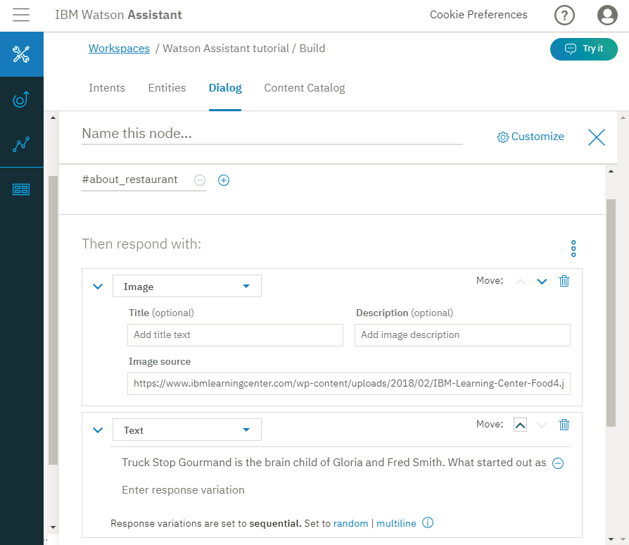
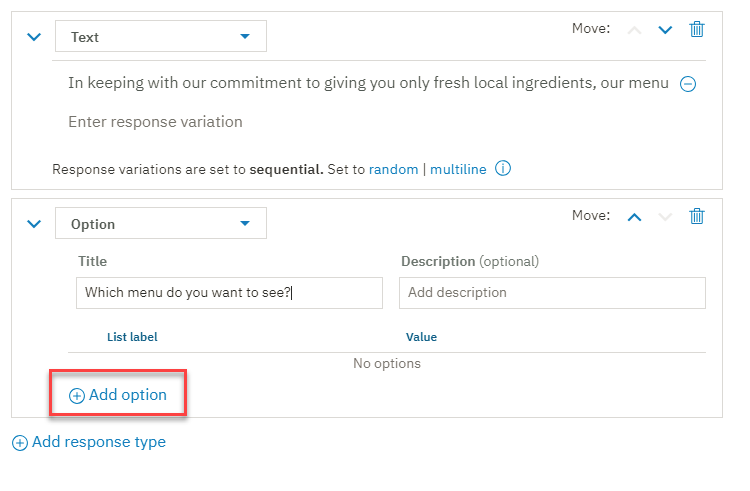
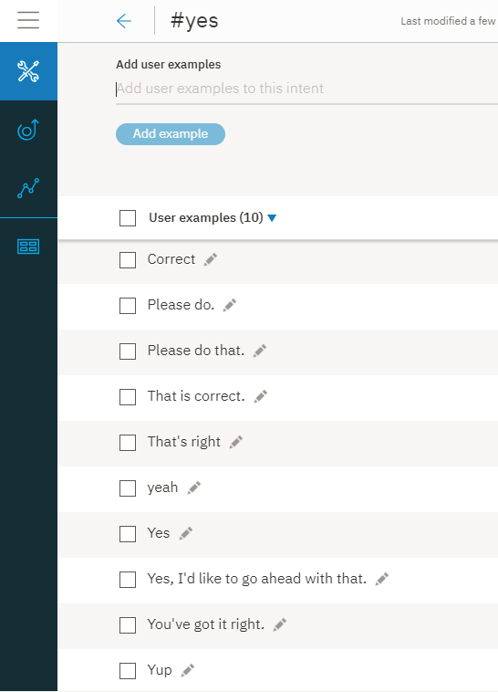
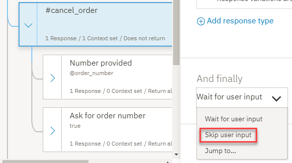

---

copyright:
  years: 2015, 2019
lastupdated: "2019-05-10"

subcollection: assistant

---

{:shortdesc: .shortdesc}
{:new_window: target="_blank"}
{:deprecated: .deprecated}
{:important: .important}
{:note: .note}
{:tip: .tip}
{:pre: .pre}
{:codeblock: .codeblock}
{:screen: .screen}
{:javascript: .ph data-hd-programlang='javascript'}
{:java: .ph data-hd-programlang='java'}
{:python: .ph data-hd-programlang='python'}
{:swift: .ph data-hd-programlang='swift'}
{:gif: data-image-type='gif'}

# 指導教學：建置複雜對話
{: #tutorial}

在本指導教學中，您將使用 {{site.data.keyword.conversationshort}} 服務來建立助理的對話，以協助使用者查詢一家叫作 *Truck Stop Gourmand* 的虛構餐廳。
{: shortdesc}

## 學習目標
{: #tutorial-objectives}

在完成本指導教學時，您將瞭解如何執行下列動作：

- 計劃對話
- 定義自訂目的
- 新增可處理您目的的對話節點
- 新增實體以讓您的回應更具體
- 新增型樣實體，並在對話中使用它，以尋找使用者輸入中的型樣
- 設定及參照環境定義變數

### 持續期間
{: #tutorial-duration}

本指導教學大約需要 2 到 3 個小時才能完成。

### 必要條件
{: #tutorial-prereqs}

開始之前，請完成[入門指導教學](/docs/services/assistant?topic=assistant-getting-started)。

您將使用您所建立的對話技能，並將節點新增至您在開始使用練習時建置的簡易對話中。

## 步驟 1：規劃對話
{: #tutorial-plan}

您要為一家叫作 *Truck Stop Gourmand* 的餐廳建立一個助理，該餐廳有一個門市，是一家生意興隆的蛋糕業者。您想要簡單的助理來回答使用者有關餐廳、菜單以及取消客戶蛋糕訂單的問題。因此，您需要建立目的來處理與下列主題相關的查詢：

- 餐廳資訊
- 菜單詳細資料
- 訂單取消

您將從建立代表這些主題的目的開始，然後建置一個對話來回應使用者相關問題。

## 步驟 2：回答有關餐廳的問題
{: #tutorial-add-about-intent}

新增一個目的以在客戶詢問有關餐廳本身的詳細資料時能夠予以辨識。目的是使用者輸入中表示的用途或目標。在*一般* 內容型錄中隨附有 `#General_About_You` 目的，其提供類似的功能，但其使用者範例的設計是著重在助理的相關查詢，而不是使用助理協助其客戶的業務。因此，您將新增自己的目的。

### 新增 #about_restaurant 目的
{: #tutorial-add-about-restaurant}

1.  在**目的**標籤中，按一下**建立目的**。

    
1.  在*目的名稱* 欄位中輸入 `about_restaurant`，然後按一下**建立目的**。

    
1.  新增下列使用者範例：

    ```
    Tell me about the restaurant
    i want to know about you
    who are the restaurant owners and what is their philosophy?
    What's your story?
    Where do you source your produce from?
    Who is your head chef and what is the chef's background?
    How many locations do you have?
    do you cater or host functions on site?
    Do you deliver?
    Are you open for breakfast?
    ```
    {: screen}

1.  按一下**關閉**  圖示，以完成新增 `#about_restaurant` 目的。

您已新增一個目的，並提供實際使用者可能輸入以觸發此目的的話語範例。

### 新增由 #about_restaurant 目的觸發的對話節點
{: #tutorial-trigger-about-intent}

新增一個對話節點以在使用者輸入對映至您在前一個步驟所建立的目的時能夠予以辨識，這表示它的條件會檢查助理是否能夠從使用者輸入中辨識出 `#about_restaurant` 目的。

1.  按一下**對話**標籤。
1.  在對話樹狀結構中，尋找 `#General_Greetings` 節點。

    您將在此起始問候語節點下面新增一個節點來檢查有關餐廳的問題，以反映您在一般交談中可能會遇到的流程。例如，`Hello.`，然後是 `Tell me about yourself.`。

1.  按一下 `#General_Greetings` 節點上的**其他**  圖示，然後選取**在下面新增節點**。

    
1.  在此節點的**如果助理能辨識**欄位中，開始鍵入 `#about_restaurant`。然後，選取 `#about_restaurant` 選項。
1.  新增下列文字作為回應。

   若要複製文字，請按一下與文字區塊  相關聯的複製圖示：

    ```
    Truck Stop Gourmand is the brain child of Gloria and Fred Smith. What started out as a food truck in 2004 has expanded into a thriving restaurant. We now have one brick and mortar restaurant in downtown Portland. The bigger kitchen brought with it new chefs, but each one is faithful to the philosophy that made the Smith food truck so popular to begin with: deliver fresh, local produce in inventive and delicious ways. Join us for lunch or dinner seven days a week. Or order a cake from our bakery.
    ```
    {: codeblock}

1.  讓我們也在回應中新增一個影像。

    按一下**新增回應類型**。從下拉清單中選取**影像**。在**影像來源**欄位中，新增 `https://www.ibmlearningcenter.com/wp-content/uploads/2018/02/IBM-Learning-Center-Food4.jpg`。
1.  將影像回應類型往上移，以在顯示文字之前讓它顯示在回應中。按一下**上移鍵**，將兩個回應類型重新排序。

    

1.  按一下 ，以關閉編輯視圖。

### 測試 #about_restaurant 對話節點
{: #tutorial-test-about-intent}

測試目的，方法是檢查與您新增至訓練資料的範例類似、但不完全相同的使用者話語是否已順利訓練助理來辨識具有 `#about_restaurant` 目的的輸入。

1.  按一下  圖示，來開啟「試用」窗格。

1.  輸入 `I want to learn more about your restaurant.`。

    助理指出辨識出 `#about_restaurant` 目的，並以您針對此對話節點所指定的影像和文字來傳回回應。

    

恭喜！您已新增一個自訂目的，以及一個知道如何進行處理的對話節點。

`#about_restaurant` 目的是設計用來辨識有關餐廳的各種常見問題。您已新增單一節點來擷取這類問題。此回應很長，但它是單一陳述，可能會回答有關下列所有主題的問題：

- 餐廳老闆
- 餐廳歷史
- 理念
- 門市數量
- 營業天數
- 提供的餐點
- 餐廳提供烘培蛋糕訂單的實際情況

對於一般可輕易實現的問題，一個一般的回答就適用了。

## 步驟 3：回答有關菜單的問題
{: #tutorial-menu}

來自潛在餐廳客戶的一個關鍵問題是菜單。Truck Stop Gourmand 餐廳每天都會更換菜單。除了標準菜單之外，它還有素食和蛋糕店菜單。當使用者詢問菜單時，對話需要找出可分享的菜單，然後提供菜單超鏈結，該餐廳網站每天都會更新菜單。如果該資訊定期更新，您絕對不希望將這些資訊寫在對話節點程式中。

### 新增 #menu 目的
{: #tutorial-add-menu-intent}

1.  按一下**目的**標籤。
1.  按一下**建立目的**。

    

1.  在*目的名稱* 欄位中輸入 `menu`，然後按一下**建立目的**。

    

1.  新增下列使用者範例：

    ```
    I want to see a menu
    What do you have for food?
    Are there any specials today?
    where can i find out about your cuisine?
    What dishes do you have?
    What are the choices for appetizers?
    do you serve desserts?
    What is the price range of your meals?
    How much does a typical dish cost?
    tell me the entree choices
    Do you offer a prix fixe option?
    ```
    {: screen}

1.  按一下**關閉**  圖示，以完成新增 `#menu` 目的。

### 新增由 #menu 目的觸發的對話節點
{: #tutorial-trigger-menu-intent}

新增一個對話節點以在使用者輸入對映至您在前一個步驟所建立的目的時能夠予以辨識，這表示它的條件會檢查助理是否能夠從使用者輸入中辨識出 `#menu` 目的。

1.  按一下**對話**標籤。
1.  在對話樹狀結構中，尋找 `#about_restaurant` 節點。

    您將在此節點下面新增一個節點來檢查有關菜單的問題。

1.  按一下 `#about_restaurant` 節點上的**其他**  圖示，然後選取**在下面新增節點**。

    

1.  在此節點的**如果助理能辨識**欄位中，開始鍵入 `#menu`。然後，選取 `#menu` 選項。

    

1.  新增下列文字作為回應：

    `In keeping with our commitment to giving you only fresh local ingredients, our menu changes daily to accommodate the produce we pick up in the morning. You can find today's menu on our website.`

1.  新增*選項* 回應類型，以提供選項清單，供使用者選擇。在此情況下，選項清單包括可用菜單的不同版本。

    按一下**新增回應類型**。從下拉清單中選取**選項**。

    

1.  在**標題**欄位中，新增 *Which menu do you want to see?*。

    

1.  按一下**新增選項**。

1.  在**清單標籤**欄位中，新增 `Standard`。您新增作為標籤的文字會顯示在使用者的回應中，作為可選取的選項。

1.  在**值**欄位中，新增 `standard menu`。指定為值的文字是在使用者從清單中選擇並按一下此選項時，將作為新的使用者輸入傳送給助理的內容。

1.  重複前兩個步驟來新增其餘菜單類型的標籤和值資訊：

    <table>
    <caption>選項回應類型詳細資料</caption>
    <tr>
      <th>清單標籤</th>
      <th>值</th>
    </tr>
    <tr>
      <td>Vegetarian</td>
      <td>vegetarian menu</td>
    </tr>
    <tr>
      <td>Cake shop</td>
      <td>cake shop menu</td>
    </tr>
    </table>

    

1.  按一下 ，以關閉編輯視圖。

### 新增 @menu 實體
{: #tutorial-add-menu-entity}

為了辨識出客戶表示他們想要查看的不同類型菜單，您將新增 `@menu` 實體。實體代表與使用者用途相關的物件類別或資料類型。藉由檢查使用者輸入中是否有特定實體存在，您可以新增更多回應，每個回應都可自訂以滿足不同的使用者要求。在本例中，您將新增一個 `@menu` 實體，用於識別不同的功能表類型。

1.  按一下**實體**標籤。

    

1.  按一下**建立實體**。

1.  在實體名稱欄位中輸入 `menu`。

    

1.  按一下**建立實體**。

1.  在**值名稱** 欄位中新增 `standard`，再將 `standard menu` 新增至**同義字**欄位，然後按 Enter 鍵。

1.  新增下列其他同義字：

    - bill of fare
    - cuisine
    - carte du jour

    

1.  按一下**新增值**，以新增 `@menu:standard` 值。

1.  在**值名稱** 欄位中新增 `vegetarian`，再將 `vegetarian menu` 新增至**同義字**欄位，然後按 Enter 鍵。

1.  按一下**顯示建議**，然後按一下 *vegan diet* 勾選框。

1.  按一下**新增選取的項目**。

1.  按一下空的*新增同義字* 欄位，然後新增下列其他同義字：

    - vegan
    - plants-only

    

1.  按一下**新增值**，以新增 `@menu:vegetarian` 值。

1.  在**值名稱** 欄位中新增 `cake`，再將 `cake menu` 新增至**同義字**欄位，然後按 Enter 鍵。

1.  新增下列其他同義字：

    - cake shop menu
    - dessert menu
    - bakery offerings

    

1.  按一下**新增值**，以新增 `@menu:cake` 值。

1.  按一下**關閉**  圖示，以完成新增 `@menu` 實體。

### 新增由 @menu 實體類型觸發的子節點
{: #tutorial-trigger-menu-entity}

在這個步驟中，您會將子節點新增至對話節點，以用來檢查 `#menu` 目的。每一個子節點會根據使用者從選項清單中選擇的 `@menu` 實體類型而顯示不同的回應。

1.  按一下**對話**標籤。
1.  在對話樹狀結構中尋找 `#menu` 節點。

    您將新增子節點來處理您新增至 `#menu` 節點的每一個菜單類型選項。

1.  按一下 `#menu` 節點上的**其他**  圖示，然後選取**新增子節點**。

    

1.  在此節點的**如果助理能辨識**欄位中，開始鍵入 `@menu:standard`。然後，選取 `@menu:standard` 選項。

1.  在回應文字欄位中新增下列訊息：`To see our menu, go to the <a href="https://www.example.com/menu.html" target="blank">menu</a> page on our website.`。

    

1.  按一下 ，以關閉編輯視圖。

1.  按一下 `@menu_standard` 節點上的**其他**  圖示，然後選取**在下面新增節點**。

1.  在此節點的**如果助理能辨識**欄位中，開始鍵入 `@menu:vegetarian`。然後，選取 `@menu:vegetarian` 選項。

1.  在回應文字欄位中新增下列訊息：`To see our vegetarian menu, go to the <a href="https://www.example.com/vegetarian-menu.html" target="blank">vegetarian menu</a> page on our website.`。

    

1.  按一下 ，以關閉編輯視圖。

1.  按一下 `@menu_vegetarian` 節點上的**其他**  圖示，然後選取**在下面新增節點**。

1.  在此節點的**如果助理能辨識**欄位中，開始鍵入 `@menu:cake`。然後，選取 `@menu:cake` 選項。

1.  在回應文字欄位中新增下列訊息：`To see our cake shop menu, go to the <a href="https://www.example.com/menu.html" target="blank">cake shop menu</a> page on our website.`。

    

1.  按一下 ，以關閉編輯視圖。

1.  標準菜單可能是最常見的要求，因此，請將它移至子節點清單的底端。將它放在最後面，當有人詢問特別菜單而非標準菜單時，可防止不小心觸發它。 

    按一下 `@menu_standard` 節點上的**其他**  圖示，然後選取**移動**。

    

1.  選取 `@menu:cake` 節點，然後選擇**節點下面**。

    

您已新增節點來辨識使用者對菜單詳細資料的要求。您的回應是通知使用者有提供三種類型的菜單，並請他們選擇一種。當使用者選擇菜單類型時，會顯示一個回應，用來提供網頁的超文字鏈結和所要求的菜單詳細資料。

### 測試菜單選項對話節點
{: #tutorial-test-menu-options-intent}

測試您新增用來辨識菜單問題的對話節點。

1.  按一下  圖示，來開啟「試用」窗格。

1.  輸入 `What type of food do you serve?`。

    助理指出辨識出 `#menu` 目的，並顯示可供使用者選擇的菜單選項清單。

    
1.  按一下 `Cake shop` 選項。

    助理會辨識 `#menu` 目的和 `@menu:cake` 實體參照，並顯示此回應：`To see our cake shop menu, go to the cake shop page on our website.`

    
1.  按一下回應中的*蛋糕店* 超鏈結。

    即會開啟新的 Web 瀏覽器頁面，並顯示 example.com 網站。

1.  關閉 example.com 網頁。

做得好。您已順利新增可用來辨識使用者對菜單詳細資料要求的目的和實體，並可將使用者引導至適當的菜單。

`#menu` 目的代表潛在餐廳客戶的一般主要需求。由於其重要性及熱門程度，您在對話中新增了更複雜的區段來妥善處理此問題。

## 步驟 4：管理蛋糕訂單
{: #tutorial-manage-orders}

客戶可以親自、透過電話或利用網站上的訂單表格來下訂單。下訂單之後，使用者可以透過虛擬助理來取消訂單。首先，要定義可辨識訂單號碼的實體。然後，新增一個目的以在使用者要取消蛋糕訂單時能夠予以辨識。

### 新增訂單號碼型樣實體
{: tutorial-add-pattern-entity}

您要助理能夠辨識訂單號碼，因此您將建立型樣實體，以辨識該餐廳用來識別其訂單的唯一格式。餐廳烘培坊所使用之訂單號碼的語法為：2 個大寫字母、後面再接著 5 個數字。例如，`YR34663`。新增一個可辨識此字元樣式的實體。

1.  按一下**實體**標籤。
1.  按一下**建立實體**。
1.  在實體名稱欄位中輸入 `order_number`。
1.  按一下**建立實體**。

    
1.  在*值名稱* 欄位中新增 `order_syntax`，然後按一下**同義字**旁的下移鍵，將類型變更為**型樣**。

    
1.  將下列正規表示式新增至「型樣」欄位：`[A-Z]{2}\d{5}`

    

1.  按一下**新增值**。

    

1.  按一下**關閉**  圖示，以完成新增 `@order_number` 實體。

    

### 新增取消訂購目的
{: #tutorial-cancel-order-intent}

1.  按一下**目的**標籤。
1.  按一下**建立目的**。
1.  在*目的名稱* 欄位中輸入 `cancel_order`，然後按一下**建立目的**。
1.  新增下列使用者範例：

    ```
    I want to cancel my cake order
    I need to cancel an order I just placed
    Can I cancel my cake order?
    I'd like to cancel my order
    There's been a change. I need to cancel my bakery order.
    please cancel the birthday cake order I placed last week
    The party theme changed; we don't need a cake anymore
    that order i placed, i need to cancel it.
    ```
    {: screen}

    
1.  按一下**關閉**  圖示，以完成新增 `#cancel_order` 目的。

### 新增 #yes 目的
{: #tutorial-yes-intent}

在代表使用者執行某個動作之前，您必須先確認您採取的是正確動作。將 #yes 目的新增至對話，以在使用者同意助理的提議時能夠予以辨識。

1.  按一下**目的**標籤。
1.  按一下**建立目的**。
1.  在*目的名稱* 欄位中輸入 `yes`，然後按一下**建立目的**。
1.  新增下列使用者範例：

    ```
    Yes
    Correct
    Please do.
    You've got it right.
    Please do that.
    that is correct.
    That's right
    yeah
    Yup
    Yes, I'd like to go ahead with that.
    ```
    {: screen}

    
1.  按一下**關閉**  圖示，以完成新增 `#yes` 目的。

### 新增可管理取消訂單要求的對話節點
{: #tutorial-cancel-order-dialog}

現在，新增一個對話節點，用來處理取消蛋糕訂單的要求。

1.  按一下**對話**標籤。
1.  尋找 `#menu` 節點。按一下 `#menu` 節點上的**其他**  圖示，然後選取**在下面新增節點**。
1.  在此節點的**如果助理能辨識**欄位中，開始鍵入 `#cancel_order`。然後，選取 `#cancel_order` 選項。
1.  在回應文字欄位中新增下列訊息：

    ```
    If the pickup time is more than 48 hours from now, you can cancel your order.
    ```
    {: codeblock}

    

    您必須先知道訂單號碼，才能實際取消訂單。使用者可能會在原始要求中指定訂單號碼。因此，為避免再次要求訂單號碼，請檢查原始輸入中具有此訂單號碼型樣的號碼。若要這樣做，請定義會依指定方式儲存訂單號碼的環境定義變數。

1.  您可在環境定義編輯器中定義環境定義變數。在節點的回應區段中，按一下**其他**  圖示，然後選取**開啟環境定義編輯器**。

    
1.  輸入下列環境定義變數名稱/值配對：

    <table>
    <caption>訂單號碼環境定義變數詳細資料</caption>

    <tr>
      <th>變數</th>
      <th>值</th>
    </tr>
    <tr>
      <td>$ordernumber</td>
      <td><? @order_number.literal ?></td>
    </tr>
    </table>

    環境定義變數值 (`<? @order_number.literal ?>`) 是 SpEL 表示式，它會擷取使用者指定且符合 @order_number 型樣實體所定義之型樣的號碼。它會將該號碼儲存至 `$ordernumber` 變數。

    
1.  按一下 ，以關閉編輯視圖。

    現在，新增子節點來要求訂單號碼，或是請使用者確認她是否要取消偵測到之訂單號碼的訂單。
1.  按一下 `#cancel_order` 節點上的**其他**  圖示，然後選取**新增子節點**。

    
1.  將標籤新增至節點，以區分它與您要新增的其他子節點。在名稱欄位中，新增 `Ask for order number`。在此節點的**如果助理能辨識**欄位中，鍵入 `true`。

1.  在回應文字欄位中新增下列訊息：

    ```
    What is the order number?
    ```
    {: codeblock}

    
1.  按一下 ，以關閉編輯視圖。

    現在，新增另一個子節點來通知使用者您要取消訂單。
1.  按一下 `Ask for order number` 節點上的**其他**  圖示，然後選取**新增子節點**。
1.  在此節點的**如果助理能辨識**欄位中，鍵入 `@order_number`。
1.  開啟環境定義編輯器。按一下**其他**  圖示，然後選取**開啟環境定義編輯器**。
1.  輸入下列環境定義變數名稱/值配對：

    <table>
    <caption>訂單號碼環境定義變數詳細資料</caption>

    <tr>
      <th>變數</th>
      <th>值</th>
    </tr>
    <tr>
      <td>$ordernumber</td>
      <td><? @order_number.literal ?></td>
    </tr>
    </table>

環境定義變數值 (`<? @order_number.literal ?>`) 是 SpEL 表示式，它會擷取使用者指定且符合 @order_number 型樣實體所定義之型樣的號碼。它會將該號碼儲存至 `$ordernumber` 變數。
1.  在回應文字欄位中新增下列訊息：

    ```
    Ok. The order $ordernumber is canceled. We hope we get the opportunity to bake a cake for you sometime soon.
    ```
    {: codeblock}

    
1.  按一下 ，以關閉編輯視圖。
1.  新增另一個節點，以擷取使用者提供的號碼不是有效訂單號碼的案例。按一下 `@order_number` 節點上的**其他**  圖示，然後選取**在下面新增節點**。
1.  在此節點的**如果助理能辨識**欄位中，鍵入 `true`。
1.  在回應文字欄位中新增下列訊息：

    ```
    I need the order number to cancel the order for you. If you don't know the order number, please call us at 958-234-3456 to cancel over the phone.
    ```
    {: codeblock}

    
1.  按一下 ，以關閉編輯視圖。

1.  在起始訂單取消要求節點下面新增一個節點，以在使用者於起始要求中提供訂單號碼時作出回應，因此您不必再次要求。按一下 `#cancel_order` 節點上的**其他**  圖示，然後選取**新增子節點**。
1.  將標籤新增至節點，以區分它與其他子節點。在名稱欄位中，新增 `Number provided`。在此節點的**如果助理能辨識**欄位中，鍵入 `@order_number`。
1.  在回應文字欄位中新增下列訊息：

    ```
    Just to confirm, you want to cancel order $ordernumber?
    ```
    {: codeblock}

    
1.  按一下 ，以關閉編輯視圖。

    您必須新增子節點，以檢查使用者對您的確認問題的回應。
1.  按一下 `Number provided` 節點上的**其他**  圖示，然後選取**新增子節點**。
1.  在此節點的**如果助理能辨識**欄位中，鍵入 `#yes`。

1.  在回應文字欄位中新增下列訊息：

    ```
    Ok. The order $ordernumber is canceled. We hope we get the opportunity to bake a cake for you sometime soon.
    ```
    {: codeblock}

    
1.  按一下 ，以關閉編輯視圖。

1.  按一下 `#yes` 節點上的**其他**  圖示，然後選取**在下面新增節點**。

1.  在此節點的**如果助理能辨識**欄位中，鍵入 `true`。

    不要新增回應。相反地，您會將使用者重新導向至會要求您先前建立之訂單號碼詳細資料的分支。

1.  在*最後* 區段中，選擇**跳至**。

    
1.  選取*要求訂單號碼* 節點的條件。

    
1.  按一下 ，以關閉編輯視圖。
1.  將*提供的號碼*節點移至*要求訂單號碼*節點上方。按一下 `Number provided` 節點上的**其他**  圖示，然後選取**移動**。選取*要求訂單號碼*節點，然後按一下**節點上方**。

    
1.  強制交談在執行時期評估 `#cancel_order` 節點下方的子節點。按一下以開啟編輯視圖中的 `#cancel_order` 節點，然後在`最後`區段中，選取`跳過使用者輸入`。

    

### 測試訂單取消
{: #tutorial-test-cancel-order}

測試助理是否可辨識符合用於使用者輸入中的產品訂單號碼之型樣的字元樣式。

1.  按一下  圖示，來開啟「試用」窗格。

1.  輸入 `i want to cancel my order number TW12345.`。

    助理可辨識 `#cancel_order` 目的和 `@order_number` 實體。它回應：`If the pickup time is more than 48 hours from now, you can cancel your order. Just to confirm, you want to cancel order TW12345?`

1.  請輸入 `Yes`。

    助理可辨識 `#yes` 目的，並回應 `Ok. The order TW12345 is canceled. We hope we get the opportunity to bake a cake for you sometime soon.`

    

    現在，如果您不知道訂單號碼就試試看。
1.  按一下「試用」窗格中的**清除**，即可重新開始。輸入 `I want to cancel my order.`。

    助理可辨識 `#cancel_order` 目的，並回應 `If the pickup time is more than 48 hours from now, you can cancel your order. What is the order number?`。

1.  輸入 `I don't know.`。

    助理會回應：`I need the order number to cancel the order for you. If you don't know the order number, please call us at 958-234-3456 to cancel over the phone.`。

    

### 新增節點以釐清訂單號碼格式
{: #tutorial-clarify-order-number format}

如果您要進行更多測試，可能會發現此對話在使用者不記得訂單號碼格式的情況下幫助不大。使用者可能只包含數字或字母，但忘記它們要大寫。因此，在這種情況下給他們一點提示會是個好點子，對吧？如果您想要友善一點，可新增另一個節點至對話樹狀結構，來檢查使用者輸入中的號碼。

1.  尋找 `@order_number` 節點，它是*要求訂單號碼* 節點的子節點。

1.  按一下 `@order_number` 節點上的**其他**  圖示，然後選取**在下面新增節點**。

1.  在條件欄位中，新增 `input.text.find('\d')`，這是一個 SpEL 表示式，指出如果您在使用者輸入中找到一個以上號碼，則觸發此回應。

1.  在文字回應欄位中，新增下列回應：

    ```
    The correct format for our order numbers is AAnnnnn. A 代表 2 個大寫字母，n 代表 5 個數字。Do you have an order number in that format?
    ```
    {: codeblock}

1.  按一下 ，以關閉編輯視圖。

1.  按一下 `input.text.find('\d')` 節點上的**其他**  圖示，然後選取**新增子節點**。

1.  在此節點的**如果助理能辨識**欄位中，鍵入 `true`。

1.  按一下**自訂**，並向下捲動，然後將*多個回應* 切換開關切換為**開啟**，來啟用條件式回應。

1.  按一下**套用**。

1.  在新增的*如果助理能辨識* 欄位中，鍵入 `@order_number`，然後在*回應* 欄位中，鍵入：

    ```
    Ok. The order $ordernumber is canceled. We hope we get the opportunity to bake a cake for you sometime soon.
    ```
    {: codeblock}

1.  按一下**新增回應**。

1.  在*如果助理能辨識* 欄位中，鍵入 `true`，然後在*回應* 欄位中，鍵入：

    ```
    I need the order number to cancel the order for you. If you don't know the order number, please call us at 958-234-3456 to cancel over the phone.
    ```
    {: codeblock}

    
1.  按一下 ，以關閉編輯視圖。

現在，當您測試時，您可以提供一組數字，或在輸入時混合數字和文字，對話會提醒您正確的訂單號碼格式。您已成功測試對話，找到其中的弱點，並加以更正。

另一種可以處理這種狀況的方式是新增含空位的節點。請參閱[將含空位的節點新增至對話](/docs/services/assistant?topic=assistant-tutorial-slots)指導教學，以進一步瞭解如何使用空位。
{:tip}

## 步驟 5：新增個性化
{: #tutorial-get-username}

如果使用者對機器人本身感到興趣，您會希望虛擬助理能夠辨識此好奇心，並以更個性化的方式來與使用者互動。在您新增自己的自訂 `#about_restaurant` 目的之前，您或許記得我們先前曾考慮使用的 `#General_About_You` 目的，它隨附於*一般* 內容型錄中。它是建置用來辨識使用者的這類問題。請新增將條件設為此目的的節點。在回應中，您可以要求使用者名稱，並將它儲存至您可以在對話的其他地方使用的 $username 變數（如果有的話）。

首先，您需要確定助理可辨識使用者提供的名稱。若要這樣做，請啟用 `@sys-person` 實體，它是設計用來辨識常用的名字和姓氏（英文）。

### 新增個人系統實體
{: #tutorial-add-person-entity}

助理提供若干*系統實體*，這些系統實體是可用於任何應用程式的一般實體。

1.  按一下**實體**標籤，然後按一下**系統實體**。

1.  尋找 *`@sys-person`* 實體切換，然後將它切換至**開啟**。

    

### 新增能夠處理機器人相關問題的節點
{: #tutorial-add-about-you-node}

現在，新增一個對話節點，它可辨識使用者對機器人感到興趣並予以回應。

1.  按一下**對話**標籤。
1.  在對話樹狀結構中尋找 `Welcome` 節點。
1.  按一下 `Welcome` 節點上的**其他**  圖示，然後選取**在下面新增節點**。
1.  在此節點的**如果助理能辨識**欄位中，開始鍵入 `#General_About_You`。然後，選取 `#General_About_You` 選項。
1.  在回應文字欄位中新增下列訊息：

    ```
    I am a virtual assistant that is designed to answer your questions about the Truck Stop Gourmand restaurant. What's your name?
    ```
    {: codeblock}

    
1.  按一下 ，以關閉編輯視圖。
1.  按一下 `#General_About_You` 節點上的**其他**  圖示，然後選取**新增子節點**。
1.  在此節點的**如果助理能辨識**欄位中，開始鍵入 `@sys-person`。然後，選取 `@sys-person` 選項。
1.  在回應文字欄位中新增下列訊息：

    ```
    Hello, <? @sys-person.literal ?>! It's lovely to meet you.     How can I help you today?
    ```
    {: codeblock}

1.  若要擷取使用者提供的名稱，請將環境定義變數新增至節點。按一下**其他**  圖示，然後選取**開啟環境定義編輯器**。
1.  輸入下列環境定義變數名稱/值配對：

    <table>
    <caption>使用者名稱環境定義變數詳細資料</caption>

    <tr>
      <th>變數</th>
      <th>值</th>
    </tr>
    <tr>
      <td>$username</td>
      <td><? @sys-person.literal ?></td>
    </tr>
    </table>

    環境定義變數值 (`<? @sys-person.literal ?>`) 是一個 SpEL 表示式，用於擷取使用者指定的使用者名稱，然後將其儲存到 `$username` 環境定義變數中。

    
1.  按一下 ，以關閉編輯視圖。
1.  按一下 `@sys-person` 節點上的**其他**  圖示，然後選取**在下面新增節點**。

    您將新增節點，以擷取不包含名稱的使用者回應。如果使用者選擇不分享它，您仍希望機器人繼續交談下去。
1.  在此節點的**如果助理能辨識**欄位中，鍵入 `true`。
1.  在回應文字欄位中新增下列訊息：

    ```
    How can I help you today?
    ```
    {: codeblock}

    
1.  按一下 ，以關閉編輯視圖。

如果在執行時期使用者觸發此節點並提供名稱，您就會知道使用者的名稱。如果您知道它，就應該使用它！將條件式回應新增至您先前新增的問候語對話節點，以包含使用這個已知使用者名稱的條件式回應。

### 將使用者名稱新增至問候語
{: #tutorial-add-username-to-greeting}

如果您知道使用者的名稱，則應將其包含在問候語訊息中。若要這樣做，請新增條件式回應，並包含一個問候語變式來包括該使用者的名稱。

1.  在對話樹狀結構中尋找 `#General_Greetings` 節點，然後按一下，以在編輯視圖中將它開啟。
1.  按一下**自訂**，並向下捲動，然後將*多個回應* 切換開關切換為**開啟**。

    
1.  按一下**套用**。

    
1.  按一下**新增回應**。
1.  在*如果助理能辨識*欄位中鍵入 `$username`，然後在*回應* 欄位中新增回應：

    ```
    Good day to you, $username!
    ```
    {: codeblock}

1.  按一下回應號碼 2 的上移鍵來移動它，讓它列在回應號碼 1 (`Good day to you!`) 之前。

    
1.  按一下 ，以關閉編輯視圖。

### 測試個人化
{: #tutorial-test-personalize}

測試助理是否可辨識及儲存使用者的名稱，然後稍後藉由該名稱來參照使用者。

1.  按一下  圖示，來開啟「試用」窗格。

1.  按一下**清除**，以重新啟動交談階段作業。

1.  請輸入 `Who are you?`。

    助理可辨識 `#General_About_You` 目的。其回應以此問題結束：`What's your name?`。
1.  輸入 `I am Jane Doe.`。

    助理可辨識 `Jane Doe` 為 `@sys-person` 實體提及項目。它會加註您的名稱，然後詢問要如何協助您。
1.  輸入 `Hello.`。

    助理可辨識 `#General_Greetings` 目的，並說 `Good day to you, Jane Doe!`。它會使用包含使用者名稱的條件式回應，因為 `$username` 環境定義變數在觸發問候語節點時包含一個值。

    

如果個人化可以幫交談加分，您可以針對任何其他回應新增一個條件式回應來包含並設定使用者名稱為條件。

## 步驟 6：從網頁整合測試助理
{: #tutorial-integrate-assistant}

現在，您已建置更準確的助理版本，請回到您在前一個指導教學中部署的公用網頁，然後測試您新增的功能。

1.  開啟助理。
1.  從*整合* 區域，按一下**預覽鏈結**。
1.  按一下頁面上所顯示的 URL。

    即會在新標籤中開啟頁面。
1.  重複使用您提交給「試用」窗格的一些測試話語，看看助理在實際整合中如何表現。

    與您從「試用」窗格將測試話語傳送至助理不同，從提交到聊天小組件的話語中產生的 API 呼叫將適用標準使用收費。
    {: note}

## 後續步驟
{: #tutorial-deploy}

您現在已建置並測試對話技能，您可以將它與客戶共用。藉由先將此技能連接至助理，然後部署助理，來部署技能。您可以利用數種方式來執行此動作。如需詳細資料，請參閱[新增整合](/docs/services/assistant?topic=assistant-deploy-integration-add)。
