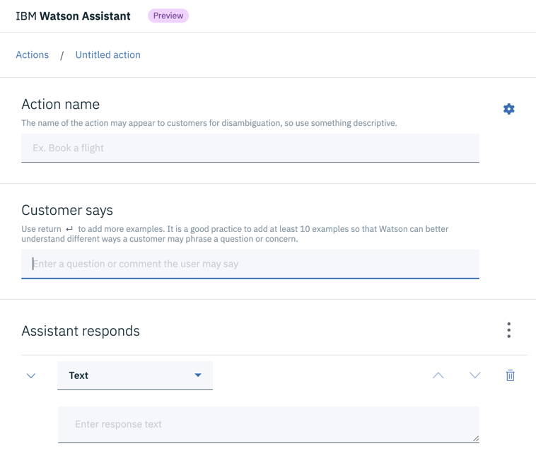
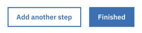
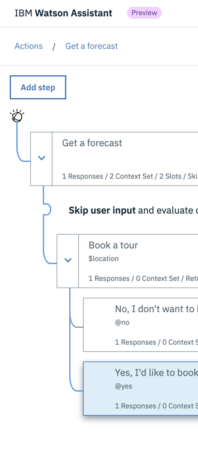
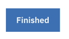
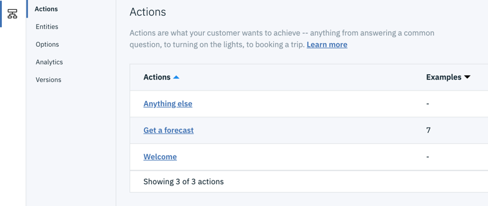
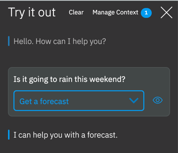

---

copyright:
  years: 2015, 2019
lastupdated: "2019-11-26"

subcollection: assistant

---

{:shortdesc: .shortdesc}
{:new_window: target="_blank"}
{:external: target="_blank" .external}
{:deprecated: .deprecated}
{:important: .important}
{:note: .note}
{:tip: .tip}
{:pre: .pre}
{:preview: .preview}
{:codeblock: .codeblock}
{:screen: .screen}
{:javascript: .ph data-hd-programlang='javascript'}
{:java: .ph data-hd-programlang='java'}
{:python: .ph data-hd-programlang='python'}
{:swift: .ph data-hd-programlang='swift'}
{:table: .aria-labeledby="caption"}

# Creating actions 
{: #actions}

Actions represent the discrete tasks or questions that your assistant is designed to handle. 
{: shortdesc}

This feature is visible only in a select set of service instances where the technology preview is deployed. See [Preview details](/docs/services/assistant?topic=assistant-preview). 
{: preview}

## Actions overview
{: #actions-overview}

Actions have a beginning and an end. 

An action begins when it recognizes the goal a customer wants to achieve based on the words she uses to articulate her goal.

The body of the action is comprised of one or more *steps* that elicit the information your assistant needs to meet the customer's goal.

Building the conversation that your assistant has with your customers is fundamentally about deciding on which steps, or which user interactions, are required to complete an action. After you identify the list of steps, you can then focus on writing engaging content to turn each interaction into a positive experience for your customer.

An action ends after the steps that are required to satisfy the customer's goal are completed.

For example, a customer named Sally might need to get a weather forecast for New York City for next week so she can prepare for a business trip. The action you build so your assistant can help Sally might look like this:

- **Action name**: Get a forecast
- **Customer says** 

  - I need a weather forecast for NYC
  - Can you tell me what the weather will be like next week?
  - And so on to reach 10 examples at least

- **Steps**

  1.  Collect the date and location values that are required to get a relevant weather forecast for NYC next week.
  1.  Make a programmatic call to an online weather service, and share the forecast results with Sally.
  1.  Show a text message that asks Sally whether she is satisfied with the information she recieved and the assistant's overall service.

## Creating an action
{: #actions-task}

When you open a dialog skill, you land on the *Actions* page. From any other page, you can click **Actions** from the skill menu to open the page.

Two actions are created for you automatically. To learn more about them, see [Built-in actions explained](#actions-builtin).

To get started quickly, add an action that represents a question which requires a single simple text response only. For example, you might add an action named *Tell me about your business* that understands questions about the founding and objectives of your business. This type of action can be satisfied with a single step that shows a text response.

Later, when you are ready to start building a powerful assistant, you will need to do some prep work. Spend time researching the most common requests that your customers need help with, and then determine which of those requests you want your assistant to handle.

To create an action, complete the following steps:

1.  Click **New action**.

    

1.  Name the action.
 
    Use a short, customer-friendly description of what the action is as its name. For example, `Open an account`, `Get policy information`, or `Get a weather forecast`.

    The name can be up to 512 characters in length.

    This field is not required, but the action name might be shown to customers or service desk personnel to express the purpose of the action, so it is worth taking some time to add a name that is concise and descriptive. If you skip adding a name, the first phrase that you add to the next field is used as the action name automatically.
    {: tip}

1.  In the **Customer says** field, add phrases that your customers use to articulate this request or question.

    Type a phrase, and then press return to add another phrase. Add 10 or more variations of the wording that your customers commonly use. For example, `I want to open an account` or `Does my policy cover water damage due to flooding?` or `Is it going to rain this weekend?`
    
    Each phrase can be up to 1,024 characters in length.

    By adding these simple examples, you are building the training data that the machine learning engine of Watson uses to create a natural language processing model for your assistant. The model it builds is customized to understand your uniquely defined actions.

1.  Add the assistant's response.

    What you define here is the first step that will be performed to fulfill the action. This is the first interaction that your assistant will have with your customer. The step can be any of the following response types:
    
    - Showing a text message
    - Displaying an image
    - Asking the customer to make a choice
    - Giving the assistant extra time
    - Adding messages that are responsive to customer information
    - Collecting a series of required values

    See [Adding steps](/docs/services/assistant?topic=assistant-steps#steps-overview).

1.  **Optional**: Add another response type to the step. Click **Add response type**.

    You might need to add multiple response types to fully implement a step. For example, to help a customer book an in-store appointment, you might want to display an image that is a map of your locations, and then ask them to choose a store location from a list. To the same step, you can add an Image response type with the map image, and an Options response type that lists each store address as a separate choice.

    You can add up to 5 response types to a single response.
    {: note}

1.  Indicate what you want your assistant to do after this step is completed.

    - **Wait for user input**: Your assistant waits for the user to provide new input that the response elicits. For example, the assistant's response might ask a yes or no question. The conversation will not continue until the customer replies.
    - **Skip user input**:  Use this option when you want to bypass waiting for the customer to reply and go directly to the first substep of the current step instead.

      This option to be available from any step with at least one substep.
      {: note}
    - **Jump to another step**: Use this option when you want the conversation to go directly to an entirely different step. Maybe your last step checks the customer's satisfaction with the action, and you want to process that step at the end of each interaction, for example. For more information about how to process the targeted step, see [Configuring the jump to another step](#actions-jump-to-config). 
    - **Jump to another action**: Use this option when you want the conversation to go directly to an entirely different action. 

      This option is available from any step that doesn't have substeps. The target action that you want to jump to must exist before you can set up a jump to it.
      {: note}

1.   If you have a Plus or Premium plan, then your action has an *external node name* field. 

    If you plan to add support for transferring conversations to a third-party service desk when a customer asks to speak to a person, then specify a value for this field. Add a description of the action goal. You can use the same text that you used in the action name field. This description is displayed in the chat summary that is provided to service desk agents. You also use the content of this field to identify actions that you want to assign to specific Intercom agents.

1.  Test the action as you build it.

    Open the "Try it out" pane to submit test input and see how your assistant responds. For more tips, see [Testing your action](#acions-test).

1.  If the customer's goal is not satistified by this first step, add another one. Click **Add another step**.

    For example, you might collect information from the customer in one step, and then in another step, call an external service to perform an action on the customer's behalf.

    

1.  To add a third step, click the **Add step** button from the action's steps view.

    

1.  Repeat the process until you have added enough steps to satisfy the customer's request, and then click **Finished**.

    
    
    Your new action is added to the actions list.

    

### Built-in actions explained
{: #actions-builtin}

The following actions are created for you automatically:

- **Welcome**: The Welcome action is triggered when the assistant starts a conversation with a customer. 

  For example, when the Web Chat is launched by a customer from their company website, this action defines how the assistant will greet the user. Use the Welcome action to define how you want the assistant to introduce itself to the customer and set the tone as it initiates a conversation.
- **Anything else**:  The Anything else action is triggered when a customer's request cannot be satisfied by any of the other defined actions.

  For example, your assistant might know how to help with product orders, but not travel plans. If a customer asks for help with travel plans, your assistant must be able to convey that it understands what the customer wants, but explain that it can't help with that particular task. Ideally, your assistant can direct the customer to other resources that might help with the task, or can explain other tasks it can help with to keep the conversation going, and headed in a positive direction.

You can customize the text that is displayed by these actions or add steps to them to incorporate other interactions. For example, you might want to add a context variable to the Welcome action response text so you can greet the customer by name. From the *Actions* page, click an action to open it for editing.

You cannot delete or disable these built-in actions.

### Configuring a jump to another step
{: #actions-jump-to-config}

If you choose to jump to another step, specify how to process the targeted step by choosing one of the following options:

- **Condition**: If the statement targets the condition section of the selected step, your assistant checks first whether the condition evaluates to true.
    - If the condition evaluates to true, the system processes the targeted action.
    - If the condition evaluate to false, the system moves to the next step after the targeted step and evaluates its condition. It repeats this process until it finds a step with a condition that evaluates to true.
    - If the system processes all the siblings and none of the conditions evaluate to true, then the Anything else action is processed instead.

    Avoid choosing this option when configuring a jump-to from one step that goes to another step that is situated above the current step within the same action. If the condition is not met, this configuration can cause the conversation to repeatedly process the same set of steps again and again.
    {: note}

- **Response**: If the statement targets the response section of the selected step, it is run immediately. That is, the system does not evaluate the condition of the selected step; it immediately processes the response of the selected step.

- **Wait for user input**: Waits for new input from the user, and then begins to process it from the step that you jump to. This option is useful if the source step asks a question, for example, and you want to jump to a separate step to process the customer's reply.

## Testing your action
{: #actions-test}

As you make changes, test the action at any time to see whether the resulting interaction works as intended.

1.  Click **Try it out**. 

    .
1.  In the chat pane, type some text and then press Enter.

    Make sure the system has finished training on your most recent changes before you start to test the action. If the system is still training, a message is displayed to say so.
    {: tip}

    
1.  Check the response to see if your assistant correctly interpreted the input and performed the appropriate step.

    The chat window indicates what actions and entities were recognized in the input:

    
1.  To check or set the value of a context variable, click the **Manage context** link.

    Any context variables that you defined in the action that is being processed are displayed.

    In addition, a `$timezone` context variable is listed. The "Try it out" pane user interface gets user locale information from the web browser and uses it to set the `$timezone` context variable. This context variable makes it easier to deal with time references in test dialog exchanges. Consider doing something similar in your user application. If not specified, Greenwich Mean Time (GMT) is used.

    You can add a variable and set its value to see how the assistant responds in the next turn of the conversation. This capability is helpful if, for example, a step is set up to show different responses based on a context variable value that is provided by the user.

    1.  To add a context variable, specify the variable name, and press **Enter**.
    1.  To define a default value for the context variable, find the context variable you added in the list, and then specify a value for it.

    For more information about variables, see [Context variables](/docs/services/assistant?topic=assistant-dialog-runtime#dialog-runtime-context).

1.  Continue to converse with your assistant to see how the conversation flows.

    - To find and resubmit a test utterance, you can press the Up key to cycle through your recent inputs.
    - To remove prior test utterances from the chat pane and start over, click the **Clear** link. Not only are the test utterances and responses removed, but this action also clears the values of any context variables that were set as a result of your previous interactions.

Queries you submit through the "Try it out" pane generate `/message` API calls, but they are not logged and do not incur charges.

## Action limits
{: #actions-limits}

The number of actions you can create per skill depends on your plan type.

| Plan     | Actions per skill | Customer says phrases per skill |
|------------------|------------------:|-------------------:|
| Premium          |             2,000 |             25,000 |
| Plus             |             2,000 |             25,000 |
| Standard         |             2,000 |             25,000 |
| Lite, Plus Trial |               100 |             25,000 |
{: caption="Plan details" caption-side="top"}

The Welcome and Anything Else actions that are created for you automatically do count toward the total.

## What to do next
{: #actions-next-steps}

If you determine that the wrong actions are being triggered, you might need to modify the phrases you included in the *Customer says* field.

If the correct action is being triggered, but the wrong interactions are happening, review the steps that you defined for the action.

If you are ready to put this set of actions to work helping your customers, integrate your assistant with a messaging platform or custom application. See [Adding integrations](/docs/services/assistant?topic=assistant-deploy-integration-add).

<!-- ### Irrelevant actions
{: #actions-irrelevant}

This section needs to explain the oob Irrelevant action, how you mark as irrelevant an action from both try it out and from the Analytics page. we link to this section from the Analytics ui page. -->