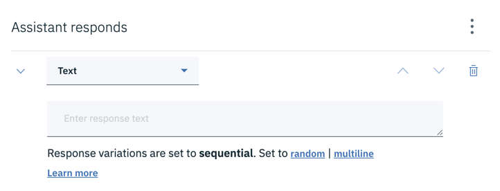
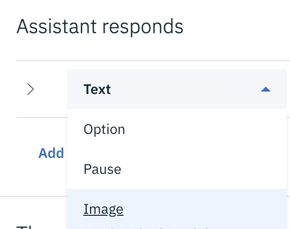
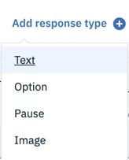
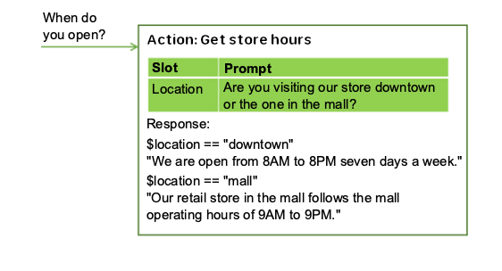
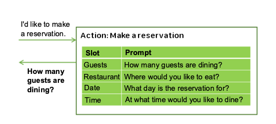
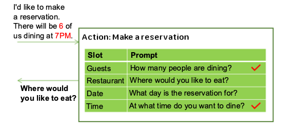
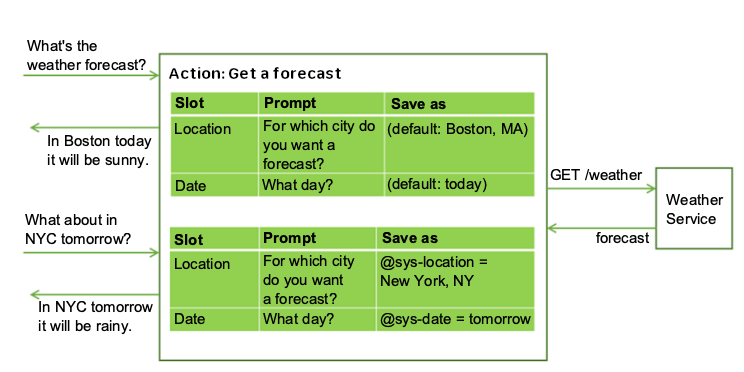
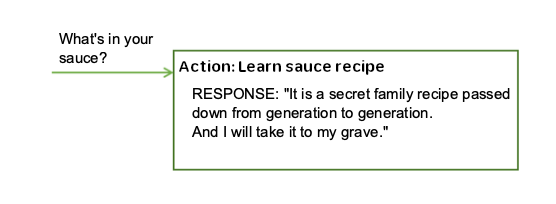

---

copyright:
  years: 2015, 2019
lastupdated: "2019-11-11"

subcollection: assistant

---

{:shortdesc: .shortdesc}
{:new_window: target="_blank"}
{:external: target="_blank" .external}
{:deprecated: .deprecated}
{:important: .important}
{:note: .note}
{:tip: .tip}
{:pre: .pre}
{:preview: .preview}
{:codeblock: .codeblock}
{:screen: .screen}
{:javascript: .ph data-hd-programlang='javascript'}
{:java: .ph data-hd-programlang='java'}
{:python: .ph data-hd-programlang='python'}
{:swift: .ph data-hd-programlang='swift'}
{:table: .aria-labeledby="caption"}

# Adding steps 
{: #steps}

A step represents an interaction or exchange of information with a customer.
{: shortdesc}

This feature is visible only in a select set of service instances where the technology preview is deployed. See [Preview details](/docs/services/assistant?topic=assistant-preview). 
{: preview}

## Steps overview
{: #steps-overview}

Each action uses a series of steps to elicit the information it needs to meet the customer's goal.

The types of steps your assistant can perform include the following tasks:

- [Showing a text message](#steps-text)
- [Displaying an image](#steps-image)
- [Asking the customer to make a choice](#steps-options)
- [Giving the assistant extra time](#steps-pause)
- [Adding messages that are responsive to customer information](#steps-mcr)
- [Collecting a series of required values](#steps-slots)

### Before you begin
{: #steps-prereq}

You must create an action in which to add steps. For information about how to create an action, see [Creating actions](/docs/services/assistant?topic=assistant-actions).

A step is defined by what you add to the *Assistant responds* section.



## Showing a text message
{: #steps-text}

1.  To show a text response to the customer, simply enter the text into the text field.

    To include a context variable value in the response, use the syntax `$variable_name` to specify it. See [Context variables](/docs/services/assistant?topic=assistant-dialog-runtime#dialog-runtime-context) for more information. 

    For example, if you know that the $user context variable is set to the current customer's name before a step is processed, then you can refer to it in the text response of the step like this:

    ```
    Hello $user
    ```
    {: codeblock}

    If the current customer's name is `Norman`, then the following response is displayed to him:

    ```
    Hello Norman
    ```
    {: screen}

### Adding rich text
{: #steps-text-rich}

If you include one of these special characters in a text response, escape it by adding a backslash (`\`) in front of it. If you are using the JSON editor, you need to use two backslashes to escape (`\\`). 

Escape special character to prevent your assistant from misinterpreting it as being one of the following artifact types:

| Special character | Artifact | Example |
|-------------------|----------|---------|
| `$` | Context variable | `The transaction fee is \$2.` |
| `@` | Entity | `Send us your feedback at feedback\@example.com.` |
{: caption="Special characters to escape in responses" caption-side="top"}

The built-in integrations support the following Markdown syntax elements:

| Format | Syntax | Example |
|------------|--------|---------|
| Italics | `We're talking about *practice*.` | We're talking about *practice*. |
| Bold | `There's **no** crying in baseball.` | There's **no** crying in baseball. |
| Hypertext link | `Contact us at [ibm.com](https://www.ibm.com).` | Contact us at [ibm.com](https://www.ibm.com). |
{: caption="Supported markdown syntax" caption-side="top"}

The "Try it out" pane does not support Markdown syntax currently. You can use the *Preview link* integration to see how the Markdown syntax is rendered.

The "Try it out" pane, and *Preview link* and *Web Chat* integrations support HTML syntax. The *Slack* and *Facebook* integrations do not.

### Adding variety
{: #steps-add-variety}

If your customers return to your assistant frequently, they might be bored to hear the same greetings and responses every time. You can add *variations* to your responses so that your assistant can respond to the same user input in different ways.

You can choose to rotate through the response variations sequentially or in random order. By default, responses are rotated sequentially, as if they were chosen from an ordered list.

To change the sequence in which individual text responses are returned, complete the following steps:

1.  Add each variation of the response into its own response variation field. For example:

    <table>
    <caption>Varying responses</caption>
    <tr>
      <th>Response variations</th>
    </tr>
    <tr>
      <td>Hello.</td>
    </tr>
    <tr>
      <td>Hi.</td>
    </tr>
    <tr>
      <td>Howdy!</td>
    </tr>
    </table>

1.  Choose one of the following response variation settings:

    - **sequential**: The system returns the first response variation the first time the step is triggered, the second response variation the second time the step is triggered, and so on, in the same order as you define the variations in the text response.
    - **random**: The system randomly selects a text string from the variations list the first time the step is triggered, and randomly selects another variation the next time, but never repeating the same text string consecutively.

### Adding multiple lines
{: #steps-multiline}

If you want a single text response to include multiple lines separated by carriage returns, then follow these steps:

1.  Add each line that you want to show to the customer as a separate sentence into its own response variation field. For example:

  <table>
  <caption>Multiple line response</caption>
  <tr>
    <th>Response variations</th>
  </tr>
  <tr>
    <td>Hi.</td>
  </tr>
  <tr>
    <td>How are you today?</td>
  </tr>
  </table>

1.  For the response variation setting, choose **multiline**.

When the response is shown to the customer, both response variations are displayed, each on its own line, like this:

```
Hi.
How are you today?
```
{: screen}

## Displaying an image
{: #steps-image}

Your assistant can show an image to the customer when it is explaining a process or telling a story. You might want to show the customer a diagram of a manufacturing process that they asked about. Or maybe you want to include an image of your company logo together with a text response when a customer asks about your company's mission statement. Visuals enhance the interaction between your assistant and the customer. 

To include an image, you simply add the image response type to a step, and provide information about the image you want to include. The source image file must be hosted somewhere and have a URL that you can use to reference it. It cannot be a file that is stored in a directory that is not publicly accessible.

### Adding an image response type
{: #steps-image-task}

1.  In the *Assistant responds* field, click **Text**, and then scroll down to find and choose **Image**.

    

    If you're adding an image to a step that already has a response type defined, click **Add response type** to add an image after it.

    

    You can reorder the response types to control the order in which they are displayed in the assistant's response.

1.  Add the full URL to the hosted image file into the **Image source** field. 

    The image must be in .jpg, .gif, or .png format. The image file must be stored in a location that is publicly addressable by URL.

    For example: `https://www.example.com/assets/common/logo.png`.

    To access an image that is stored in {{site.data.keyword.cloud}} {{site.data.keyword.cos_short}}, enable public access to the individual image storage object, and then reference it by specifying the image source with syntax like this: `https://s3.eu.cloud-object-storage.appdomain.cloud/your-bucket-name/image-name.png`.
    {: tip}

1.  If you want to display an image title and description above the embedded image in the response, then add them in the fields provided.

    Slack integrations require a title. Other integration channels ignore titles or descriptions.

## Asking the customer to make a choice
{: #steps-options}

Show customers a list of options and ask them to make a selection. Using this type of option list is useful in situations where you want to help the assistant to distinguish between similar customer goals. For some subjects, you can't trust the customer to articulate the request clearly enough to trigger the right action. With options, you can collect these similar goals in one place, and let the customer choose the correct one. The power of the feature is that you get to define the input that is submitted when the customer makes a choice. You can author input that always triggers the appropriate action.

### Adding an option response type
{: #steps-options-task}

1.  In the *Assistant responds* field, click **Text**, and then choose **Option**.

    If you're adding an options list along with another response type, such as pause, click **Add response type**, and then select **Option**.
1.  Click **Add option**.
1.  In the **List label** field, enter the option to display in the list. 

    The label can be up to 2,048 characters in length.
1.  In the corresponding **Value** field, enter the user input to pass to your assistant when this option is selected. 

    Specify a value that you know will trigger the correct action when it is submitted. For example, it might be a phrase that you copy directly from the *Customer says* field for the action you want it to trigger. The value can be up to 2,048 characters in length.
1.  Repeat the previous steps to add more options to the list.

    You can add up to 20 options.
1.  Add a list introduction in the **Title** field. The title can ask the customer to pick from the list of options.

    Some integration channels do not display the title.
1.  Optionally, add additional information in the **Description** field. If specified, the description is displayed after the title and before the option list.

    Some integration channels do not display the description.

For example, you can construct a response like this:

<table>
<caption>Response options</caption>
<tr>
  <th>List title</th>
  <th>List description</th>
  <th>Option label</th>
  <th>User input submitted when clicked</th>
</tr>
<tr>
  <td>Insurance types</td>
  <td>Which of these items do you want to insure?</td>
  <td></td>
  <td></td>
</tr>
<tr>
  <td></td>
  <td></td>
  <td>Boat</td>
  <td>I want to buy boat insurance</td>
</tr>
<tr>
  <td></td>
  <td></td>
  <td>Car</td>
  <td>I want to buy car insurance</td>
</tr>
<tr>
  <td></td>
  <td></td>
  <td>Home</td>
  <td>I want to buy home insurance</td>
</tr>
</table>

## Giving the assistant extra time
{: #steps-pause}

There might be steps that your assistant takes that require a little extra time, such as waiting for an external service to finish a process. You can build a visual indicator into your action that lets the customer know that the assistant is still there and is actively working on their request. To buy the assistant some time, as it were, add a pause response type to your step. The assistant shows a typing indicator to the customer. 

This response type is especially useful if you are making a programmatic call from the action by using a webhook, because such calls can take a few seconds to return a response. For more information about webhooks, see [Making a programmatic call from dialog](/docs/services/assistant?topic=assistant-dialog-webhook).

### Adding a pause response type
{: #steps-pause-task}

1.  In the *Assistant responds* field, click **Text**, and then choose **Pause**.

    If you're adding a pause along with another response type, click **Add response type**, and then select **Pause**.
1.  Add the length of time for the pause to last as a number of milliseconds (ms) to the **Duration** field.

    Customers are typically willing to wait about 8 seconds (8,000 ms) for someone to enter a response. 
    
1.  To prevent a typing indicator from being displayed during the pause, choose **Off**.

1.  Add another response type, such as a text response type, after the pause to clearly denote when the pause ends.

## Adding messages that are responsive to customer information
{: #steps-mcr}

Author a set of alternative responses to share with the customer that change based on information you know about the customer or other conditions. For example, you might check whether the customer is a member of a customer loyalty program before you offer them a discount as part of the response. Or you might check which state the customer lives in before you share details about insurance coverage that differs by state.

### Enabling multiple conditioned responses
{: #steps-mcr-task}

To add messages that are responsive to information about the customer, enable multiple conditioned responses.

1.  From the step where you want to define responsive messages, click the **Customize** icon , and then click the **Multiple conditioned responses** switch to turn it **On**.

    The response section changes to show a pair of condition and response fields. You can add a condition and a response into them.
1.  To customize a response further, click the **Edit response**  icon next to the response.

    You must open the response for editing to complete the following tasks:

    - **Update context**. To change the value of a context variable when the response is triggered, you need to open the context editor from the response edit view. 
    
      You update context for each individual conditional response; there is no common context editor or JSON editor where you can edit all of the conditional responses at once.
      {: note}
    - **Add rich responses**. To add a response type other than a text response.
    - **Configure a jump**. To instruct your assistant to jump somewhere after this conditional response is processed. 
    
      You configure the **Jump to** from the *Then your assistant should* section of the response edit view. Identify the step or action that you want your assistant to process next. For help configuring a jump to a step, see [Configuring a jump to another step](/docs/services/assistant?topic=assistant-actions#actions-jump-to-config).

      A jump that is configured for the step itself is not processed until all of the conditional responses are processed. Therefore, if a conditional response is configured to jump to another step or action, and that conditional response is triggered, the jump configured for the current step will never be processed, and will not occur.
      {: tip}

1.  Click **Add response** to add another conditional response.

The conditions within a step are evaluated in order, just as steps are. Be sure that your conditional responses are listed in the correct order.  If you need to change the order, select a condition and response pair and move it up or down in the list by using the arrows that are displayed.

## Collecting a series of required values
{: #steps-slots}

Add slots to a step to enable the step to gather multiple pieces of information from a customer within that step. Slots collect information at the customer's pace. Details that a customer provides up front are saved, and your assistant asks only for the missing details it needs to fulfill the request.

Sometimes your assistant needs information from the customer before it can respond accurately. For example, if customers ask about operating hours, but the hours differ by store location, your assistant could ask a follow-up question about which store location they plan to visit before it answers. You can then add conditioned responses that take the provided location information into account.



Slots can help your assistant collect multiple pieces of information that it needs to complete a complex task for a customer, such as making a dinner reservation.



The customer might provide values for mutliple slots at once. For example, the input might include the information, `There will be 6 of us dining at 7 PM.` This one input contains two of the missing required values: the number of guests and time of the reservation. Your assistant recognizes and stores both of them, each one in its corresponding slot. It then displays the prompt that is associated with the next empty slot.



Slots also make it possible for your assistant to answer follow-up questions without having to reestablish the customer's goal. For example, a customer might ask for a weather forecast, then ask a follow-up question about weather in another location or on a different day. If you save the required forecast variables, such as location and day, in slots, then if a customer asks a follow-up question with new variable values, you can overwrite the slot values with the new values provided, and give a response that reflects the new information. (For more information about how to call an external service, see [Making programmatic calls from dialog](/docs/services/assistant?topic=assistant-dialog-webhooks)).



Using slots produces a more natural conversational flow between your assistant and your customer, and is easier for you to manage than trying to collect the information by using many separate steps.

### Adding slots
{: #actions-slots-task}

1.  Identify the units of information that you want to collect. 

    For example, to order a pizza for someone, you might want to collect the following information:

    - Delivery time
    - Size
1.  From the step where you want to collect values, click the **Customize** icon , and then click the switch next to *Slots* to turn it **On**.

    To author a response that asks the customer to provide all of the values you need at once, select the **Prompt for everything** checkbox.
1.  **Add a slot for each unit of required information**. For each slot, specify these details:

    - **Check for**: Identify the type of information you want to extract from the customer's response to the slot prompt. In most cases, you check for entity values. In fact, the condition builder that is displayed suggests entities that you can check for. However, you can also check for an intent; just type the intent name into the field. You can use AND and OR operators here to define more complex conditions.

      The *Check for* value is first used as a condition, but then becomes the value of the context variable that you name in the *Save as* field. It specifies both **what to check for** and **what to save**. If you want to change how the value is saved, then add the expression that reformats the value to the *Check for* field.
      {: important}

      For example, if the entity is a pattern entity, such as `@email`, then after adding the entity name, append `.literal` to it. Adding `.literal` indicates that you want to capture the exact text that was entered by the customer and was identified as an email address based on its pattern.

      In some cases, you might want to use an expression to capture the value, but not apply the expression to what is saved. In such cases, you can use one value in the *Check for* field to capture the value, and then open the JSON editor to change the value of the context variable, so it saves something else.

      Any edit you make to a slot's context variable value in the JSON editor is not reflected in the **Check for** field after you exit the JSON editor. And if you click the **Check for** field to give the field focus at any time after you use the JSON editor to edit the value, then the change you made is lost.
      {: important}

      Avoid checking for context variable values in the *Check for* field. Because the value you check for is also the value that is saved, using a context variable in the condition can lead to unexpected behavior.

    - **Save as**: Provide a name for the context variable in which to store the value of interest from the customer's response to the slot prompt.

       Do not reuse a context variable that is used elsewhere in the dialog. If the context variable has a value already, then the slot's prompt is not displayed. It is only when the context variable for the slot is null that the prompt for the slot is displayed.

    - **Prompt**: Write a statement that elicits the piece of the information you need from the customer. After displaying this prompt, the conversation pauses and your assistant waits for the customer to reply.

      If you want the prompt to be something other than a text response, you can change the response type by clicking the **Edit slot**  icon. Click **Text** to choose a different response type. 
      
    - If you want different follow-up statements to be shown based on whether the customer provides the information you need in response to the initial slot prompt, you can edit the slot (by clicking the **Edit slot**  icon) and define the follow-up statements:

      - **Found**: Displayed after the customer provides the expected information.

      - **Not found**: Displayed if the information provided by the customer is not understood, or is not provided in the expected format. If the slot is filled successfully, or the customer input is understood and handled by a slot handler, then this statement is never displayed.

      For information about how to define conditions and associated actions for Found and Not found responses, see [Adding conditions to Found and Not found responses](/docs/services/assistant?topic=assistant-dialog-slots#dialog-slots-handler-next-steps).

    This table shows example slot values for a step that helps customers place a pizza order by collecting two pieces of information, the pizza size and delivery time.

    <table>
    <caption>Example slots for pizza order</caption>
    <tr>
      <th>Check for</th>
      <th>Save as</th>
      <th>Prompt</th>
      <th>Follow-up if found</th>
      <th>Follow-up if not found</th>
    </tr>
    <tr>
      <td>@size</td>
      <td>$size</td>
      <td>What size pizza would you like?</td>
      <td>$size it is.</td>
      <td>What size did you want? We have small, medium, and large.</td>
    </tr>
    <tr>
      <td>@sys-time</td>
      <td>$time</td>
      <td>When do you need the pizza by?</td>
      <td>For delivery by $time.</td>
      <td>What time did you want it delivered? We need at least a half hour to prepare it.</td>
    </tr>
    </table>

1.  **Make a slot optional or disable it under certain conditions**. You can optionally configure a slot in these ways:

    - **Optional**: To make a slot optional, add a slot without a prompt. Your assistant does not ask the customer for the information, but it does look for the information in the user input, and saves the value if the customer provides it. For example, you might add a slot that captures dietary restriction informations in case the customer specifies any. However, you don't want to ask all customers for dietary information since it is irrelevant in many cases.

       <table>
       <caption>Optional slot</caption>
       <tr>
          <th>Information</th>
          <th>Check for</th>
          <th>Save as</th>
       </tr>
       <tr>
          <td>Wheat restriction</td>
          <td>@dietary</td>
          <td>$dietary</td>
      </tr>
      </table>

      If you make a slot optional, only reference its context variable in the step-level response text if you can word it such that it makes sense even if no value is provided for the slot. For example, you might word a summary statement like this, `I am ordering a $size $dietary pizza for delivery at $time.` The resulting text makes sense whether the dietary restriction information, such as `gluten-free` or `dairy-free`, is provided or not. The result is either, `I am ordering a large gluten-free pizza for delivery at 3:00PM.` or `I am ordering a large pizza for delivery at 3:00PM.`
      {: tip}

    - **Conditional**: If you want a slot to be enabled only under certain conditions, then you can add a condition to it. For example, if slot 1 asks for a meeting start time, slot 2 captures the meeting duration, and slot 3 captures the end time, then you might want to enable slot 3 (and ask for the meeting end time) only if a value for slot 2 is not provided. To make a slot conditional, edit the slot, and then from the **More**  menu, select **Enable condition**. Define the condition that must be met for the slot to be enabled.

      You can condition on the value of a context variable from an earlier slot because the order in which the slots are listed is the order in which they are evaluated. However, only condition on a slot context variable that you can be confident will contain a value when this slot is evaluated. The earlier slot must be a required slot, for example.
    {: tip}
1.  **Keep customers on track**. You can optionally define slot handlers that provide responses to questions customers might ask during the interaction that are tangential to the purpose of the step.

    For example, the customer might ask about the tomato sauce recipe or where you get your ingredients. To handle such off-topic questions, click the **Manage handlers** link and add a condition and response for each anticipated question.

    

    After responding to the off-topic question, the prompt associated with the current empty slot is displayed.

    This condition is triggered if the customer provides input that matches the slot handler conditions at any time during the conversatin up until the step-level response is displayed. See [Handling requests to exit a process](/docs/services/assistant?topic=assistant-dialog-slots#dialog-slots-node-level-handler) for more ways to use the slot handler.
1.  **Add a step-level response**. The step-level response is not executed until after all of the required slots are filled. You can add a response that summarizes the information you collected. For example, `A $size pizza is scheduled for delivery at $time. Enjoy!`

    You can alternatively show an image or list of options as a response instead of a text response.

## Step limits
{: #steps-limits}

The number of steps you can create per skill depends on your plan type.

| Plan     | Steps per skill     |
|------------------|---------------------------:|
| Premium          |                    100,000 |
| Plus             |                    100,000 |
| Plus Trial       |                     25,000 |
| Standard         |                    100,000 |
| Lite             |                     25,000 |
{: caption="Plan details" caption-side="top"}

## Copying a step
{: #steps-copy}

You can duplicate a step to create an exact copy of it as a peer step. The duplicate step is added directly below the original step in the steps list for the action. The new copy of the step is given the same name as the original step, but with `- copyn` appended to it, where `n` is a number that starts with 1. If you duplicate the same step more than once, then the `n` in the name increments by one for each copy to help you distinguish the copies from one another.

When you duplicate a step that has substeps, the substeps are duplicated also. The copied substeps have the exact same names as the original substeps. The only way to distinguish a copied substep from an original substep is the `copy` reference in the parent step name.

1.  From the steps view for the action, find the step you want to copy, and then click the **More**  icon and select **Duplicate**.
1.  Rename the copied step so you can tell it apart from the original.
