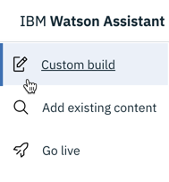
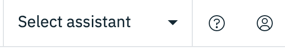
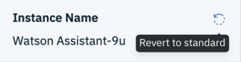

---

copyright:
  years: 2015, 2020
lastupdated: "2019-12-17"

subcollection: assistant

---

{:shortdesc: .shortdesc}
{:new_window: target="_blank"}
{:external: target="_blank" .external}
{:deprecated: .deprecated}
{:important: .important}
{:note: .note}
{:tip: .tip}
{:pre: .pre}
{:preview: .preview}
{:codeblock: .codeblock}
{:screen: .screen}
{:javascript: .ph data-hd-programlang='javascript'}
{:java: .ph data-hd-programlang='java'}
{:python: .ph data-hd-programlang='python'}
{:swift: .ph data-hd-programlang='swift'}

# Preview details 
{: #preview}

A select group of customers is being presented with a technology preview version of the product instead of the standard user experience. This topic describes the features that are available only to users of the Preview experience. 

The product documentation describes how to complete tasks in the standard user experience. Therefore, much of the content is not applicable to the version of the product you are using. Stay in the **Technology preview** section of the table of contents to find information about how to complete tasks in the preview user experience.
{: important}

In particular, the preview experience removes the **Dialog**, **Intents**, and **Content Catalog** pages (and replaces them with a single Actions page). Any documentation that describes the removed pages is not applicable to the version of the product you are using.

## Available preview features
{: #preview-features}

The following features are available in the technology preview experience only.
{: preview}

- **Actions**: Use actions to take a conversation-first approach to defining what your assistant will do to help your customers. See [Creating actions](/docs/services/assistant?topic=assistant-actions).

- **New navigation**: A new navigation bar is available in some locations. Use the menu to switch between key tasks you can complete for the current assistant, such as building a dialog skill, building a search skill, or deploying the assistant.

  

  Before you can access the menu options, you must choose the assistant that you want to work with.
  {: note}
  

## Tell us what you think
{: #preview-feedback}

To share your feedback, join the [Watson Developer Community on Slack](http://wdc-slack-inviter.mybluemix.net/){: external}. Add your first impressions and suggestions to the **#assistant-early-access** channel.

## Opting out of the preview experience
{: #preview-opt-out}

If you would prefer to work with the standard user experience, you can revert to the standard version of the product from the account page. 

1.  To open the account page, click the user icon  that is displayed in the page header.
1.  Find the service instance name.

    

1.  Click the *Revert to standard*  icon, and then click **Revert to standard**.
