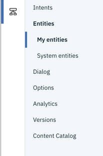

---

copyright:
  years: 2015, 2019
lastupdated: "2019-11-07"

subcollection: assistant

---

{:shortdesc: .shortdesc}
{:new_window: target="_blank"}
{:external: target="_blank" .external}
{:deprecated: .deprecated}
{:important: .important}
{:note: .note}
{:tip: .tip}
{:pre: .pre}
{:codeblock: .codeblock}
{:screen: .screen}
{:javascript: .ph data-hd-programlang='javascript'}
{:java: .ph data-hd-programlang='java'}
{:python: .ph data-hd-programlang='python'}
{:swift: .ph data-hd-programlang='swift'}

# Release notes
{: #release-notes}

## Service API Versioning
{: #release-notes-api-version}

API requests require a version parameter that takes a date in the format `version=YYYY-MM-DD`. Whenever we change the API in a backwards-incompatible way, we release a new minor version of the API.

Send the version parameter with every API request. {{site.data.keyword.conversationshort}} uses the API version for the date you specify, or the most recent version before that date. Don't default to the current date. Instead, specify a date that matches a version that is compatible with your app, and don't change it until your app is ready for a later version.

- The current version for V1 is `2019-02-28`.
- The current version for V2 is `2019-02-28`.
- The dialog skill "Try it out" pane uses version `2018-07-10`.
- The search skill "Try it out" pane uses {{site.data.keyword.discoveryshort}} API version `2018-12-03`.

## Beta features
{: #release-notes-beta}

IBM releases services, features, and language support for your evaluation that are classified as beta. These features might be unstable, might change frequently, and might be discontinued with short notice. Beta features also might not provide the same level of performance or compatibility that generally available features provide and are not intended for use in a production environment. Beta features are supported only on the [IBM Developer Answers](https://developer.ibm.com/answers/topics/watson-assistant/){: external}.

## Updated models
{: #release-notes-updated-models}

The {{site.data.keyword.conversationshort}} algorithms may be periodically refined and updated based on feedback, scientific enhancements, and additional factors, in order to continuously enhance the performance. Updates to the model will be communicated in these release notes.

Existing models that you have trained will not be immediately impacted, but expired models will be updated to the current model, if you have not already done so, after 60 days of a new model becoming available.

**Note:** This updating statement applies to Generally Available (GA) languages and features only.

7 November 2019
{: 7Novembber2019}
<!--1.82-->

- **Irrelevance detection has been added**: When enabled, a supplemental model is used to help identify utterances that are irrelevant and should not be answered by the dialog skill. This new model is especially beneficial for skills that have not been trained on what subjects to ignore. This feature is available for English skills only. For more information, see [New irrelevant topic detection](/docs/services/assistant?topic=assistant-irrelevance-detection).

## 24 October 2019
{: #24October2019}
<!--1.80-->

- **Testing improvement**: You can now see the top three intents that were recognized in a test user input from the "Try it out" pane. For more details, see [Testing your dialog](/docs/services/assistant?topic=assistant-dialog-build#dialog-build-test).

## 16 October 2019
{: #16October2019}

The changes from 14 October are now available in Dallas.

## 14 October 2019
{: #14October2019}
<!--1.79-->

The following updates are available in all locations except Dallas currently.
{: important}

- Deploy your assistant in minutes. Create a web chat integration to embed your assistant into a page on your website as a chat widget. See [Integrating with your own website](/docs/services/assistant?topic=assistant-deploy-web-chat).

- The main menu options of **Assistants** and **Skills** have moved from being displayed at the top of the page to being shown as icons on the side of the page.

  -  Assistants
  -  Skills

  The tabbed pages for the tools you use to develop a dialog skill were moved to a secondary navigation bar that is displayed when you open the skill.

  

- **Rich response types are supported in a dialog node with slots**. You can display a list of options for a user to choose from as the prompt for a slot, for example. See [Adding rich responses to slots](dialog-slots-multimedia).

- Where you go to switch service instances has changed. See [Switching the service instance](/docs/services/assistant?topic=assistant-skill-open#skill-open-switch-instance).

- **Known issue: Cannot rename search skills**: You currently cannot rename a search skill after you create it. 
 
## 9 October 2019 
{: #9October2019}

- **New system entities changes**: The following updates have been made:

  - In addition to English and German, the new numeric system entities are now available in these languages: Brazilian Portuguese, Czech, French, Italian, and Spanish.
  - The `part_of_day` property of the `@sys-time` entity now returns a time range instead of a single time value.

## 23 September 2019 
{: #23September2019}

- **Dallas updates**: The updates from 20 September are now available to service instances hosted in Dallas.

## 20 September 2019 
{: #20September2019}
<!--1.77-->

The following updates are available in all locations except Dallas currently.
{: important}

- **Inactivity timeout increase**: The maximum inactivity timeout can now be extended to up to 7 days for Premium plans. See [Changing the inactivity timeout setting](/docs/services/assistant?topic=assistant-assistant-settings).

- **Pattern entity fix**: A change that was introduced in the previous release which changed all alphabetic characters to lower case at the time an entity value was added has been fixed. The case of any alphabetic characters that are part of a pattern entity value are no longer changed when the value is added. <!--30545-->

- **Dialog text response syntax fix**: Fixed a bug in which the format of a dialog response reverted to an earlier version of the JSON syntax. Standard text responses were being saved as `output.text` instead of `output.generic`. For more information about the `output` object, see [Anatomy of a dialog call](/docs/services/assistant?topic=assistant-dialog-runtime#dialog-runtime-message-anatomy). <!--30176-->

## 13 September 2019 
{: #13September2019}
<!--1.76-->

- **Improved Entities and Intents page responsiveness**: The Entities and Intents pages were updated to use a new JavaScript library that increases the page responsiveness. As a result, the look of some graphical user interface elements, such as buttons, changed slightly, but the function did not.

- **Creating contextual entities got easier**: The process you use to annotate entity mentions from intent user examples was improved. You can now put the intent page into annotation mode to more easily select and label mentions. See [Adding contextual entities](/docs/services/assistant?topic=assistant-entities#entities-create-annotation-based).

## 6 September 2019
{: #6September2019}

- **Label character limit increase**: The limit to the number of characters allowed for a label that you define for an option response type changed from 64 characters to 2,048 characters. <!--1.75 --> 

## 12 August 2019
{: #12August2019}

- **New dialog method**: The `getMatch` method was added. You can use this method to extract a specific occurrence of a regular expression pattern that recurs in user input. For more details, see the [dialog methods](/docs/services/assistant?topic=assistant-dialog-methods#dialog-methods-strings-getMatch) topic.

## 9 August 2019
{: #9August2019}

- **Introductory product tour**: For some first-time users, a new introductory product tour is shown that the user can choose to follow to perform the initial steps of creating an assistant.

## 6 August 2019
{: #6August2019}

- Webhook callouts and Dialog page improvements are available in Dallas.

## 1 August 2019
{: #1August2019}

The following updates are available in all locations except Dallas currently.
{: important}

- **Webhook callouts are available**: Add webhooks to dialog nodes to make programmatic calls to an external application as part of the conversational flow. The new Webhook support simplifies the callout implementation process. (No more `action` JSON objects required.) For more information, see [Making a programmatic call from a dialog node](/docs/services/assistant?topic=assistant-dialog-webhooks).

- **Improved dialog page responsiveness**: In all service instances, the user interface of the Dialog page was updated to use a new JavaScript library that increases the page responsiveness. As a result, the look of some graphical user interface elements, such as buttons, changed slightly, but the function did not.

## 31 July 2019
{: #31July2019}

- **Search skill and autocorrection are generally available**: The search skill and spelling autocorrection features, which were previously available as beta features, are now generally available. 

  - Search skills can be created by users of Plus or Premium plans only. 
  - You can enable autocorrection for English-language dialog skills only. It is enabled automatically for new English-language dialog skills.

## 26 July 2019
{: #26July2019}

- **Missing skills issue is resolved**: In some cases, workspaces that were created through the API only were not being displayed when you opened the {{site.data.keyword.conversationshort}} user interface. This issue has been addressed. All workspaces that you create by using the API are displayed as dialog skills when you open the user interface.

## 23 July 2019
{: #23July2019}

- **Dialog search is fixed**: In some skills, the search function was not working in the Dialog page. The issue is now fixed.

## 17 July 2019
{: #17July2019}

- **Disambiguation choice limit**: You can now set the maximum number of options to show to users when the assistant asks them to clarify what they want to do. For more information about disambiguation, see [Disambiguation](/docs/services/assistant?topic=assistant-dialog-runtime#dialog-runtime-disambiguation).

- **Dialog search issue**: In some skills, the search function is not working in the Dialog page. A new user interface library, which increases the page responsiveness, is being rolled out to existing service instances in phases. This search issue affects only dialog skills for which the new library is not yet enabled.

- **Missing skills issue**: In some cases, workspaces that were created through the API only are not being displayed when you open the {{site.data.keyword.conversationshort}} user interface. Normally, these workspaces are displayed as dialog skills. If you do not see your skills from the UI, don't worry; they are not gone. Contact support to report the issue, so the team can enable the workspaces to be displayed properly.

<!--- **Premium plan maximum inactivity period increases**: The maximum time that a session can persist after a user stops interacting with the assistant increased from 1 day to 7 days (168 hours).
-->
## 15 July 2019
{: #15July2019}

- **Numeric system entities upgrade available in Dallas **: The new system entities are now also available as a beta feature for instances that are hosted in Dallas. See [New system entities](/docs/services/assistant?topic=assistant-beta-system-entities)

## 12 June 2019
{: #12June2019}

- **Numeric system entities upgrade **: New system entities are available as a beta feature that you can enable in dialog skills that are written in English or German. The revised system entities offer better date and time understanding. They can recognize date and number spans, national holiday references, and classify mentions with more precision. For example, a date such as `May 15` is recognized as a date mention(`@sys-date:2019-05-15`), and is *not* also identified as a number mention (`@sys-number:15`). See [New system entities](/docs/services/assistant?topic=assistant-beta-system-entities)

  You cannot try out these system entities in instances hosted in Dallas currently. 
  {: note}

- **A Plus Trial plan is available**: You can use the free Plus Trial plan to try out the features of the Plus plan as you make a purchasing decision. The trial lasts for 30 days. After the trial period ends, if you do not upgrade to a Plus plan, your Plus Trial instance is converted to a Lite plan instance.

## 23 May 2019
{: #23May2019}

The following updates are available in all locations except Dallas currently.
{: important}

- **Updated navigation**: The home page was removed, and the order of the Assistants and Skills tabs was reversed. The new tab order encourages you to start your development work by creating an assistant, and then a skill. 

- **Disambiguation settings have moved**: The toggle to enable disamibugation, which is a feature that is available to Plus and Premium plan users only, has moved. The **Settings** button was removed from the **Dialog** page. You can now enable disambiguation and configure it from the skill's **Options** tab.

- **An introductory tour is now available**: A short product tour is now displayed when a new service instance is created. Brand new users are also given help as they start development. A new assistant is created for them automatically. Informational popups are displayed to introduce the product user interface features, and guide the new user toward taking the key first step of creating a dialog skill. 

## 10 April 2019
{: #10April2019}

- **Autocorrection is now available **: Autocorrection is a beta feature that helps your assistant understand what your customers want. It corrects misspellings in the input that customers submit before the input is evaluated. With more precise input, your assistant can more easily recognize entity mentions and understand the customer's intent. See [Correcting user input](/docs/services/assistant?topic=assistant-dialog-runtime#dialog-runtime-spell-check) for more details.

## 22 March 2019
{: #22March2019}

- **Introducing search skill **: A search skill helps you to make your assistant useful to customers faster. Customer inquiries that you did not anticipate and so have not built dialog logic to handle can be met with useful responses. Instead of saying it can't help, the assistant can query an external data source to find relevant information to share in its response. Over time, you can build dialog responses to answer customer queries that require follow-up questions to clarify the user's meaning or for which a short and clear response is suitable. And you can use search skill responses to address more open-ended customer queries that require a longer explanation. This beta feature is available to users of Premium and Plus service plans only. 

  See [Building a search skill](/docs/services/assistant?topic=assistant-skill-search-add) for more details.

## 14 March 2019
{: #14March2019}

- **Have Watson help you build intents**: Use Watson machine learning technology to help you choose the right intents for your assistant. Watson analyzes your existing call center log data to identify the customer questions and requests that occur most often. It then recommends intents and user examples you can use to train your assistant so it can recognize the same and similar requests in future. Once you determine the right intents to use, you can augment them and keep them up-to-date over time using the intent user example recommendations functionality, which is already available. For more information, see [Get help defining intents](/docs/services/assistant?topic=assistant-intent-recommendations).

## 4 March 2019
{: #4March2019}

- **Simplified navigation**: The sidebar navigation with separate *Build*,  *Improve*, and *Deploy* tabs has been removed. Now, you can get to all the tools you need to build a dialog skill from the main skill page.

- **Improve page is now called Analytics**: The informational metrics that Watson generates from conversations between your users and your assistant moved from the *Improve* tab of the sidebar to a new tab on the main skill page called **Analytics**.

## 1 March 2019
{: #1March2019}

- **Japanese intent user example recommendations **: You can now upload a file that contains raw user inputs in Japanese, such as user inquiries from a call center log, that Watson can analyze and mine for intent user example candidates. See [Adding examples from log files](/docs/services/assistant?topic=assistant-intent-recommendations).

## 28 February 2019
{: #28February2019}

- **New API version**: The current API version is now `2019-02-28`. The following changes were made with this version:

    - The order in which conditions are evaluated in nodes with slots has changed. Previously, if you had a node with slots that allowed for digressions away, the `anything_else` root node was triggered before any of the slot level Not found conditions could be evaluated. The order of operations has been changed to address this behavior. Now, when a user digresses away from a node with slots, all the root nodes except the `anything_else` node are processed. Next, the slot level Not found conditions are evaluated. And, finally, the root level `anything_else` node is processed. To better understand the full order of operations for a node with slots, see [Slot usage tips](/docs/services/assistant?topic=assistant-dialog-slots#dialog-slots-node-level-handler).

    - Strings that begin with a number sign (#) in the `context` or `output` objects of a message are no longer treated as intent references.
  
      Previously, these strings were treated as intents automatically. For example, if you specified a context variable, such as `"color":"#FFFFFF"`, then the hex color code (#FFFFFF) would be treated as an intent. Your assistant would check whether an intent named #FFFFFF was detected in the user's input, and if not, would replace #FFFFFF with `false`. This replacement no longer occurs.
  
      Similarly, if you included a number sign (#) in the text string in a node response, you used to have to escape it by preceding it with a back slash (`\`). For example, `We are the \#1 seller of lobster rolls in Maine.` You no longer need to escape the `#` symbol in a text response.

      This change does not apply to node or condtional response conditions. Any strings that begin with a number sign (#) which are specified in conditions continue to be treated as intent references. Also, you can use SpEL expression syntax to force the system to treat a string in the `context` or `output` objects of a message as an intent. For example, specify the intent as `<? #intent-name ?>`.

## 25 February 2019
{: #25February2019}

**Slack integration enhancement**: You can now choose the type of event that triggers your assistant in a Slack channel. Previously, when you integrated your assistant with Slack, the assistant interacted with users through a direct message channel. Now, you can configure the assistant to listen for mentions, and respond when it is mentioned in other channels. You can choose to use one or both event types as the mechanism through which your assistant interacts with users.

## 11 February 2019
{: #11February2019}

**Integrate with Intercom**: Intercom, a leading customer service messaging platform, has partnered with IBM to add a new agent to the team, a virtual Watson Assistant. You can integrate your assistant with an Intercom application to enable the app to seamlessly pass user conversations between your assistant and human support agents. This integration is available to Plus and Premium plan users only. See [Integrating with Intercom](/docs/services/assistant?topic=assistant-deploy-intercom) for more details.

## 8 February 2019
{: #8February2019}

- **Version your skills**: You can now capture a snapshot of the the intents, entities, dialog, and configuration settings for a skill at key points during the development process. With versions, it's safe to get creative. You can deploy new design approaches in a test environment to validate them before you apply any updates to a production deployment of your assistant. See [Creating skill versions](/docs/services/assistant?topic=assistant-versions) for more details.

- **Arabic content catalog**: Users of Arabic-language skills can now add prebuilt intents to their dialogs. See [Using content catalogs](/docs/services/assistant?topic=assistant-catalog) for more information.

## 17 January 2019
{: #17January2019}

- **Czech language support is generally available**: Support for the Czech language is no longer classified as beta; it is now generally available. See [Supported languages](/docs/services/assistant?topic=assistant-language-support) for more information.

- **Language support improvements**: The language understanding components were updated to improve the following features:

  - German and Korean system entities
  - Intent classification tokenization for Arabic, Dutch, French, Italian, Japanese, Portuguese, and Spanish

## 4 January 2019
{: #4January2019}

- **IBM Cloud Functions in DC and London locations**: You can now make programmatic calls to IBM Cloud Functions from the dialog of an assistant in a service instance that is hosted in the London and Washington, DC data centers. See [Making programmatic calls from a dialog node](/docs/services/assistant?topic=assistant-dialog-actions-client).

- **New methods for working with arrays**: The following SpEL expression methods are available that make it easier to work with array values in your dialog:

  - **JSONArray.filter**: Filters an array by comparing each value in the array to a value that can vary based on user input.
  - **JSONArray.includesIntent**: Checks whether an `intents` array contains a particular intent.
  - **JSONArray.indexOf**: Gets the index number of a specific value in an array.
  - **JSONArray.joinToArray**: Applies formatting to values that are returned from an array.

   See the [array method documentation](/docs/services/assistant?topic=assistant-dialog-methods#dialog-methods-arrays) for more details.

## 13 December 2018
{: #13December2018}

- **London data center**: You can now create {{site.data.keyword.conversationshort}} service instances that are hosted in the London data center without syndication. See [Data centers](/docs/services/assistant?topic=assistant-services-information#services-information-regions) for more details.

- **Dialog node limit changes**: The dialog node limit was temporarily changed from 100,000 to 500 for new Standard plan instances. This limit change was later reversed. If you created a Standard plan instance during the time frame in which the limit was in effect, your dialogs might be impacted. The limit was in effect for skills created between 10 December and 12 December 2018. The lower limits will be removed from all impacted instances in January. If you need to have the lower limit lifted before then, open a support ticket.

## 1 December 2018
{: #1December2018}

   To determine the number of dialog nodes in a dialog skill, do one of the following things:

   - From the tool, if it is not associated with an assistant already, add the dialog skill to an assistant, and then view the skill tile from the main page of the assistant. The *trained data* section lists the number of dialog nodes.

   - Send a GET request to the /dialog_nodes API endpoint, and include the `include_count=true` parameter. For example:

     ```curl
     curl -u "apikey:{apikey}" "https://gateway.watsonplatform.net/assistant/api/v1/workspaces/{workspace_id}/dialog_nodes?version=2018-09-20&include_count=true"
     ```

     In the response, the `total` attribute in the `pagination` object contains the number of dialog nodes.

     See [Troubleshooting skill import issues](/docs/services/assistant?topic=assistant-skill-dialog-add#skill-dialog-add-import-errors) for information about how to edit skills that you want to continue using.

## 27 November 2018
{: #27November2018}

- **A new service plan, the Plus plan, is available**: The new plan offers premium-level features at a lower price point. Unlike previous plans, the Plus plan is a user-based billing plan. It measures usage by the number of unique users that interact with your assistant over a given time period. To get the most from the plan, if you build your own client application, design your app such that it defines a unique ID for each user, and passes the user ID with each /message API call. For the built-in integrations, the session ID is used to identify user interactions with the assistant. See [User-based plans](/docs/services/assistant?topic=assistant-services-information#services-information-user-based-plans) for more information.

  <table>
  <caption>Plus plan limits</caption>
    <tr>
      <th>Artifact</th>
      <th>Limit</th>
    </tr>
    <tr>
      <td>Assistants</td>
      <td>100</td>
    </tr>
    <tr>
       <td>Contextual entities</td>
       <td>20</td>
    </tr>
    <tr>
       <td>Contextual entity annotations</td>
       <td>2,000</td>
    </tr>
    <tr>
       <td>Dialog nodes</td>
       <td>100,000</td>
    </tr>
    <tr>
       <td>Entities</td>
       <td>1,000</td>
    </tr>
    <tr>
       <td>Entity synonyms</td>
       <td>100,000</td>
    </tr>
    <tr>
       <td>Entity values</td>
       <td>100,000</td>
    </tr>
    <tr>
       <td>Intents</td>
       <td>2,000</td>
    </tr>
    <tr>
       <td>Intent user examples</td>
       <td>25,000</td>
    </tr>
    <tr>
       <td>Integrations</td>
       <td>100</td>
    </tr>
    <tr>
       <td>Logs</td>
       <td>30 days</td>
    </tr>
    <tr>
       <td>Skills</td>
       <td>50</td>
    </tr>
  </table>

- **User-based Premium plan**: The Premium plan now bases its billing on the number of active unique users. If you choose to use this plan, design any custom applications that you build to properly identify the users who generate /message API calls. See [User-based plans](/docs/services/assistant?topic=assistant-services-information#services-information-user-based-plans) for more information.

  Existing Premium plan service instances are not impacted by this change; they continue to use API-based billing methods. Only existing Premium plan users will see the API-based plan listed as the *Premium (API)* plan option.
  {: note}

  See {{site.data.keyword.conversationshort}} [service plan options](https://www.ibm.com/cloud/watson-assistant/pricing/){: external} for more information about all available service plans.

- **Intent user example recommendations **: You can upload a file that contains raw user inputs, such as user inquiries from a call center log, that Watson can analyze and mine for intent user example candidates. See [Adding examples from log files](/docs/services/assistant?topic=assistant-intent-recommendations#intent-recommendations-get-example-recommendations).

## 20 November 2018
{: #20November2018}

**Recommendations are discontinued**: The Recomendations section on the Improve tab was removed. Recommendations was a beta feature available to Premium plan users only. It recommended actions that users could take to improve their training data. Instead of consolidating recommendations in one place, recommendations are now being made available from the parts of the tool where you make actual training data changes. For example, while adding entity synonyms, you can now opt to see a list of synonymous terms that are recommended by Watson. If you are looking for other ways to analyze your user conversation logs in more detail, consider using Jupyter notebooks. See [Advanced tasks](/docs/services/assistant?topic=assistant-logs-resources) for more details.

## 9 November 2018
{: #9November2018}

- **Major user interface revision**: The {{site.data.keyword.conversationshort}} service has a new look and added features.

  This version of the tool was evaluated by beta program participants over the past several months.

  - **Skills**: What you think of as a *workspace* is now called a *skill*. A *dialog skill* is a container for the natural language processing training data and artifacts that enable your assistant to understand user questions, and respond to them.

    **Where are my workspaces?** Any workspaces that you created previously are now listed in your service instance as skills. Click the **Skills** tab to see them. For more information, see [Skills](/docs/services/assistant?topic=assistant-skills).

  - **Assistants**: You can now publish your skill in just two steps. Add your skill to an assistant, and then set up one or more integrations with which to deploy your skill. The assistant adds a layer of function on top of your skill that enables {{site.data.keyword.conversationshort}} to orchestrate and manage the flow of information for you. See [Assistants](/docs/services/assistant?topic=assistant-assistants).

  - **Built-in integrations**: Instead of going to the **Deploy** tab to deploy your workspace, you add your dialog skill to an assistant, and add integrations to the assistant through which the skill is made available to your users. You do not need to build a custom front-end application and manage the conversation state from one call to the next. However, you can still do so if you want to. See [Adding integrations](/docs/services/assistant?topic=assistant-deploy-integration-add) for more information.

  - **New major API version**: A V2 version of the API is available. This version provides access to methods you can use to interact with an assistant at run time. No more passing context with each API call; the session state is managed for you as part of the assistant layer.
  
    What is presented in the tooling as a dialog skill is effectively a wrapper for a V1 workspace. There are currently no API methods for authoring skills and assistants with the V2 API. However, you can continue to use the V1 API for authoring workspaces. See [API Overview](/docs/services/assistant?topic=assistant-api-overview) for more details.
    {: note}

  - **Switching data sources**: It is now easier to improve the model in one skill with user conversation logs from a different skill. You do not need to rely on deployment IDs, but can simply pick the name of the assistant to which a skill was added and deployed to use its data. See [Improving across assistants](/docs/services/assistant?topic=assistant-logs#logs-deploy-id).

  The following video provides a 2-minute overview of the updated {{site.data.keyword.conversationshort}} tool.

  <iframe class="embed-responsive-item" id="youtubeplayer" title="Product overview" type="text/html" width="640" height="390" src="https://www.youtube.com/embed/OkW7gnHrw30?rel=0" frameborder="0" webkitallowfullscreen mozallowfullscreen allowfullscreen> </iframe>

  - **Preview links from London instances**: If your service instance is hosted in London, then you must edit the preview link URL. The URL includes a region code for the region where the instance is hosted. Because instances in London are syndicated to Dallas, you must replace the `eu-gb` reference in the URL with `us-south` for the preview web page to render properly.

## 8 November 2018
{: #8November2018}

- **Japanese data center**: You can now create {{site.data.keyword.conversationshort}} service instances that are hosted in the Tokyo data center. See [Data centers](/docs/services/assistant?topic=assistant-services-information#services-information-regions) for more details.

## 30 October 2018
{: #30October2018}

- **New API authentication process**: The {{site.data.keyword.conversationshort}} service transitioned from using Cloud Foundry to using token-based Identity and Access Management (IAM) authentication in the following regions:

  - Dallas (us-south)
  - Frankfurt (eu-de)

  For new service instances, you use IAM for authentication. You can pass either a bearer token or an API key. Tokens support authenticated requests without embedding service credentials in every call. API keys use basic authentication.

  For all existing service instances, you continue to use service credentials (`{username}:{password}`) for authentication.

  See [Authenticating API calls](/docs/services/assistant?topic=assistant-services-information#services-information-authenticate-api-calls) for more information.

## 25 October 2018
{: #25October2018}

- **Entity synonym recommendations are available in more languages**: Synonym recommendation support was added for the French, Japanese, and Spanish languages.

## 26 September 2018
{: #26September2018}

- **{{site.data.keyword.conversationfull}} is available in {{site.data.keyword.icpfull}}**: See the [{{site.data.keyword.icpfull}} documentation](https://www.ibm.com/support/knowledgecenter/en/SSBS6K_2.1.0.3/featured_applications/watson_assistant.html) for more information.

## 21 September 2018
{: #21September2018}

- **New API version**: The current API version is now `2018-09-20`. In this version, the `errors[].path` attribute of the error object that is returned by the API is expressed as a [JSON Pointer](https://tools.ietf.org/html/rfc6901) instead of in dot notation form.
- **Web actions support**: You can now call {{site.data.keyword.openwhisk_short}} web actions from a dialog node. See [Making programmatic calls from a dialog node](/docs/services/assistant?topic=assistant-dialog-actions-client) for more details.

## 15 August 2018
{: #15August2018}

- **Entity fuzzy matching support improvements**: Fuzzy matching is fully supported for English entities, and the misspelling feature is no longer a Beta-only feature for many other languages. See [Supported languages](/docs/services/assistant?topic=assistant-language-support) for details.

## 6 August 2018
{: #6August2018}

- **Intent conflict resolution **: The tool can now help you to resolve conflicts when two or more user examples in separate intents are similar to one another. Non-distinct user examples can weaken the training data and make it harder for your assistant to map user input to the appropriate intent at run time. See [Resolving intent conflicts](/docs/services/assistant?topic=assistant-intents#intents-resolve-conflicts) for details.

- **Disambiguation** : Enable disambiguation to allow your assistant to ask the user for help when it needs to decide between two or more viable dialog nodes to process for a response. See [Disambiguation](/docs/services/assistant?topic=assistant-dialog-runtime#dialog-runtime-disambiguation) for more details.

- **Jump-to fix**: Fixed a bug in the Dialogs tool which prevented you from being able to configure a jump-to that targets the response of a node with the `anything_else` special condition.

- **Digression return message**: You can now specify text to display when the user returns to a node after a digression. The user will have seen the prompt for the node already. You can change the message slightly to let users know they are returning to where they left off. For example, specify a response like, `Where were we? Oh, yes...` See [Digressions](/docs/services/assistant?topic=assistant-dialog-runtime#dialog-runtime-digressions) for more details.

## 12 July 2018
{: #12July2018}

- **Rich response types**: You can now add rich responses that include elements such as images or buttons in addition to text, to your dialog. See [Rich responses](/docs/services/assistant?topic=assistant-dialog-overview#dialog-overview-multimedia) for more information.

- **Contextual entities (Beta)**: Contextual entities are entities that you define by labeling mentions of the entity type that occur in intent user examples. These entity types teach your assistant not only terms of interest, but also the context in which terms of interest typically appear in user utterances, enabling your assistant to recognize never-seen-before entity mentions based solely on how they are referenced in user input. For example, if you annotate the intent user example, "I want a flight to Boston" by labeling "Boston" as a @destination entity, then your assistant can recognize "Chicago" as a @destination in a user input that says, "I want a flight to Chicago." This feature is currently available for English only. See [Adding contextual entities](/docs/services/assistant?topic=assistant-entities#entities-create-annotation-based) for more information.

  When you access the tool with an Internet Explorer web browser, you cannot label entity mentions in intent user examples nor edit user example text.
  {: note}

- **Entity recommendations**: Watson can now recommend synonyms for your entity values. The recommender finds related synonyms based on contextual similarity extracted from a vast body of existing information, including large sources of written text, and uses natural language processing techniques to identify words similar to the existing synonyms in your entity value. For more information see [Synonyms](/docs/services/assistant?topic=assistant-entities#entities-synonyms).

- **New API version**: The current API version is now `2018-07-10`. This version introduces the following changes:

  - The content of the /message `output` object changed from being a `text` JSON object to being a `generic` array that supports multiple rich response types, including `image`, `option`, `pause`, and `text`.
  - Support for contextual entities was added.
  - You can no longer add user-defined properties in `context.metadata`. However, you can add them directly to `context`.

- **Overview page date filter**: Use the new date filters to choose the period for which data is displayed. These filters affect all data shown on the page: not just the number of conversations displayed in the graph, but also the statistics displayed along with the graph, and the lists of top intents and entities. See [Controls](/docs/services/assistant?topic=assistant-logs-overview#logs-overview-controls) for more information.

- **Pattern limit expanded**: When using the **Patterns** field to [define specific patterns for an entity value](/docs/services/assistant?topic=assistant-entities#entities-patterns), the pattern (regular expression) is now limited to 512 characters.

## 2 July 2018
{: #2July2018}

- **Jump-tos from conditional responses**: You can now configure a conditional response to jump directly to another node. See [Conditional responses](/docs/services/assistant?topic=assistant-dialog-overview#dialog-overview-multiple) for more details.

## 21 June 2018
{: #21June2018}

- **Language updates for system entities**: Dutch and Simplified Chinese language support are now generally available. Dutch language support includes fuzzy matching for misspellings. Traditional Chinese language support includes the availability of [system entities](/docs/services/assistant?topic=assistant-system-entities) in beta release. See [Supported languages](/docs/services/assistant?topic=assistant-language-support) for details.

## 14 June 2018
{: #14June2018}

- **Washington, DC data center opens**: You can now create {{site.data.keyword.conversationshort}} service instances that are hosted in the Washington, DC data center. See [Data centers](/docs/services/assistant?topic=assistant-services-information#services-information-regions) for more details.

- **New API authentication process**: The {{site.data.keyword.conversationshort}} service has a new API authentication process for service instances that are hosted in the following regions:

  - Washington, DC (us-east) as of 14 June 2018
  - Sydney, Australia (au-syd) as of 7 May 2018

  {{site.data.keyword.cloud}} is migrating to token-based Identity and Access Management (IAM) authentication.

  For new service instances in the regions listed above, you use IAM for authentication. You can pass either a bearer token or an API key. Tokens support authenticated requests without embedding service credentials in every call. API keys use basic authentication.

  For all new and existing service instances in other regions, you continue to use service credentials (`{username}:{password}`) for authentication.

  When you use any of the Watson SDKs, you can pass the API key and let the SDK manage the lifecycle of the tokens. For more information and examples, see [Authentication]https://{DomainName}/apidocs/assistant/assistant-v2#authentication){: external} in the API reference.

  If you are not sure which type of authentication to use, view the {{site.data.keyword.conversationshort}} credentials by clicking the service instance from the Services section of the [{{site.data.keyword.Bluemix_notm}} Resource List](https://cloud.ibm.com){: external}.

## 25 May 2018
{: #25May2018}

- **New sample workspace**: The sample workspace that is provided for you to explore or to use as a starting point for your own workspace has changed. The **Car Dashboard** sample was replaced by a **Customer Service** sample. The new sample showcases how to use content catalog intents and other newer features to build a bot. It can answer common questions, such as inquiries about store hours and locations, and illustrates how to use a node with slots to schedule in-store appointments.

- **HTML rendering was added to Try it out**: The "Try it out" pane now renders HTML formatting that is included in response text. Previously, if you included a hypertext link as an HTML anchor tag in a text response, you would see the HTML source in the "Try it out" pane during testing. It used to look like this:

  `Contact us at <a href="https://www.ibm.com">ibm.com</a>.`

  Now, the hypertext link is rendered as if on a web page. It is displayed like this:

  `Contact us at` [ibm.com](https://www.ibm.com){: external}.

    Remember, you must use the appropriate type of syntax in your responses for the client application to which you will deploy the conversation. Only use HTML syntax if your client application can interpret it properly. Other integration channels might expect other formats.

- **Deployment changes**: The **Test in Slack** option was removed.

## 11 May 2018
{: #11May2018}

- **Information security**: The documentation includes some new details about data privacy. Read more in [Information security](/docs/services/assistant?topic=assistant-information-security).

## 7 May 2018
{: #7May2018}

- **Sydney, Australia data center opens**: You can now create {{site.data.keyword.conversationshort}} service instances that are hosted in the Sydney, Australia data center. See [IBM Cloud global data centers  for more details.

## 4 April 2018
{: #4April2018}

- **Search dialogs**: You can now [search dialog nodes](/docs/services/assistant?topic=assistant-dialog-build#dialog-build-search) for a given word or phrase.

## 15 March 2018
{: #15March2018}

- **Introducing {{site.data.keyword.conversationfull}}**: {{site.data.keyword.ibmwatson}} Conversation has been renamed. It is now called {{site.data.keyword.conversationfull}}. The name change reflects the fact that {{site.data.keyword.conversationshort}} is expanding to provide prebuilt content and tools that help you more easily share the virtual assistants you build. Read [this blog post](https://www.ibm.com/blogs/watson/2018/03/the-future-of-watson-conversation-watson-assistant/) for more details.

- **New REST APIs and SDKs are available for Watson Assistant**: The new APIs are functionally identical to the existing Conversation APIs, which continue to be supported. For more information about the Watson Assistant APIs, see the [API Reference](https://{DomainName}/apidocs/assistant/assistant-v1){: external}.

- **Dialog enhancements**: The following features were added to the dialog tool:

  - Simple variable name and value fields are now available that you can use to add context variables or update context variable values. You do not need to open the JSON editor unless you want to. See [Defining a context variable](/docs/services/assistant?topic=assistant-dialog-runtime#dialog-runtime-context-var-define) for more details.
  - Organize your dialog by using folders to group together related dialog nodes. See [Organizing the dialog with folders](/docs/services/assistant?topic=assistant-dialog-build#dialog-build-folders) for more details.
  - Support was added for customizing how each dialog node participates in user-initiated digressions away from the designated dialog flow. See [Digressions](/docs/services/assistant?topic=assistant-dialog-runtime#dialog-runtime-digressions) for more details.

- **Search intents and entities**: A new search feature has been added that allows you to [search intents](/docs/services/assistant?topic=assistant-intents#intents-search) for user examples, intent names, or descriptions, or to [search entity](/docs/services/assistant?topic=assistant-entities#entities-search) values and synonyms.

- **Content catalogs**: The new [content catalogs](/docs/services/assistant?topic=assistant-catalog#catalog-add) contain a single category of prebuilt common intents and entities that you can add to your application. For example, most applications require a general #greeting-type intent that starts a dialog with the user. You can add it from the content catalog rather than building your own.

- **Enhanced user metrics**: The Improve component has been enhanced with additional user metrics and logging statistics. For example, the Overview page includes several new, detailed graphs that summarize interactions between users and your application, the amount of traffic for a given time period, and the intents and entities that were recognized most often in user conversations.

## 12 March 2018
{: #12March2018}

- **New date and time methods**: Methods were added that make it easier to perform date calculations from the dialog. See [Date and time calculations](/docs/services/assistant?topic=assistant-dialog-methods#dialog-methods-date-and-time-calculations) for more details.

## 16 February 2018
{: #16February2018}

- **Dialog node tracing**: When you use the "Try it out" pane to test a dialog, a location icon is displayed next to each response. You can click the icon to highlight the path that your assistant traversed through the dialog tree to arrive at the response. See [Building a dialog](/docs/services/assistant?topic=assistant-dialog-build#dialog-build-test) for details.

- **New API version**: The current API version is now `2018-02-16`. This version introduces the following changes:

  - A new `include_audit` parameter is now supported on most GET requests. This is an optional boolean parameter that specifies whether the response should include the audit properties (`created` and `updated` timestamps). The default value is `false`. (If you are using an API version earlier than `2018-02-16`, the default value is `true`.) For more information, see the [API Reference](https://{DomainName}/apidocs/assistant/assistant-v1){: external}.

  - Responses from API calls using the new version include only properties with non-`null` values.

  - The `output.nodes_visited` and `output.nodes_visited_details` properties of message responses now include nodes with the following types, which were previously omitted:

    - Nodes with `type`=`response_condition`
    - Nodes with `type`=`event_handler` and `event_name`=`input`

## 9 February 2018
{: #9February2018}

- **Dutch system entities (Beta)**: Dutch language support has been enhanced to include the availability of [System entities](/docs/services/assistant?topic=assistant-system-entities) in beta release. See [Supported languages](/docs/services/assistant?topic=assistant-language-support) for details.

## 29 January 2018
{: #29January2018}

- The {{site.data.keyword.conversationshort}} REST API now supports new request parameters:
  - Use the `append` parameter when updating a workspace to indicate whether the new workspace data should be added to the existing data, rather than replacing it. For more information, see [Update workspace](https://cloud.ibm.com/apidocs/assistant/assistant-v1?curl=#update-workspace){: external}.
  - Use the `nodes_visited_details` parameter when sending a message to indicate whether the response should include additional diagnostic information about the nodes that were visited during processing of the message. For more information, see [Send message](https://cloud.ibm.com/apidocs/assistant/assistant-v1?curl=#get-response-to-user-input){: external}.

## 23 January 2018
{: #23January2018}

- **Unable to retrieve list of workspaces**: If you see this or similar error messages when working in the tooling, it might mean that your session has expired. Log out by choosing **Log out** from the **User information** icon , and then log back in.

## 8 December 2017
{: #8December2017}

- **Log data access across instances (Premium users only)**: If you are a {{site.data.keyword.conversationshort}} Premium user, your premium instances can optionally be configured to allow access to log data from workspaces across your different premium instances.

- **Copy nodes**: You can now duplicate a node to make a copy of it and its children. This feature is helpful if you build a node with useful logic that you want to reuse elsewhere in your dialog. See [Copying a dialog node](/docs/services/assistant?topic=assistant-dialog-build#dialog-build-copy-node) for more information.

- **Capture groups in pattern entities**: You can identify groups in the regular expression pattern that you define for an entity. Identifying groups is useful if you want to be able to refer to a subsection of the pattern later. For example, your entity might have a regex pattern that captures US phone numbers. If you identify the area code segment of the number pattern as a group, then you can subsequently refer to that group to access just the area code segment of a phone number. See [Defining entities](/docs/services/assistant?topic=assistant-entities#entities-creating-task) for more information.

## 6 December 2017
{: #6December2017}

- **{{site.data.keyword.openwhisk}} integration (Beta)**: Call {{site.data.keyword.openwhisk}} (formerly IBM OpenWhisk) actions directly from a dialog node. This feature enables you to, for example, call an action to retrieve weather information from within a dialog node, and then condition on the returned information in the dialog response. Currently, you can call an action from a {{site.data.keyword.openwhisk_short}} instance that is hosted in the US South region from {{site.data.keyword.conversationshort}} instances that are hosted in the US South region. See [Making programmatic calls from a dialog node](/docs/services/assistant?topic=assistant-dialog-actions-client) for more details.

## 5 December 2017
{: #5December2017}

- **Redesigned UI for Intents and Entities**: The `Intents` and `Entities` tabs have been redesigned to provide an easier, more efficient workflow when creating and editing entities and intents. See [Defining intents](/docs/services/assistant?topic=assistant-intents-create-task) and [Defining entities](/docs/services/assistant?topic=assistant-entities#entities-creating-task) for information about working with these tabs.

## 30 November 2017
{: #30November2017}

- **Eastern Arabic numeral support**: Eastern Arabic numerals are now supported in Arabic system entities.

## 29 November 2017
{: #29November2017}

- **Improving understanding of user input across workspaces**: You can now improve a workspace with utterances that were sent to other workspaces within your instance. For example, you might have multiple versions of production workspaces and development workspaces; you can use the same utterance data to improve any of these workspaces. See [Improving across workspaces](/docs/services/assistant?topic=assistant-logs#logs-deploy-id).

## 20 November 2017
{: #20November2017}

- **GB18030 compliance**: GB18030 is a Chinese standard that specifies an extended code page for use in the Chinese market. This code page standard is important for the software industry because the China National Information Technology Standardization Technical Committee has mandated that any software application that is released for the Chinese market after September 1, 2001, be enabled for GB18030. The {{site.data.keyword.conversationshort}} service supports this encoding, and is certified GB18030-compliant.

## 9 November 2017
{: #9November2017}

- **Intent examples can directly reference entities**: You can now specify an entity reference directly in an intent example. That entity reference, along with all its values or synonyms, is used by the {{site.data.keyword.conversationshort}} service classifier for training the intent. For more information, see [*Entity as example*](/docs/services/assistant?topic=assistant-intents#intents-entity-as-example) in the [Intents](/docs/services/assistant?topic=assistant-intents) topic.

  Currently, you can only directly reference closed entities that you define. You cannot directly reference [pattern entities](/docs/services/assistant?topic=assistant-entities#entities-pattern) or [system entities](/docs/services/assistant?topic=assistant-system-entities).
  {: note}

## 8 November 2017
{: #8November2017}

- **{{site.data.keyword.conversationshort}} connector**: You can use the new {{site.data.keyword.conversationshort}} connector tool to connect your workspace to a Slack or Facebook Messenger app that you own, making it available as a chat bot that Slack or Facebook Messenger users can interact with. This tool is available only for the {{site.data.keyword.Bluemix_notm}} US South region.

## 3 November 2017
{: #3November2017}

- **Dialog updates**: The following updates make is easier for you to build a dialog. (See [Building a dialog](/docs/services/assistant?topic=assistant-dialog-build) for details.)

    - You can add a condition to a slot to make it required only if certain conditions are met. For example, you can make a slot that asks for the name of a spouse required only if a previous (required) slot that asks for marital status indicates that the user is married.

    - You can now choose **Skip user input** as the next step for a node. When you choose this option, after processing the current node, your assistant jumps directly to the first child node of the current node. This option is similar to the existing *Jump to* next step option, except that it allows for more flexibility. You do not need to specify the exact node to jump to. At run time, your assistant always jumps to whichever node is the first child node, even if the child nodes are reordered or new nodes are added after the next step behavior is defined.

    - You can add conditional responses for slots. For both Found and Not found responses, you can customize how your assistant responds based on whether certain conditions are met. This feature enables you to check for possible misinterpretations and correct them before saving the value provided by the user in the slot's context variable. For example, if the slot saves the user's age, and uses `@sys-number` in the *Check for* field to capture it, you can add a condition that checks for numbers over 100, and responds with something like, *Please provide a valid age in years.* See [Adding conditions to Found and Not found responses](/docs/services/assistant?topic=assistant-dialog-slots#dialog-slots-handler-next-steps) for more details.

    - The interface you use to add conditional responses to a node has been redesigned to make it easier to list each condition and its response. To add node-level conditional responses, click **Customize**, and then enable the **Multiple responses** option.

     The **Multiple responses** toggle sets the feature on or off for the node-level response only. It does not control the ability to define conditional responses for a slot. The slot multiple response setting is controlled separately.
     {: note}

    - To keep the page where you edit a slot simple, you now select menu options to a.) add a condition that must be met for the slot to be processed, and b.) add conditional responses for the Found and Not found conditions for a slot. Unless you choose to add this extra functionality, the slot condition and multiple responses fields are not displayed, which declutters the page and makes it easier to use.

## 25 October 2017
{: #25October2017}

- **Updates to Simplified Chinese**: Language support has been enhanced for Simplified Chinese. This includes intent classification improvements using character-level word embeddings, and the availability of system entities. Note that the {{site.data.keyword.conversationshort}} service learning models may have been updated as part of this enhancement, and when you retrain your model any changes will be applied; see [Updated models](#release-notes-updated-models) for more information.
- **Updates to Spanish** - Improvements have been made to Spanish intent classification, for very large datasets.

## 11 October 2017
{: #11October2017}

- **Updates to Korean**: Language support has been enhanced for Korean. Note that the {{site.data.keyword.conversationshort}} service learning models may have been updated as part of this enhancement, and when you retrain your model any changes will be applied; see [Updated models](#release-notes-updated-models) for more information.

## 3 October 2017
{: #3October2017}

- **Pattern-defined entities (Beta)**: You can now define specific patterns for an entity, using regular expressions. This can help you identify entities that follow a defined pattern, for example SKU or part numbers, phone numbers, or email addresses. See [Pattern-defined entities](/docs/services/assistant?topic=assistant-entities#entities-pattern) for additional details.
    - You can add either synonyms or patterns for a single entity value; you cannot add both.
    - For each entity value, there can be a maximum of up to 5 patterns.
    - Each pattern (regular expression) is limited to 128 characters.
    - Importing or exporting via a CSV file does not currently support patterns.
    - The REST API does not support direct access to patterns, but you can retrieve or modify patterns using the `/values` endpoint.

- **Fuzzy matching filtered by dictionary (English only)**: An improved version of fuzzy matching for entities is now available, for English. This improvement prevents the capturing of some common, valid English words as fuzzy matches for a given entity. For example, fuzzy matching will not match the entity value `like` to `hike` or `bike`, which are valid English words, but will continue to match examples such as `lkie` or `oike`.

## 27 September 2017
{: #27September2017}

- **Condition builder updates**: The control that is displayed to help you define a condition in a dialog node has been updated. Enhancements include support for listing available context variable names after you enter the $ to begin adding a context variable.

## 31 August 2017
{: #31August2017}

- **Improve section rollback**: The median conversation time metric, and corresponding filters, are being temporarily removed from the Overview page of the Improve section. This removal will prevent the calculation of certain metrics from causing the median conversation time metric, and the conversations over time graph, to display inaccurate information. IBM regrets removing functionality from the tool, but is committed to ensuring that we are communicating accurate information to users.
- **Dialog node names**: You can now assign any name to a dialog node; it does not need to be unique. And you can subsequently change the node name without impacting how the node is referenced internally. The name you specify is saved as a title attribute of the node in the workspace JSON file and the system uses a unique ID that is stored in the name attribute to reference the node.

## 23 August 2017
{: #23August2017}

- **Updates to Korean, Japanese, and Italian**: Language support has been enhanced for Korean, Japanese, and Italian. Note that the {{site.data.keyword.conversationshort}} service learning models may have been updated as part of this enhancement, and when you retrain your model any changes will be applied; see [Updated models](#release-notes-updated-models) for more information.

## 10 August 2017
{: #10August2017}

- **Accent normalization**: In a conversational setting, users may or may not use accents while interacting with the {{site.data.keyword.conversationshort}} service. As such, an update has been made to the algorithm so that accented and non-accented versions of words are treated the same for intent detection and entity recognition.

  However for some languages, like Spanish, some accents can alter the meaning of the entity. Thus, for entity detection, although the original entity may implicitly have an accent, your assistant can also match the non-accented version of the same entity, but with a slightly lower confidence score.

  For example, for the word `barrió`, which has an accent and corresponds to the past tense of the verb `barrer` (to sweep), your assistant can also match the word `barrio` (neighborhood), but with a slightly lower confidence.

  The system will provide the highest confidence scores in entities with exact matches. For example, `barrio` will not be detected if `barrió` is in the training set; and `barrió` will not be detected if `barrio` is in the training set.

  You are expected to train the system with the proper characters and accents. For example, if you are expecting `barrió` as a response, then you should put `barrió` into the training set.

  Although not an accent mark, the same applies to words using, for example, the Spanish letter `ñ` vs. the letter `n`, such as `uña` vs. `una`. In this case the letter `ñ` is not simply an `n` with an accent; it is a unique, Spanish-specific letter.

  You can enable fuzzy matching if you think your customers will not use the appropriate accents, or misspell words (including, for example, putting a `n` instead of a `ñ`), or you can explicitly include them in the training examples.

  **Note:** Accent normalization is enabled for Portuguese, Spanish, French, and Czech.

- **Workspace opt-out flag**: The {{site.data.keyword.conversationshort}} REST API now supports an opt-out flag for workspaces. This flag indicates that workspace training data such as intents and entities are not to be used by IBM for general service improvements. For more information, see the [API Reference](https://cloud.ibm.com/apidocs/assistant/assistant-v1?curl=#data-collection){: external}

## 7 August 2017
{: #7August2017}

- **`Next` and `last` date interpretation**: The {{site.data.keyword.conversationshort}} service treats `last` and `next` dates as referring to the most immediate last or next day referenced, which may be in either the same or a previous week. See the [system entities](/docs/services/assistant?topic=assistant-system-entities#system-entities-sys-datetime) topic for additional information.

## 3 August 2017
{: #3August2017}

- **Fuzzy matching for additional languages (Beta)**: Fuzzy matching for entities is now available for additional languages, as noted in the [Supported languages](/docs/services/assistant?topic=assistant-language-support) topic.
- **Partial match (Beta - English only)**: Fuzzy matching will now automatically suggest substring-based synonyms present in user-defined entities, and assign a lower confidence score as compared to the exact entity match. See [Fuzzy matching](/docs/services/assistant?topic=assistant-entities#entities-fuzzy-matching) for details.

## 28 July 2017
{: #28July2017}

- When you set bidirectional preferences for the tooling, you can now specify the graphical user interface direction.
- The color scheme of the tooling was updated to be consistent with other Watson services and products.

## 19 July 2017
{: #19July2017}

- The {{site.data.keyword.conversationshort}} REST API now supports access to dialog nodes. For more information, see the [API Reference](https://cloud.ibm.com/apidocs/assistant/assistant-v1?curl=#list-dialog-nodes){: external}.

## 14 July 2017
{: #14July2017}

- The slots functionality of dialogs was enhanced. For example, a *slot_in_focus* property was added that you can use to define a condition that applies to a single slot only. See [Gathering information with slots](/docs/services/assistant?topic=assistant-dialog-slots) for details.

## 12 July 2017
{: #12July2017}

- **Support for Czech**: Czech language support has been introduced; please see the [Supported languages](/docs/services/assistant?topic=assistant-language-support) topic for additional details.

## 11 July 2017
{: #11July2017}

- **Test in Slack**: You can use the new **Test in Slack** tool to quickly deploy your workspace as a Slack bot user for testing purposes. This tool is available only for the {{site.data.keyword.Bluemix_notm}} US South region.
- **Updates to Arabic**: Arabic language support has been enhanced to include absolute scoring per intent, and the ability to mark intents as irrelevant; please see the [Supported languages](/docs/services/assistant?topic=assistant-language-support) topic for additional details. Note that the {{site.data.keyword.conversationshort}} service learning models may have been updated as part of this enhancement, and when you retrain your model any changes will be applied; see [Updated models](#release-notes-updated-models) for more information.

## 23 June 2017
{: #23June2017}

- **Updates to Korean**: Korean language support has been enhanced; please see the [Supported languages](/docs/services/assistant?topic=assistant-language-support) topic for additional details. Note that the {{site.data.keyword.conversationshort}} service learning models may have been updated as part of this enhancement, and when you retrain your model any changes will be applied; see [Updated models](#release-notes-updated-models) for more information.

## 22 June 2017
{: #22June2017}

- **Introducing slots**: It is now easier to collect multiple pieces of information from a user in a single node by adding slots. Previously, you had to create several dialog nodes to cover all the possible combinations of ways that users might provide the information. With slots, you can configure a single node that saves any information that the user provides, and prompts for any required details that the user does not. See [Gathering information with slots](/docs/services/assistant?topic=assistant-dialog-slots) for more details.
- **Simplified dialog tree** - The dialog tree has been redesigned to improve its usability. The tree view is more compact so it is easier to see where you are within it. And the links between nodes are represented in a way that makes it easier to understand the relationships between the nodes.

## 21 June 2017
{: #21June2017}

- **Arabic support**: Language support for Arabic is now generally available. For details, see [Configuring bi-directional languages](/docs/services/assistant?topic=assistant-language-support#language-support-configuring-bi-directional).
- **Language updates**: The {{site.data.keyword.conversationshort}} service algorithms have been updated to improve overall language support. See the [Supported languages](/docs/services/assistant?topic=assistant-language-support) topic for details.

## 16 June 2017
{: #16June2017}

- **Recommendations (Beta - Premium users only)**: The Improve panel also includes a **Recommendations** page that recommends ways to improve your system by analyzing the conversations that users have with your chatbot, and taking into account your system's current training data and response certainty.

## 14 June 2017
{: #14June2017}

- **Fuzzy matching for additional languages (Beta)**: Fuzzy matching for entities is now available for additional languages, as noted in the [Supported languages](/docs/services/assistant?topic=assistant-language-support) topic. You can turn on fuzzy matching per entity to improve the ability of your assistant to recognize terms in user input with syntax that is similar to the entity, without requiring an exact match. The feature is able to map user input to the appropriate corresponding entity despite the presence of misspellings or slight syntactical differences. For example, if you define giraffe as a synonym for an animal entity, and the user input contains the terms giraffes or girafe, the fuzzy match is able to map the term to the animal entity correctly. See [Fuzzy matching](/docs/services/assistant?topic=assistant-entities#entities-fuzzy-matching) for details.

## 13 June 2017
{: #13June2017}

- **User conversations**: The Improve panel now includes a **User conversations** page, which provides a list of user interactions with your chatbot that can be filtered by keyword, intent, entity, or number of days. You can open individual conversations to correct intents, or to add entity values or synonyms.
- **Regex change**: The regular expressions that are supported by SpEL functions like find, matches, extract, replaceFirst, replaceAll and split have changed. A group of regular expression constructs are no longer allowed, including look-ahead, look-behind, possessive repetition and backreference constructs. This change was necessary to avoid a security exposure in the original regular expression library.

## 12 June 2017
{: #12June2017}

- The maximum number of workspaces that you can create with the **Lite** plan (formerly named the Free plan) changed from 3 to 5.
- You can now assign any name to a dialog node; it does not need to be unique. And you can subsequently change the node name without impacting how the node is referenced internally. The name you specify is treated as an alias and the system uses its own internal identifier to reference the node.
- You can no longer change the language of a workspace after you create it by editing the workspace details. If you need to change the language, you can export the workspace as a JSON file, update the language property, and then import the JSON file as a new workspace.

## 6 June 2017
{: #6June2017}

- **Learn**: A new *Learn about {{site.data.keyword.conversationfull}}* page is available that provides getting started information and links to service documentation and other useful resources. To open the page, click the  icon in the page header.
- **Bulk export and delete**: You can now simultaneously export a number of intents or entities to a CSV file, so you can then import and reuse them for another {{site.data.keyword.conversationshort}} application. You can also simultaneously select a number of entities or intents for deletion in bulk.
- **Updates to Korean**: Korean tokenizers have been updated to address informal language support. IBM continues to work on improvements to entity recognition and classification.
- **Emoji support**: Emojis added to intent examples, or as entity values, will now be correctly classified/extracted.

  Only emojis that are included in your training data will be correctly and consistently identified; emoji support may not correctly classify similar emojis with different color tones or other variations.
  {: note}

- **Entity stemming (Beta - English only)**: The fuzzy matching beta feature recognizes entities and matches them based on the stem form of the entity value. For example, this feature correctly recognizes 'bananas' as being similar to 'banana', and 'run' being similar to 'running' as they share a common stem form. For more information, see [Fuzzy matching](/docs/services/assistant?topic=assistant-entities#entities-fuzzy-matching).
- **Workspace import progress**: When you import a workspace from a JSON file, a tile for the workspace is displayed immediately, in which information about the progress of the import is displayed.
- **Reduced training time**: Multiple models are now trained in parallel, which noticeably reduces the training time for large workspaces.

## 26 May 2017
{: #26May2017}

- The current API version is now `2017-05-26`. This version introduces the following changes:
    - The schema of ErrorResponse objects has changed. This change affects all endpoints and methods. For more information, see the [API Reference](https://{DomainName}/apidocs/assistant){: external}.
    - The internal schema used to represent dialog nodes in exported workspace JSON has changed. If you use the `2017-05-26` API to import a workspace that was exported using an earlier version, some dialog nodes might not import correctly. For best results, always import a workspace using the same version that was used to export it.

## 25 May 2017
{: #25May2017}

- You can now manage context variables in the "Try it out" pane. Click the **Manage context** link to open a new pane where you can set and check the values of context variables as you test the dialog. See [Testing your dialog](/docs/services/assistant?topic=assistant-dialog-build#dialog-build-test) for more information.

## 16 May 2017
{: #16May2017}

- A **Car Dashboard** sample workspace is now available when you open the tool. To use the sample as a starting point for your own workspace, edit the workspace. If you want to use it for multiple workspaces, then duplicate it instead. The sample workspace does not count toward your subscription workspace total unless you use it.
- It is now easier to navigate the tool. The navigation menu options are available from the side of the main page instead of the top. At the top of the page, Breadcrumb links display that show you where you are. You can now switch between service instances from the Workspaces page. To get there quickly, click **Back to workspaces** from the navigation menu. If you have multiple service instances, the name of the current instance is displayed. You can click the **Change** link beside it to choose another instance.
- When you create a dialog, two nodes are now added to it for you: 1) a **Welcome** node at the top of the dialog tree that contains the greeting to display to the user and 2) an **Anything else** node at the bottom of the tree that catches any user inquiries that are not recognized by other nodes in the dialog and responds to them. See [Creating a dialog](/docs/services/assistant?topic=assistant-dialog-build) for more details.
- When you are testing a dialog in the "Try it out" pane, you can now find and resubmit a recent test utterance by pressing the Up key to cycle through your previous inputs.
- Experimental Korean language support for 5 system entities (`@sys-date`, `@sys-time`, `@sys-currency`, `@sys-number`, `@sys-percentage`) is now available. There are known issues for some of the numeric entities, and limited support for informal language input.
- An Overview page is available from the Improve tab. The page provides a summary of interactions with your bot. You can view the amount of traffic for a given time period, as well as the intents and entities that were recognized most often in user conversations. For additional information, see [Using the Overview page](/docs/services/assistant?topic=assistant-logs-overview).

## 27 April 2017
{: #27April2017}

- The following system entities are now available as beta features in English only:
    - sys-location: Recognizes references to locations, such as towns, cities, and countries, in user utterances.
    - sys-person: Recognizes references to people's names, first and last, in user utterances.

    For more information, see the [System entities reference](/docs/services/assistant?topic=assistant-system-entities).
- Fuzzy matching for entities is a beta feature that is now available in English. You can turn on fuzzy matching per entity to improve the ability of your assistant to recognize terms in user input with syntax that is similar to the entity, without requiring an exact match. The feature is able to map user input to the appropriate corresponding entity despite the presence of misspellings or slight syntactical differences. For examples, if you define **giraffe** as a synonym for an animal entity, and the user input contains the terms *giraffes* or *girafe*, the fuzzy match is able to map the term to the animal entity correctly. See [Defining entities](/docs/services/assistant?topic=assistant-entities#entities-fuzzy-matching) and search for `Fuzzy Matching` for details.

## 18 April 2017
{: #18April2017}

- The {{site.data.keyword.conversationshort}} REST API now supports access to the following resources:
    - entities
    - entity values
    - entity value synonyms
    - logs

    For more information, see the [API Reference](https://{DomainName}/apidocs/assistant/assistant-v1){: external}.
- The behavior of the /messages `POST` method has changed the handling of entities and intents specified as part of the message input:
    - If you specify intents on input, your assistant uses the intents you specify, but uses natural language processing to detect entities in the user input.
    - If you specify entities on input, your assistant uses the entities you specify, but uses natural language processing to detect intents in the user input.

        The behavior has not changed for messages that specify both intents and entities, or for messages that specify neither.
- The option to mark user input as irrelevant is now available for all supported languages. This is a beta feature.
- A new Credentials tab provides a single place where you can find all of the information you need for connecting your application to a workspace (such as the {{site.data.keyword.conversationshort}} credentials and workspace ID), as well as other deployment options. To access the Credentials tab for your workspace, click the  icon and select **Credentials**.

## 9 March 2017
{: #9March2017}

The {{site.data.keyword.conversationshort}} REST API now supports access to the following resources:

- workspaces
- intents
- examples
- counterexamples

For more information, see the [API Reference](https://{DomainName}/apidocs/assistant/assistant-v1){: external}.

## 7 March 2017
{: #7March2017}

- The use of `.` or `..` as an intent name causes problems and is no longer supported.

    You cannot rename or delete an intent with this name; to change the name, export your intents to a file, rename the intent in the file, and import the updated file into your workspace.

    Paying customers can contact support for a database change.

## 1 March 2017
{: #1March2017}

- System entities are now enabled in German.

## 22 February 2017
{: #22February2017}

- Messages are now limited to 2,048 characters.

## 3 February 2017
{: #3February2017}

- We changed how intents are scored and added the ability to mark input as irrelevant to your application. For details, see [Defining intents](/docs/services/assistant?topic=assistant-intents) and search for `Mark as irrelevant`.

- This release introduced a major change to the workspace. To benefit from the changes, you must manually upgrade your workspace.

- The processing of **Jump to** actions changed to prevent loops that can occur under certain conditions. Previously, if you jumped to the condition of a node and neither that node nor any of its peer nodes had a condition that was evaluated as true, the system would jump to the root-level node and look for a node whose condition matched the input. In some situations this processing created a loop, which prevented the dialog from progressing.

  Under the new process, if neither the target node nor its peers is evaluated as true, the dialog turn is ended. To reimplement the old model, add a final peer node with a condition of `true`. In the response, use a **Jump to** action that targets the condition of the first node at the root level of your dialog tree.

## 11 January 2017
{: #11January2017}

- In this release, you can customize node titles in dialog.

## 22 December 2016
{: #22December2016}

- In this release, dialog nodes display a new section for `node title`. The ability to customize the `node title` is not available. When collapsed, the `node title` displays the `node condition` of the dialog node. If there is not a `node condition`, "Untitled Node" is displayed as the title.

## 19 December 2016
{: #19December2016}

Several changes make the dialog editor easier and more intuitive to use:

- A larger editing view makes it easier to view all the details of a node as you work on it.
- A node can contain multiple responses, each triggered by a separate condition. For more information see [Multiple responses](/docs/services/assistant?topic=assistant-dialog-overview#dialog-overview-responses).

## 5 December 2016
{: #5December2016}

- New languages are supported, all in Experimental mode: German, Traditional Chinese, Simplified Chinese, and Dutch.
- Two new system entities are available: @sys-date and @sys-time. For details, see [System entities](/docs/services/assistant?topic=assistant-system-entities).

## 21 October 2016
{: #21October2016}

- The {{site.data.keyword.conversationshort}} service now provides system entities, which are common entities that can be used across any use case. For details, see [Defining entities](/docs/services/assistant?topic=assistant-entities) and search for `Enabling system entities`.
- You can now view a history of conversations with users on the Improve page. You can use this to understand your bot's behavior. For details, see [Improving your skill](/docs/services/assistant?topic=assistant-logs).
- You can now import entities from a comma-separated value (CSV) file, which helps with when you have a large number of entities. For details, see [Defining entities](/docs/services/assistant?topic=assistant-entities) and search for `Importing entities`.

## 20 September 2016
{: #20September2016}

**New version**: 2016-09-20

To take advantage of the changes in a new version, change the value of the `version` parameter to the new date. If you're not ready to update to this version, don't change your version date.

- version **2016-09-20**: `dialog_stack` changed from an array of strings to an array of JSON objects.

## 29 August 2016
{: #29August2016}

- You can move dialog nodes from one branch to another, as siblings or peers. For details, see [Moving a dialog node](/docs/services/assistant?topic=assistant-dialog-build#dialog-build-move-node).
- You can expand the JSON editor window.
- You can view chat logs of your bot's conversations to help you understand it's behavior. You can filter by intents, entities, date, and time. For details, see [Improving your skill](/docs/services/assistant?topic=assistant-logs)

## 11 July 2016
{: #21July2016}

- This General Availability release enables you to work with entities and dialogs to create a fully functioning bot.

## 18 May 2016
{: #18May2016}

- This Experimental release of the {{site.data.keyword.conversationshort}} introduces the user interface and enables you to work with workspaces, intents, and examples.
