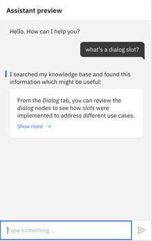
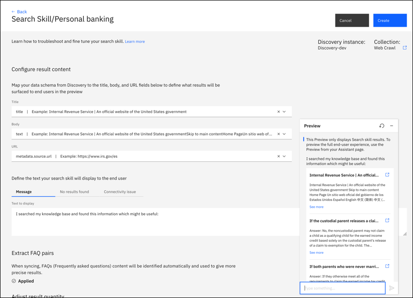

---

copyright:
  years: 2018, 2020
lastupdated: "2020-04-24"

subcollection: assistant

---

{:shortdesc: .shortdesc}
{:new_window: target="_blank"}
{:deprecated: .deprecated}
{:important: .important}
{:note: .note}
{:tip: .tip}
{:pre: .pre}
{:codeblock: .codeblock}
{:screen: .screen}
{:javascript: .ph data-hd-programlang='javascript'}
{:java: .ph data-hd-programlang='java'}
{:python: .ph data-hd-programlang='python'}
{:swift: .ph data-hd-programlang='swift'}

# Creating a search skill 
{: #skill-search-add}

An assistant uses a *search skill* to route complex customer inquiries to the {{site.data.keyword.discoveryfull}} service. {{site.data.keyword.discoveryshort}} treats the user input as a search query. It finds information that is relevant to the query from an external data source and returns it to the assistant.
{: shortdesc}

This feature is available only to Plus or Premium plan users.
{: note}

Add a search skill to your assistant to prevent the assistant from having to say things like, `I'm sorry. I can't help you with that`. Instead, the assistant can query existing company documents or data to see whether any useful information can be found and shared with the customer.



The following 4-minute video provides an overview of the search skill.

<iframe class="embed-responsive-item" id="youtubeplayer" title="Search skill overview" type="text/html" width="640" height="390" src="https://www.youtube.com/embed/_UgRPaxipgI?rel=0" frameborder="0" webkitallowfullscreen mozallowfullscreen allowfullscreen> </iframe>

To learn more about how search skill can benefit your business, [read this blog post](https://medium.com/ibm-watson/adding-search-to-watson-assistant-99e4e81839e5){: external}.

Find out how to keep your assistant data current by reading the blog post, [COVID-19: Are Your Virtual Assistant’s Answers Up-To-Date?](https://medium.com/ibm-watson/covid-19-are-your-virtual-assistants-answers-up-to-date-c9e1ba70eb65){: external}.

## How it works
{: #skill-search-add-how}

The search skill searches for information from a data collection that you create by using the {{site.data.keyword.discoveryshort}} service.

{{site.data.keyword.discoveryshort}} is a service that crawls, converts, and normalizes your unstructured data. The product applies data analysis and cognitive intuition to enrich your data such that you can more easily find and retrieve meaningful information from it later. To read more about {{site.data.keyword.discoveryshort}}, see the [product documentation](/docs/discovery?topic=discovery-about){: external}.

Typically, the type of data collection you add to {{site.data.keyword.discoveryshort}} and access from your assistant contains information that is owned by your company. This proprietary information can include FAQs, sales collateral, technical manuals, or papers written by subject matter experts. Mine this dense collection of proprietary information to find answers to customer questions quickly.

The following diagram illustrates how user input is processed when both a dialog skill and a search skill are added to an assistant.


## Before you begin
{: #skill-search-add-prereqs}

If you do not have a {{site.data.keyword.discoveryshort}} service instance, then a free Lite plan instance is provisioned for you as part of this process. If you have an existing {{site.data.keyword.discoveryshort}} service instance, connect to it; you are not asked to create a new instance as part of this process.

If you create a Discovery instance first, do not add the pre-enriched data source that is named *Watson Discovery News* to your instance. It is not a data type that can be searched from {{site.data.keyword.conversationshort}}.
{: tip}

## Create the search skill
{: #skill-search-add-task}

1.  Click the **Skills** icon , and then click **Create skill**.

1.  Click the *Search skill* tile, and then click **Next**.

    You can only select the Search skill if you are a Plus or Premium plan user.
    {: note}

1.  Specify the details for the new skill:
    - **Name**: A name no more than 100 characters in length. A name is required.
    - **Description**: An optional description no more than 200 characters in length.

1.  Click **Continue**.

The remaining steps differ depending on whether you have access to an existing {{site.data.keyword.discoveryshort}} service instance with collections created or not. Follow the appropriate procedure for your situation:

- [Connect to an existing Watson Discovery instance](#skill-search-add-connect-discovery)
- [Create a Watson Discovery instance](#skill-search-add-create-discovery)

## Connect to an existing Watson Discovery service instance
{: #skill-search-add-connect-discovery}

1.  Choose the {{site.data.keyword.discoveryshort}} service instance that you want to extract information from.
{: #choose-d-instance}

    Any {{site.data.keyword.discoveryshort}} service instances that you have access to are displayed in the list.

    If you see a warning that some of your {{site.data.keyword.discoveryshort}} service instances do not have credentials set, it means that you can access at least one instance that you never opened from the {{site.data.keyword.cloud_notm}} dashboard directly yourself. You must access a service instance for credentials to be created for it. And credentials must exist before {{site.data.keyword.conversationshort}} can establish a connection to the {{site.data.keyword.discoveryshort}} service instance on your behalf. If you think a {{site.data.keyword.discoveryshort}} service instance is missing from the list, open the instance from the {{site.data.keyword.cloud}} dashboard directly to generate credentials for it.
    {: note}

1.  Indicate the data collection to use, by doing one of the following things:
{: #pick-data-collection}

    - Choose an existing data collection.

      You can click the *Open in Discovery* link to review the configuration of a data collection before you decide which one to use.

      Go to [Configure the search](#search-skill-add-configure).

    - If you do not have a collection or do not want to use any of the data collections that are listed, click **Create a new collection** to add one. Follow the procedure in [Create a data collection](#skill-search-add-create-discovery-collection).

      The **Create a new collection** button is not displayed if you have reached the limit to the number of collections you are allowed to create based on your {{site.data.keyword.discoveryshort}} service plan. See [{{site.data.keyword.discoveryshort}} pricing plans](/docs/discovery/discovery-about?topic=discovery-discovery-pricing-plans){: external} for plan limit details.
      {: note}

## Create a Watson Discovery service instance
{: #skill-search-add-create-discovery}

1.  To create a {{site.data.keyword.discoveryshort}} service instance, click **Create new collection**.

    If you do not have an existing {{site.data.keyword.discoveryshort}} service instance, a free instance of the {{site.data.keyword.discoveryshort}} service is created for you.

    A Lite plan instance of the service is provisioned in {{site.data.keyword.Bluemix_notm}}, no matter what type of {{site.data.keyword.conversationshort}} service plan you have.
    {: note}

1.  Review the terms and conditions for using the instance, and then click **Accept** to continue.

1.  [Create a data collection](#skill-search-add-create-discovery-collection).

## Create a data collection
{: #skill-search-add-create-discovery-collection}

If you have a Discovery service Lite plan, you are given an opportunity to upgrade your plan. If you don't want to upgrade now, click **Let's get started**.

1.  To create a {{site.data.keyword.discoveryshort}} collection, do one of the following things:

      - To create a collection from data that is stored in a type of data source for which {{site.data.keyword.discoveryshort}} provides built-in support, pick a data source type.

        1.  Provide the required information for the data source you choose, and then click **Connect**.

            For a list of the supported data types and details on how to set up access to them, see [Connecting to data sources](/docs/discovery?topic=discovery-sources){: external}.
        1.  Indicate the frequency with which you want data from the data source to be synchronized with the collection you are creating in {{site.data.keyword.discoveryshort}}.
        1.  Specify the information that you want to extract from the data source and include in your {{site.data.keyword.discoveryshort}} collection.

            The options that are displayed differ depending on the data source type.

            - For a Salesforce data source, you select the object types that you want to extract from the source documents. You might select a [Case object type](https://developer.salesforce.com/docs/atlas.en-us.object_reference.meta/object_reference/sforce_api_objects_case.htm#!){: external} that represents a *case*, which is a customer issue or problem, for example.
            - For a Sharepoint data source, you specify paths.
            - For file repositories, you specify directories or files.
            - For a web crawl data source, specify the base URL of a website that you want to crawl. The web page that you specify and any pages that it links to are crawled and a document is created per web page.

            Give Watson a few minutes to start creating documents. As soon as the source starts to be ingested, the number of documents displayed on the {{site.data.keyword.discoveryshort}} details page increases. You might need to refresh the page. 
            
            To get help with creating data sources, see [Troubleshooting](#skill-search-add-troubleshoot).

        1.  Click **Save and sync objects**.

            The data collection is created. After the process completes, a summary page is displayed in {{site.data.keyword.discoveryshort}}, which is hosted in a separate web browser tab.

      - To create a collection by uploading documents, click **Upload documents**.

        1.  First, you define the collection, and then you upload the documents. Provide the following information:

            - Collection name. The name must be unique for this service instance.
            - Language. Select the language of the files that you are adding to this collection. For information about the languages supported by {{site.data.keyword.discoveryshort}}, see [Language support](/docs/discovery?topic=discovery-language-support){: external}.

              If you are uploading a PDF document and want to extract party, nature, and category information from it, then expand the **Advanced** section and click **Use the Default Contract Configuration with this collection**. See [Collection requirements](/docs/discovery?topic=discovery-element-classification#element-collection){: external} for more details.
        1.  Upload documents.

            Supported file types include PDF, HTML, JSON, and DOC files. See [Adding content](/docs/discovery?topic=discovery-addcontent){: external} for more details.
            {: note}

            No ongoing synchronization of uploaded documents is available. If you want to pick up changes that are made to a document, upload a later version of the document.

Wait for the collection to be fully ingested before you return to {{site.data.keyword.conversationshort}}.

### Data collection creation example
{: #skill-search-add-json-collection-example}

For example, you might have a JSON file like this one:

```bash
{
  "Title": "About",
  "Shortdesc": "IBM Watson Assistant is a cognitive bot that you can customize for your business needs, and deploy across multiple channels to bring help to your customers where and when they need it.",
  "Topics": "overview",
  "url": "https://cloud.ibm.com/docs/assistant?topic=assistant-index"
}
```
{: codeblock}

If you upload a JSON file that contains repeating name values, then only the first occurrence of the name and value pair is indexed and returned by search. Break up the file into multiple JSON files and upload the set.
{: tip}

## Configure the search
{: #skill-search-add-configure}

1.  From the {{site.data.keyword.discoveryshort}} instance, click **Finish setup in Watson Assistant**.

1.  On the {{site.data.keyword.conversationshort}} search skill page, click **Configure**.

1.  Choose the {{site.data.keyword.discoveryshort}} collection fields from which you want to extract text to include in the search result that is returned to the user.

    The fields that are available differ based on the data you ingested.

    Each search result can consist of the following sections:

    - **Title**: Search result title. Use the title, name, or similar type of field from the collection as the search result title.

      You must select something for the title or no search result response is displayed in the Facebook and Slack integrations.
    - **Body**: Search result description. Use an abstract, summary, or highlight field from the collection as the search result body.

       You must select something for the body or no search result response is displayed in the Facebook and Slack integrations.
    - **URL**: This field can be populated with any footer content that you want to include at the end of the search result.

       For example, you might want to include a hypertext link to the original data object in its native data source. Most online data sources provide self-referencing public URLs for objects in the store to support direct access. If you add a URL, it must be valid and reachable. If it is not, the Slack integration will not include the URL in its response and the Facebook integration will not return any response.

       The Facebook and Slack integrations can successfully display the search result response when the URL field is empty.
  
    You must choose a value for at least one of the search result sections.
    {: important}

    See [Tips for collection field selection](#skill-search-add-field-tips) for help.

    If no options are available from the drop-down fields, give {{site.data.keyword.discoveryshort}} more time to finish creating the collection. After waiting, if the collection is not created, then your collection might not contain any documents or might have ingestion errors that you need to address first.

    To continue the [example of the uploaded JSON file](#skill-search-add-json-collection-example), a good mapping is to use the *Title*, *Shortdesc*, and *url* fields.

    

    As you add field mappings, a preview of the search result is displayed with information from the corresponding fields of your data collection. This preview shows you what gets included in the search result response that is returned to users.

    To get help with configuring the search, see [Troubleshooting](#skill-search-add-troubleshoot).

1.  Draft different messages to share with users based on the successfulness of the search.

    <table>
    <caption>Search result messages</caption>
    <tr>
      <th>Field name</th>
      <th>Scenario</th>
      <th>Example message</th>
    </tr>
    <tr>
      <td>Message</td>
      <td>Search results are returned</td>
      <td>I found this information that might be helpful: </td>
    </tr>
    <tr>
      <td>No results found</td>
      <td>No search results are found</td>
      <td>I searched my knowledge base for information that might address your query, but did not find anything useful to share.</td>
    </tr>
    <tr>
      <td>Error message</td>
      <td>I was unable to complete the search for some reason</td>
      <td>I might have information that could help address your query, but am unable to search my knowledge base at the moment.</td>
    </tr>
    </table>

1.  Click **Try it** to open the "Try it out" pane for testing. Enter a test message to see the results that are returned when your configuration choices are applied to the search. Make adjustments as necessary.

1.  Click **Create**.

If you want to change the configuration of the search result card later, open the search skill again, and make edits. You do not need to save changes as you make them; they are automatically applied. When you are happy with the search results, click **Save** to finish configuring the search skill.

If you decide you want to connect to a different {{site.data.keyword.discoveryshort}} service instance or data collection, then create a new search skill and configure it to connect to the other instance. You **cannot** change the service instance or data collection details for a search skill after you create it.
{: important}

### Tips for collection field selection
{: #skill-search-add-field-tips}

The appropriate collection fields to extract data from vary depending on your collection's data source and how the data source was enriched. After you choose a data collection type, the collection field values are prepopulated with source fields that are considered most likely to contain useful information given the collection's data source type. However, you know your data better than anyone. You can change the source fields to ones that contain the best information to meet your needs.

To learn more about the structure of the documents in your collection, including the names of fields that contain information you might want to extract, open the collection in {{site.data.keyword.discoveryshort}}, and then click the View data schema icon .

The source fields are created when the collection is created. To learn more about fields that are generated for you, such as `enriched_text.concepts.text`, see [Configuring your service > Adding enrichments](/docs/discovery?topic=discovery-configservice#adding-enrichments){: external}.

## Troubleshooting
{: #skill-search-add-troubleshoot}

Review this information for help with performing common tasks.

- **Creating a Web crawl data collection**: Things to know when you create a web crawl data source:

    - For a {{site.data.keyword.discoveryshort}} Lite plan, you cannot create more than 1,000 documents. 
    - To increase the number of documents that are available to the data collection, click add a URL group where you can list the URLs for pages that you want to crawl but that are not linked to from the initial seed URL.
    - To decrease the number of documents that are available to the data collection, specify a subdomain of the base URL. Or, in the web crawl settings, limit the number of hops that Watson can make from the original page. You can specify subdomains to explicitly exclude from the crawl also.
    - If no documents are listed after a few minutes and a page refresh, then make sure that the content you want to ingest is available from the URL's page source. Some web page content is dynamically generated and therefore cannot be crawled.

- **Configuring search results for uploaded documents**: If you are using a collection of uploaded documents and cannot get the correct search results or the results are not concise enough, consider using *Smart Document Understanding* when you create the data collection. 

  This feature enables you to annotate documents based on text formatting. For example, you can teach {{site.data.keyword.discoveryshort}} that any text in 28-point bold font is a document title. If you apply this information to the collection when you ingest it, you can later use the *title* field as the source for the title section of your search result. 
  
  You can also use Smart Document Understanding to split up large documents into segments that are easier to search. For more information, see the the [Smart Document Understanding](/docs/discovery?topic=discovery-sdu) topic in the {{site.data.keyword.discoveryshort}} documentation.

- **Improve search results**: If you don't like the results you are seeing, review this information for help.

  - Call the search skill from a dialog node, and specify filter details. 

    From a dialog node search skill response, you can specify a full {{site.data.keyword.discoveryshort}} query syntax filter to help narrow the results. 
    
    For example, you can define a filter that filters out any documents in the data collection that do not mention an intent in the document title or some other metadata field. Or the filter can filter out documents that do not identify an entity as a known entity in the data collection's metadata or that don't mention the entity anywhere in the full text of the document. For details about how to add a search skill response type, see [Adding rich responses](https://cloud.ibm.com/docs/assistant?topic=assistant-dialog-overview#dialog-overview-multimedia-add).

    For more tips about improving results, read the [Improve your natural language query results from Watson Discovery](https://developer.ibm.com/blogs/improving-your-natural-language-query-results-from-watson-discovery/){: external} blog post.

- **My response text is surrounded by brackets**: If you notice that your response text is surrounded by brackets and quotation marks (`["My response text"]`) when you test it from the Preview link integration, for example, you might need to change the source field that you're using in the configuration. The unexpected formatting indicates that the value is stored in the source document as an array. Any field that you extract text from must contain a value with a String data type, not an Array data type. When the chat integration shows a response that is extracted from a field that stores the data as an array, it does a straight conversion of the array value into a string, which produces a response that includes the array syntax.

  For example, maybe the field in the source document contains an array with a single text value as its only array element:

  ```json
  "title": ["a single array element"]
  ```
  {: codeblock}

  The array value is converted by the {{site.data.keyword.conversationshort}} into this string value:

  ```json
  "title": "[\"a single array element\"]"
  ```
  {: codeblock}

  As a result, the string is returned in this format in the chat; the surrounding brackets and quotation marks are displayed:

  ```
  ["a single array element"]
  ```
  {: codeblock}

  If you see this happening, consider choosing a different collection field from which to extract search results.
  
  The {{site.data.keyword.discoveryshort}} document `highlight` field stores values in an array.
  {: note}

## Next steps
{: #skill-search-add-next-steps}

After you create the skill, it appears as a tile on the Skills page.

The search skill cannot interact with customers until it is added to an assistant and the assistant is deployed. See [Creating assistants](/docs/assistant?topic=assistant-assistant-add).

### Adding the skill to an assistant
{: #skill-search-add-to-assistant}

You can add one skill to an assistant. Open the assistant tile and add the skill to the assistant from there. You cannot choose the assistant that will use the skill from within the skill configuration page.

One search skill can be used by more than one assistant.

1.  From the Assistants page, click to open the tile for the assistant to which you want to add the skill.

1.  Click **Add Search Skill**.

1.  Click **Add existing skill**.

    Click the skill that you want to add from the available skills that are displayed.

After you add a search skill to an assistant, it is automatically enabled for the assistant as follows:

- If the assistant has only a search skill, any user input that is submitted to one of the assistant's integration channels triggers the search skill.

- If the assistant has both a dialog skill and a search skill, any user input triggers the dialog skill first. The dialog addresses any user input that it has a high confidence it can answer correctly. Any queries that would normally trigger the `anything_else` node in the dialog tree are sent to the search skill instead.

  You can prevent the search from being triggered from the `anything_else` node by following the steps in [Disabling search](#search-skill-add-disable).
  {: note}

- If you want a specific search query to be triggered for specific questions, add a search skill response type to the appropriate dialog node. See [Responses](/docs/assistant?topic=assistant-dialog-overview#dialog-overview-multimedia) for more details.

## Search triggers
{: #skill-search-add-trigger}

The search skill is triggered in the following ways:

- **Anything else node**: Searches an external data source for a relevant answer when none of the dialog nodes can address the user's query.

  Instead of showing a standard message, such as `I don't know how to help you with that.` the assistant can say, `Maybe this information can help:` followed by the passage returned by the search. If a search skill is linked to your assistant, then whenever the `anything_else` node is triggered, rather than displaying the node response, a search occurs instead. The assistant passes the user input as the query to your search skill, and returns the search results as the response.

  You can prevent the search from being triggered from the `anything_else` node by following the steps in [Disabling search](#search-skill-add-disable).
  {: note}

- **Search response type**: If you add a search response type to a dialog node, then your assistant retrieves a passage from an external data source and returns it as the response to a particular question. This type of search occurs only when the individual dialog node is processed.

  This approach is useful if you want to narrow down a user query before you trigger a search. For example, the dialog branch might collect information about the type of device the customer wants to buy. When you know the make and model, you can then send a model keyword in the query that is submitted to the search skill, and get better results.
- **Search skill only**: If only a search skill is linked to an assistant, and no dialog skill is linked to the assistant, then a search query is sent to the {{site.data.keyword.discoveryshort}} service when any user input is received from one of the assistant's integration channels.

## Test the search skill
{: #search-skill-add-test}

After you configure the search, you can send test queries to see the search results that get returned from {{site.data.keyword.discoveryshort}} by using the "Try it out" pane of the search skill.

To test the full experience that customers will have when they ask questions that are either answered by the dialog or trigger a search, use a channel integration, such as the preview link.

You cannot test the full end-to-end user experience from the dialog "Try it out" pane. The search skill is configured separately and attached to an assistant. The dialog skill has no way of knowing the details of the search, and therefore cannot show search results in its "Try it out" pane.
{: important}

Configure at least one integration channel to test the search skill. In the channel, enter queries that trigger the search. If you initiate any type of search from your dialog, test the dialog to ensure that the search is triggered as expected. If you are not using search response types, test that a search is triggered only when no existing dialog nodes can address the user input. And any time a search is triggered, ensure that it returns meaningful results.

## Sending more requests to the search skill
{: #search-skill-add-increase-flow}

If you want the dialog skill to respond less often and to send more queries to the search skill instead, you can configure the dialog to do so.

You must add both a dialog skill and search skill to your assistant for this approach to work.

Follow this procedure to make it less likely that the dialog will respond by resetting the confidence level threshold from the default setting of 0.2 to 0.5. Changing the confidence level threshold to 0.5 instructs your assistant to not respond with an answer from the dialog unless the assistant is more than 50% confident that the dialog can understand the user's intent and can address it.

1.  From the *Dialog* page of your dialog skill, make sure that the last node in the dialog tree has an `anything_else` condition.

    Whenever this node is processed, the search skill is triggered.

1.  Add a folder to the dialog. Position the folder before the first dialog node that you want to de-emphasize. Add the following condition to the folder:

    `intents[0].confidence > 0.5`

    This condition is applied to all of the nodes in the folder. The condition tells your assistant to process the nodes in the folder only if your assistant is at least 50% confident that it knows the user's intent.

1.  Move any dialog nodes that you do not want your assistant to process often into the folder.

After changing the dialog, test the assistant to make sure the search skill is triggered as often as you want it to be.

An alternative approach is to teach the dialog about topics to ignore. To do so, you can add utterances that you want the assistant to send to the search skill immediately as test utterances in the dialog skill's "Try it out" pane. You can then select the **Mark as irrelevant** option within the "Try it out" pane to teach the dialog not to respond to this utterance or others like it. For more information, see [Teaching your assistant about topics to ignore](/docs/assistant?topic=assistant-logs#logs-mark-irrelevant).

## Disabling search
{: #search-skill-add-disable}

You can disable the search skill from being triggered.

You might want to do so temporarily, while you are setting up the integration. Or you might want to only ever trigger a search for specific user queries that you can identify within the dialog, and use a search skill response type to answer.

To prevent the search skill from being triggered, complete the following steps:

1.  From the **Assistants** page, click the menu for your assistant, and then choose **Settings**.
1.  Open the *Search Skill* page, and then click to switch the toggle to **Disabled**.
