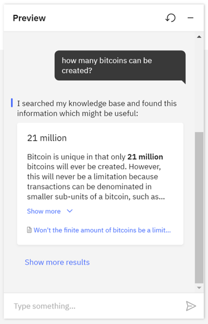

---

copyright:
  years: 2018, 2021
lastupdated: "2021-12-09"

subcollection: assistant

---

{:shortdesc: .shortdesc}
{:new_window: target="_blank"}
{:external: target="_blank" .external}
{:deprecated: .deprecated}
{:important: .important}
{:note: .note}
{:tip: .tip}
{:pre: .pre}
{:preview: .preview}
{:codeblock: .codeblock}
{:screen: .screen}
{:javascript: .ph data-hd-programlang='javascript'}
{:java: .ph data-hd-programlang='java'}
{:python: .ph data-hd-programlang='python'}
{:swift: .ph data-hd-programlang='swift'}
{:table: .aria-labeledby="caption"}
{:video: .video}

{{site.data.content.newlink}}

# Use a search skill to embed existing help content 
{: #skill-search-add}

Put your subject matter expertise to work by adding a search skill. The search skill gives your assistant access to corporate data collections that it can mine for answers.
{: shortdesc}

When a *search skill* is added, your assistant can route complex customer inquiries to the {{site.data.keyword.discoveryfull}} service. {{site.data.keyword.discoveryshort}} treats the user input as a search query. It finds information that is relevant to the query from an external data source and returns it to the assistant.

This feature is available only to paid plan users.
{: note}

Add a search skill to your assistant to prevent the assistant from having to say things like, `I'm sorry. I can't help you with that`. Instead, the assistant can query existing company documents or data to see whether any useful information can be found and shared with the customer.



To show the exact answer highlighted in bold font, enable the *Emphasize the answer* feature that is available with {{site.data.keyword.discoveryshort}} v2 instances.
{: tip}

The following 4-minute video provides an overview of the search skill.

{: video output="iframe" id="youtubeplayer" frameborder="0" width="560" height="315" webkitallowfullscreen mozallowfullscreen allowfullscreen}

To read a transcript of the video, [open the video on YouTube.com](https://www.youtube.com/watch?v=_UgRPaxipgI&feature=emb_imp_woyt), click the *More actions* icon, and then choose *Open transcript*.

To learn more about how search skill can benefit your business, [read this blog post](https://medium.com/ibm-watson/adding-search-to-watson-assistant-99e4e81839e5){: external}.

Find out how to keep your assistant data current by reading the blog post, [COVID-19: Are Your Virtual Assistant’s Answers Up-To-Date?](https://medium.com/ibm-watson/covid-19-are-your-virtual-assistants-answers-up-to-date-c9e1ba70eb65){: external}.

## How it works
{: #skill-search-add-how}

The search skill searches for information from a data collection that you create by using the {{site.data.keyword.discoveryshort}} service.

{{site.data.keyword.discoveryshort}} is a service that crawls, converts, and normalizes your unstructured data. The product applies data analysis and cognitive intuition to enrich your data such that you can more easily find and retrieve meaningful information from it later. To read more about {{site.data.keyword.discoveryshort}}, see the [product documentation](/docs/discovery-data?topic=discovery-data-about){: external}.

Typically, the type of data collection you add to {{site.data.keyword.discoveryshort}} and access from your assistant contains information that is owned by your company. This proprietary information can include FAQs, sales collateral, technical manuals, or papers written by subject matter experts. Mine this dense collection of proprietary information to find answers to customer questions quickly.

The following diagram illustrates how user input is processed when both a dialog skill and a search skill are added to an assistant.


For a step-by-step tutorial, read [Help your chatbot get answers from existing content](/docs/discovery-data?topic=discovery-data-tutorial-convo){: external} in the [Watson Discovery documentation](/docs/discovery-data?topic=discovery-data-about){: external}.

## Before you begin
{: #skill-search-add-prereqs}

1.  Before you begin, you must set up a {{site.data.keyword.discoveryshort}} instance.

    You can do this at no cost by using a Plus plan, which offers a free 30-day trial. However, to create a Plus plan instance of the service, you must have a paid account (where you provide credit card details).

1.  Create a Plus plan {{site.data.keyword.discoveryshort}} service instance.

    Go to the [{{site.data.keyword.discoveryshort}}](https://cloud.ibm.com/catalog/services/watson-discovery){: external} page in the {{site.data.keyword.cloud_notm}} catalog and create a Plus plan service instance.

If you decide not to continue using the Plus plan and don't want to pay for it, delete the Plus plan service instance before the 30-day trial period ends.
{: important}

## Create the search skill
{: #skill-search-add-task}

1.  From the assistant where you want to add the skill, click **Add search skill**.

    You can only add a search skill if you are a user with a paid plan.
    {: note}

1.  Take one of the following actions:

    - To create a new search skill, stay on the *Create skill* tab.

    - If you have created a search skill already, the *Add existing skill* tab is displayed, and you can click to add an existing skill.

1.  Specify the details for the new skill:
    - **Name**: A name no more than 64 characters in length. A name is required.
    - **Description**: An optional description no more than 128 characters in length.

    Next, you will connect to a {{site.data.keyword.discoveryshort}} service instance.

1.  Click **Continue**.

## Connect to an existing Watson Discovery instance
{: #skill-search-add-connect-discovery}

1.  Choose the {{site.data.keyword.discoveryshort}} instance that you want to connect to.
{: #choose-d-instance}

    If you see a warning that some of your {{site.data.keyword.discoveryshort}} service instances do not have credentials set, it means that you can access at least one instance that you never opened from the {{site.data.keyword.cloud_notm}} dashboard directly yourself. You must access a service instance for credentials to be created for it, and credentials must exist before {{site.data.keyword.conversationshort}} can establish a connection to the {{site.data.keyword.discoveryshort}} service instance on your behalf. If you think a {{site.data.keyword.discoveryshort}} service instance is missing from the list, open the instance from the {{site.data.keyword.cloud}} dashboard directly to generate credentials for it.
    {: note}

1.  Indicate the collection to use, by doing one of the following things:
{: #pick-data-collection}

    - Choose an existing project.

      You can click the *Open {{site.data.keyword.discoveryshort}}* icon to review the configuration of a project before you decide which one to use.

      Go to [Configure the search](#skill-search-add-configure) and follow the remaining steps.

    - If you do not have a project or do not want to use any of the projects that are listed, click **Create a new project** to add one. Follow the steps in [Create a project](#skill-search-add-create-discovery-collection).

      The **Create a new project** button is not displayed if you have reached the limits based on your {{site.data.keyword.discoveryshort}} service plan. See [{{site.data.keyword.discoveryshort}} pricing plans](/docs/discovery-data?topic=discovery-data-pricing-plans){: external} for plan limit details.
      {: note}

## Create a project
{: #skill-search-add-create-discovery-collection}

1.  On the **OK, where is your data?** page, select your data source, then click **Next**. Example choices include Salesforce, SharePoint, Box, IBM Cloud Object Storage, web crawl, and upload data. 

1. On the **Let's create a collection for your data** pages, enter the information on how to connect to your data and configure your collection. The information you need to enter is different depending on the data source. For example, you need to enter your authentication credentials for services such as Salesforce, Sharepoint, and Box. For web crawl, you specify the website where your existing information resides.

    Optionally, select the **Apply FAQ extraction** checkbox. This feature allows the {{site.data.keyword.discoveryshort}} service to extract question and answer pairs that it identifies in the data collection. If the answers to common questions are identified ahead of time, your assistant can more quickly find and return a concise answer when a customer asks a similar question.

1. Click **Finish**. Give {{site.data.keyword.discoveryshort}} a few minutes to start creating documents. You can use the **Manage collections** page within the project to see the progress.

    After the digestion process is completed, a summary page is displayed in {{site.data.keyword.discoveryshort}}, which is hosted in a separate web browser tab.

1.  Wait for the collection to be fully ingested, then click **Back to {{site.data.keyword.conversationshort}}**.

## Configure the search
{: #skill-search-add-configure}

1.  On the {{site.data.keyword.conversationshort}} search skill page, ensure the {{site.data.keyword.discoveryshort}} project you want to use is selected, then click **Next**.

1.  In the **Configure result content** section, review the {{site.data.keyword.discoveryshort}} fields and examples that are used in the search results shown to your customers. You can accept the defaults, or customize them as you want.

    The appropriate collection fields to extract data from vary depending on your collection's data source and how the data source was enriched. After you choose a data collection type, the collection field values are prepopulated with source fields that are considered most likely to contain useful information given the collection's data source type. However, you know your data better than anyone. You can change the source fields to ones that contain the best information to meet your needs.

     To learn more about the structure of the documents in your collection, including the names of fields that contain information you might want to extract, open the collection in {{site.data.keyword.discoveryshort}}, and then use the **Identity fields** and **Manage fields** tabs.

    Each search result can consist of the following sections:

    - **Title**: Search result title. Use the title, name, or similar type of field from the collection as the search result title.

      You must select something for the title or no search result response is displayed in the Facebook and Slack integrations.

    - **Body**: Search result description. Use an abstract, summary, or highlight field from the collection as the search result body.

       You must select something for the body or no search result response is displayed in the Facebook and Slack integrations.

    - **URL**: This field can be populated with any footer content that you want to include at the end of the search result.

       For example, you might want to include a hypertext link to the original data object in its native data source. Most online data sources provide self-referencing public URLs for objects in the store to support direct access. If you add a URL, it must be valid and reachable. If it is not, the Slack integration will not include the URL in its response and the Facebook integration will not return any response.

       The Facebook and Slack integrations can successfully display the search result response when the URL field is empty.
  
    You must use a field for at least one of the search results.
    {: important}

    If no options are available from the drop-down fields, give {{site.data.keyword.discoveryshort}} more time to finish creating the collection. After waiting, if the collection is not created, then your collection might not contain any documents or might have ingestion errors that you need to address first.

    

    As you add field mappings, a preview of the search result is displayed with information from the corresponding fields of your data collection. This preview shows you what gets included in the search result response that is returned to users.

    To get help with configuring the search, see [Troubleshooting](#skill-search-add-troubleshoot).

1.  Use the **Message**, **No results found** and **Connectivity issue** tabs to customize different messages to share with users based on the successfulness of the search.

    | Tab | Scenario | Example message |
    | --- | --- | --- |
    | Message | Search results are returned | `I found this information that might be helpful:` |
    | No results found | No search results are found | `I searched my knowledge base for information that might address your query, but did not find anything useful to share.` |
    | Connectivity issue | I was unable to complete the search for some reason | `I might have information that could help address your query, but am unable to search my knowledge base at the moment.` |
    {: caption="Search result messages" caption-side="top"}

1.  The **Extract FAQ pairs** section displays if the feature is enabled in your {{site.data.keyword.discoveryshort}} collection. Frequently asked questions content is identified automatically and used to give more precise results.

1.  Choose whether to enable **Emphasize the answer**. 

    This option is available only if your {{site.data.keyword.discoveryshort}} instance uses the v2 {{site.data.keyword.discoveryshort}} API.
    {: note}

    When you enable this feature, the sentence that is determined by {{site.data.keyword.discoveryshort}} to be the exact answer to the customer's question is highlighted in the block of text that is displayed to the customer as the search result.

1.  In the **Adjust result quantity** section, specify the number of results to return.

    The top three results are returned automatically. You can choose to show fewer or more (up to 10) results in the response.

    By default, customers can choose to see more results. If you don't want to give customers this choice, clear the **Include link for customers to view up to 10 results** checkbox.

1.  In the **Set result selectivity** section, decide whether to be more selective with the answers that are returned. By increasing result selectivity, Search returns fewer but more accurate results. In most cases, Search is accurate enough that the default setting (off) is sufficient.

1.  Click **Preview** to open the Preview pane for testing. Enter a test message to see the results that are returned when your configuration choices are applied to the search. Make adjustments as necessary.

1.  Click **Create**.

If you want to change the configuration of the search result card later, open the search skill again, and make edits. You do not need to save changes as you make them; they are automatically applied. When you are happy with the search results, click **Save** to finish configuring the search skill.

If you decide you want to connect to a different {{site.data.keyword.discoveryshort}} service instance or data collection, then create a new search skill and configure it to connect to the other instance. You *cannot* change the service instance or data collection details for a search skill after you create it.
{: important}

## Troubleshooting
{: #skill-search-add-troubleshoot}

Review this information for help with performing common tasks.

- **Creating a Web crawl data collection**: Things to know when you create a web crawl data source:

    - To increase the number of documents that are available to the data collection, click add a URL group where you can list the URLs for pages that you want to crawl but that are not linked to from the initial seed URL.
    - To decrease the number of documents that are available to the data collection, specify a subdomain of the base URL. Or, in the web crawl settings, limit the number of hops that Watson can make from the original page. You can specify subdomains to explicitly exclude from the crawl also.
    - If no documents are listed after a few minutes and a page refresh, then make sure that the content you want to ingest is available from the URL's page source. Some web page content is dynamically generated and therefore cannot be crawled.

- **Configuring search results for uploaded documents**: If you are using a collection of uploaded documents and cannot get the correct search results or the results are not concise enough, consider using *Smart Document Understanding* when you create the data collection. 

    This feature enables you to annotate documents based on text formatting. For example, you can teach {{site.data.keyword.discoveryshort}} that any text in 28-point bold font is a document title. If you apply this information to the collection when you ingest it, you can later use the *title* field as the source for the title section of your search result. 
  
    You can also use Smart Document Understanding to split up large documents into segments that are easier to search. For more information, see the the [Using Smart Document Understanding](/docs/discovery-data?topic=discovery-data-configuring-fields){: external} topic in the {{site.data.keyword.discoveryshort}} documentation.

- **Improve search results**: If you don't like the results you are seeing, call the search skill from a dialog node, and specify filter details. 

    From a dialog node search skill response, you can specify a full {{site.data.keyword.discoveryshort}} query syntax filter to help narrow the results. 
    
    For example, you can define a filter that filters out any documents in the data collection that do not mention an intent in the document title or some other metadata field. Or the filter can filter out documents that do not identify an entity as a known entity in the data collection's metadata or that don't mention the entity anywhere in the full text of the document. For details about how to add a search skill response type, see [Adding a *Search skill* response type](/docs/assistant?topic=assistant-dialog-overview#dialog-overview-add-search-skill).

    For more tips about improving results, read the [Improve your natural language query results from Watson Discovery](https://developer.ibm.com/blogs/improving-your-natural-language-query-results-from-watson-discovery/){: external} blog post.

- **My response text is surrounded by brackets**: If you notice that your response text is surrounded by brackets and quotation marks (`["My response text"]`) when you test it from the Preview, for example, you might need to change the source field that you're using in the configuration. The unexpected formatting indicates that the value is stored in the source document as an array. Any field that you extract text from must contain a value with a String data type, not an Array data type. When the chat integration shows a response that is extracted from a field that stores the data as an array, it does a straight conversion of the array value into a string, which produces a response that includes the array syntax.

    For example, maybe the field in the source document contains an array with a single text value as its only array element:

    ```json
    "title": ["a single array element"]
     ```
     {: codeblock}

    The array value is converted by the {{site.data.keyword.conversationshort}} into this string value:

    ```json
    "title": "[\"a single array element\"]"
    ```
    {: codeblock}

    As a result, the string is returned in this format in the chat; the surrounding brackets and quotation marks are displayed:

    ```code
    ["a single array element"]
    ```
    {: codeblock}

    If you see this happening, consider choosing a different collection field from which to extract search results.
  
    The {{site.data.keyword.discoveryshort}} document `highlight` field stores values in an array.
    {: note}

## Next steps
{: #skill-search-add-next-steps}

After you create the skill, it appears as a tile on the Skills page.

The search skill cannot interact with customers until it is added to an assistant and the assistant is deployed. See [Creating assistants](/docs/assistant?topic=assistant-assistant-add).

### Adding the skill to an assistant
{: #skill-search-add-to-assistant}

Open the assistant tile and add the skill to the assistant from there. You cannot choose the assistant that will use the skill from within the skill configuration page.

One search skill can be used by more than one assistant.

1.  From the Assistants page, click to open the tile for the assistant to which you want to add the skill.

1.  Click **Add search skill**.

1.  Click **Add existing skill**, then click the skill that you want to add from the available skills that are displayed.

## Search triggers
{: #skill-search-add-trigger}

The search skill is triggered in the following ways:

- **From a specific dialog node or action step**: This approach is useful if you want to narrow down a user query before you trigger a search. 

    For example, the conversational flow might collect information about the type of device a customer wants to buy. When you know the device model, you can then send a model keyword in the query that is submitted to the search skill to get better results.

    Trigger the search only at a specific point in a conversation in one of the following ways:

    - Dialog skill: Add a *search skill* response type to a dialog node. When the node is processed, your assistant retrieves a passage from an external data source and returns it as the response to a particular question. This type of search occurs only when the individual dialog node is processed. For more information, see [Adding a search skill response type](/docs/assistant?topic=assistant-dialog-overview#dialog-overview-add-search-skill).

    - Actions skill: In the *And then* field of the step where you want the search to be triggered, choose **Search for the answer**. For more information, see [Configuring the search for an answer](/docs/assistant?topic=assistant-actions#actions-what-next-search).

- **From the dialog skill's *Anything else* node**: If the assistant has a dialog skill and a search skill, any user input triggers the dialog skill first. The dialog addresses user input that it has a high confidence it can answer correctly. Any queries that would normally trigger the `anything_else` node in the dialog tree are sent to the search skill instead.

    For example, instead of showing a standard message, such as `I don't know how to help you with that.` the assistant can say, `Maybe this information can help:`. The assistant passes the user input as the query to your search skill, and returns the search results as the response.

    You can prevent the search from being triggered from the `anything_else` node by following the steps in [Disabling search](#search-skill-add-disable).
    {: note}

- **When only a search skill is used**: If only a search skill is linked to an assistant, and no conversational skill is configured, then a search query is sent to the {{site.data.keyword.discoveryshort}} service when any user input is received from one of the assistant's integration channels.

## Test the search skill
{: #search-skill-add-test}

After you configure the search, you can send test queries to see the search results that get returned from {{site.data.keyword.discoveryshort}} by using the Preview pane of the search skill.

To test the full experience that customers will have when they ask questions that are either answered by the dialog or trigger a search, use the *Preview* button for your assistant.

You cannot test the full end-to-end user experience from the dialog "Try it out" pane. The search skill is configured separately and attached to an assistant. The dialog skill has no way of knowing the details of the search, and therefore cannot show search results in its "Try it out" pane.
{: important}

Configure at least one integration channel to test the search skill. In the channel, enter queries that trigger the search. If you initiate any type of search from your dialog, test the dialog to ensure that the search is triggered as expected. If you are not using search response types, test that a search is triggered only when no existing dialog nodes can address the user input. And any time a search is triggered, ensure that it returns meaningful results.

## Sending more requests to the search skill
{: #search-skill-add-increase-flow}

If you want the dialog skill to respond less often and to send more queries to the search skill instead, you can configure the dialog to do so.

You must add both a dialog skill and search skill to your assistant for this approach to work.

Follow this procedure to make it less likely that the dialog will respond by resetting the confidence level threshold from the default setting of 0.2 to 0.5. Changing the confidence level threshold to 0.5 instructs your assistant to not respond with an answer from the dialog unless the assistant is more than 50% confident that the dialog can understand the user's intent and can address it.

1.  From the *Dialog* page of your dialog skill, make sure that the last node in the dialog tree has an `anything_else` condition.

    Whenever this node is processed, the search skill is triggered.

1.  Add a folder to the dialog. Position the folder before the first dialog node that you want to de-emphasize. Add the following condition to the folder:

    `intents[0].confidence > 0.5`

    This condition is applied to all of the nodes in the folder. The condition tells your assistant to process the nodes in the folder only if your assistant is at least 50% confident that it knows the user's intent.

1.  Move any dialog nodes that you do not want your assistant to process often into the folder.

After changing the dialog, test the assistant to make sure the search skill is triggered as often as you want it to be.

An alternative approach is to teach the dialog about topics to ignore. To do so, you can add utterances that you want the assistant to send to the search skill immediately as test utterances in the dialog skill's "Try it out" pane. You can then select the **Mark as irrelevant** option within the "Try it out" pane to teach the dialog not to respond to this utterance or others like it. For more information, see [Teaching your assistant about topics to ignore](/docs/assistant?topic=assistant-logs#logs-mark-irrelevant).

## Disabling search
{: #search-skill-add-disable}

You can disable the search skill from being triggered.

You might want to do so temporarily, while you are setting up the integration. Or you might want to only ever trigger a search for specific user queries that you can identify within the dialog, and use a search skill response type to answer.

To prevent the search skill from being triggered, complete the following steps:

1.  From the **Assistants** page, click the menu for your assistant, and then choose **Settings**.
1.  Open the *Search skill* page, and then set the switch to **Disabled**.
