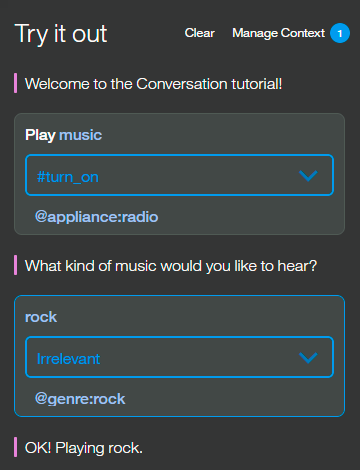
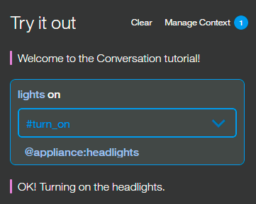
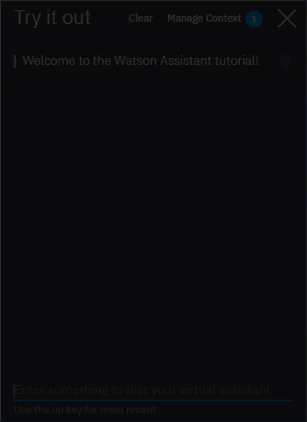

---

copyright:
  years: 2015, 2019
lastupdated: "2019-02-28"

subcollection: assistant


---

{:shortdesc: .shortdesc}
{:new_window: target="_blank"}
{:deprecated: .deprecated}
{:important: .important}
{:note: .note}
{:tip: .tip}
{:pre: .pre}
{:codeblock: .codeblock}
{:screen: .screen}
{:javascript: .ph data-hd-programlang='javascript'}
{:java: .ph data-hd-programlang='java'}
{:python: .ph data-hd-programlang='python'}
{:swift: .ph data-hd-programlang='swift'}
{:gif: data-image-type='gif'}

# Tutorial: Building a car dashboard dialog
{: #tutorial-car-dashboard}

In this tutorial, you will use the {{site.data.keyword.conversationshort}} service to create a dialog that helps users interact with a cognitive car dashboard.
{: shortdesc}

## Learning objectives
{: #car-dashboard-objectives}

By the time you finish the tutorial, you will understand how to:

- Define entities
- Plan a dialog
- Use node and response conditions in a dialog

### Duration
{: #tutorial-car-dashboard-duration}

This tutorial will take approximately 2 to 3 hours to complete.

### Prerequisite
{: #tutorial-car-dashboard-prereqs}

Before you begin, complete the [Getting Started tutorial](/docs/services/assistant?topic=assistant-getting-started).

You will use the {{site.data.keyword.conversationshort}} tutorial skill that you created, and add nodes to the simple dialog that you built as part of the getting started exercise.

## Step 1: Add intents and examples
{: #tutorial-car-dashboard-add-intents}

Add an intent on the Intents tab. An intent is the purpose or goal expressed in user input.

1.  From the **Intents** page of the {{site.data.keyword.conversationshort}} tutorial skill, click **Add intent**.
1.  Add the following intent name, and then click **Create intent**:

    ```
    turn_on
    ```
    {: codeblock}

    A `#` is prepended to the intent name you specify. The `#turn_on` intent indicates that the user wants to turn on an appliance such as the radio, windshield wipers, or headlights.
1.  In the **Add user example** field, type the following utterance, and then click **Add example**:

    ```
    I need lights
    ```
    {: codeblock}

1.  Add these 5 more examples to help Watson recognize the `#turn_on` intent.

    ```
    Play some tunes
    Turn on the radio
    turn on
    Air on please
    Crank up the AC
    Turn on the headlights
    ```
    {: codeblock}

1.  Click the **Close**  icon to finish adding the `#turn_on` intent.

You now have three intents, the `#turn_on` intent that you just added, and the `#hello` and `#goodbye` intents that were added in the *Getting started tutorial* that you completed as a prerequisite step. Each intent has a set of example utterances that help train Watson to recognize the intents in user input.

## Step 2: Add entities
{: #tutorial-car-dashboard-add-entities}

An entity definition includes a set of entity *values* that can be used to trigger different responses. Each entity value can have multiple *synonyms*, which define different ways that the same value might be specified in user input.

Create entities that might occur in user input that has the #turn_on intent to represent what the user wants to turn on.

1.  Click the **Entities** tab to open the Entities page.
1.  Click **Add entity**.
1.  Add the following entity name, and then press Enter:

    ```
    appliance
    ```
    {: codeblock}

    A `@` is prepended to the entity name you specify. The `@appliance` entity represents an appliance in the car that a user might want to turn on.
1.  Add the following value to the **Value name** field:

    ```
    radio
    ```
    {: codeblock}

    The value represents a specific appliance that users might want to turn on.
1.  Add other ways to specify the radio appliance entity in the **Synonyms** field. Press **Tab** to give the the field focus, and then enter the following synonyms. Press **Enter** after each synonym.

    ```
    music
    tunes
    ```
    {: codeblock}

1.  Click **Add value** to finish defining the `radio` value for the `@appliance` entity.
1.  Add other types of appliances.

    - Value: `headlights`. Synonym: `lights`.
    - Value: `air conditioning`. Synonyms: `air` and `AC`.

1.  Click the toggle to turn fuzzy matching **On** for the `@appliance` entity.
    This setting helps the service recognize references to entities in user input even when the entity is specified in a way that does not exactly match the syntax you use here.
1.  Click the **Close**  icon to finish adding the `@appliance` entity.
1.  Repeat Steps 2-8 to create the `@genre` entity with fuzzy matching on, and these values and synonyms:

    - Value: `classical`. Synonym: `symphonic`.
    - Value: `rhythm and blues` Synonym: `r&b`.
    - Value: `rock`. Synonym: `rock & roll`, `rock and roll`, and `pop`.

You defined two entities: `@appliance` (representing an appliance the assistant can turn on) and `@genre` (representing a genre of music the user can choose to listen to).

When the user's input is received, the {{site.data.keyword.conversationshort}} service identifies both the intents and entities. You can now define a dialog that uses intents and entities to choose the correct response.

## Step 3: Create a complex dialog
{: #tutorial-car-dashboard-complex-dialog}

In this complex dialog, you will create dialog branches that handle the #turn_on intent you defined earlier.

### Add a root node for #turn_on
{: #tutorial-car-dashboard-add-turn-on}

Create a dialog branch to respond to the #turn_on intent. Start by creating the root node:

1.  Click the More icon  on the **#hello** node, and then select **Add node below**.
1.  Start typing `#turn_on` in the condition field, and then select it from the list.
    This condition is triggered by any input that matches the #turn_on intent.
1.  Do not enter a response in this node. Click  to close the node edit view.

### Scenarios
{: #tutorial-car-dashboard-scenarios}

The dialog needs to determine which appliance the user wants to turn on. To handle this, create multiple responses based on additional conditions.

There are three possible scenarios, based on the intents and entities that you defined:

**Scenario 1**: The user wants to turn on the music, in which case the assistant must ask for the genre.

**Scenario 2**: The user wants to turn on any other valid appliance, in which case the assistant echos the name of the requested appliance in a message that indicates it is being turned on.

**Scenario 3**: The user does not specify a recognizable appliance name, in which case the assistant must ask for clarification.

Add nodes that check these scenario conditions in this order so the dialog evaluates the most specific condition first.

### Address Scenario 1
{: #tutorial-car-dashboard-address-scenario1}

Add nodes that address scenario 1, which is that the user wants to turn on the music. In response, the assistant must ask for the music genre.

#### Add a child node that checks whether the appliance type is music
{: #tutorial-car-dashboard-add-music-check}

1.  Click the More icon  on the **#turn_on** node, and select **Add child node**.
1.  In the condition field, enter `@appliance:radio`.
    This condition is true if the value of the @appliance entity is `radio` or one of its synonyms, as defined on the Entities tab.
1.  In the response field, enter `What kind of music would you like to hear?`
1.  Name the node `Music`.
1.  Click  to close the node edit view.

#### Add a jump from the #turn_on node to the Music node
{: #tutorial-car-dashboard-add-jump-to-music}

Jump directly from the `#turn on` node to the `Music` node without asking for any more user input. To do this, you can use a **Jump to** action.

1.  Click the More icon  on the **#turn_on** node, and select **Jump to**.
1.  Select the **Music** child node, and then select **If bot recognizes (condition)** to indicate that you want to process the condition of the Music node.


Note that you had to create the target node (the node to which you want to jump) before you added the **Jump to** action.

After you create the Jump to relationship, you see a new entry in the tree:


#### Add a child node that checks the music genre
{: #tutorial-car-dashboard-check-genre}

Now add a node to process the type of music that the user requests.

1.  Click the More icon  on the **Music** node, and select **Add child node**.
    This child node is evaluated only after the user has responded to the question about the type of music they want to hear. Because we need a user input before this node, there is no need to use a **Jump to** action.
1.  Add `@genre` to the condition field.  This condition is true whenever a valid value for the @genre entity is detected.
1.  Enter `OK! Playing @genre.` as the response. This response reiterates the genre value that the user provides.

#### Add a node that handles unrecognized genre types in user responses
{: #tutorial-car-dashboard-catch-genre}

Add a node to respond when the user does not specify a recognized value for @genre.

1.  Click the More icon  on the *@genre* node, and select **Add node below** to create a peer node.
1.  Enter `true` in the condition field.
    The true condition is a special condition. It specifies that if the dialog flow reaches this node, it should always evaluate as true. (If the user specifies a valid @genre value, this node will never be reached.)
1.  Enter `I'm sorry, I don't understand. I can play classical, rhythm and blues, or rock music.` as the response.

That takes care of all the cases where the user asks to turn on the music.

#### Test the dialog for music
{: #tutorial-car-dashboard-test-music}

1.  Select the  icon to open the chat pane.
1.  Type `Play music`.
    The assistant recognizes the #turn_on intent and the @appliance:music entity, and it responds by asking for a musical genre.

1.  Type a valid @genre value (for example, `rock`).
    The assistant recognizes the @genre entity and responds appropriately.

    

1.  Type `Play music` again, but this time specify an invalid response for the genre. The assistant responds that it does not understand.

### Address Scenario 2
{: #tutorial-car-dashboard-address-scenario2}

We will add nodes that address scenario 2, which is that the user wants to turn on another valid appliance. In this case, the assistant echos the name of the requested appliance in a message that indicates it is being turned on.

#### Add a child node that checks for any appliance
{: #tutorial-car-dashboard-check-applicance}

Add a node that is triggered when any other valid value for @appliance is provided by the user.
For the other values of @appliance, the assistant doesn't need to ask for any more input. It just returns a positive response.

1.  Click the More icon  on the **Music** node, and then select **Add node below** to create a peer node that is evaluated after the @appliance:music condition is evaluated.
1.  Enter `@appliance` as the node condition.
    This condition is triggered if the user input includes any recognized value for the @appliance entity besides music.
1.  Enter `OK! Turning on the @appliance.` as the response.
    This response reiterates the appliance value that the user provided.

#### Test the dialog with other appliances
{: #tutorial-car-dashboard-test-other-appliances}

1.  Select the  icon to open the chat pane.
1.  Type `lights on`.

    The assistant recognizes the #turn_on intent and the @appliance:headlights entity, and it responds with `OK, turning on the headlights`.

    

1.  Type `turn on the air`.

    The assistant recognizes the #turn_on intent and the @appliance:(air conditioning) entity, and it responds with `OK, turning on the air conditioning.`

1.  Try variations on all of the supported commands based on the example utterances and entity synonyms you defined.

### Address Scenario 3
{: #tutorial-car-dashboard-address-scenario3}

Now add a peer node that is triggered if the user does not specify a valid appliance type.

1.  Click the More icon  on the **@appliance** node, and then select **Add node below** to create a peer node that is evaluated after the @appliance condition is evaluated.
1.  Enter `true` in the condition field.
    (If the user specifies a valid @appliance value, this node will never be reached.)
1.  Enter `I'm sorry, I'm not sure I understood you. I can turn on music, headlights, or air conditioning.` as the response.

#### Test some more
{: #tutorial-car-dashboard-test-more}

1.  Try more utterance variations to test the dialog.

    If the assistant fails to recognize the correct intent, you can retrain it directly from the chat window. Select the arrow next to the incorrect intent and choose the correct one from the list.

    {: gif}

Optionally, you can review the **Customer Service - Sample** skill to see this same use case fleshed out even more with a longer dialog and additional functionality.

1.  Click the **Back to skills** button  from the navigation menu.

1.  Click **Add a sample**.

    The sample skill is added to your list of skills. It is not associated with any assistants.

## Next steps
{: #tutorial-car-dashboard-deploy}

Now that you have built and tested your dialog skill, you can share it with customers. Deploy your skill by first connecting it to an assistant, and then deploying the assistant. There are several ways you can do this. See [Adding integrations](/docs/services/assistant?topic=assistant-deploy-integration-add) for more details.

You can access the source code for a full car dashboard sample application from [GitHub ](https://github.com/watson-developer-cloud/car-dashboard).
