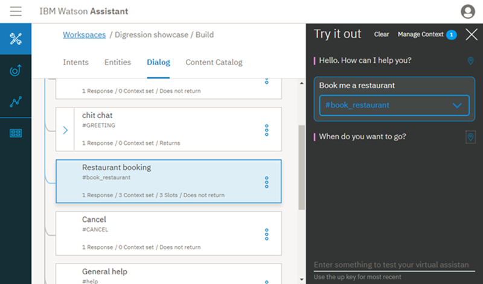
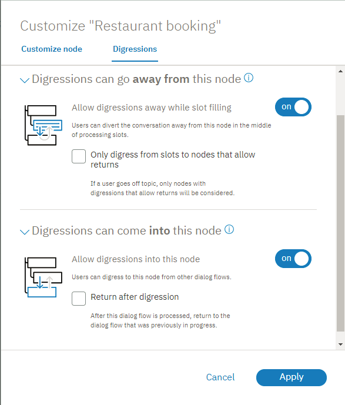

---

copyright:
  years: 2015, 2021
lastupdated: "2020-09-16"

subcollection: assistant

---

{:shortdesc: .shortdesc}
{:new_window: target="_blank"}
{:deprecated: .deprecated}
{:important: .important}
{:note: .note}
{:tip: .tip}
{:pre: .pre}
{:codeblock: .codeblock}
{:screen: .screen}
{:javascript: .ph data-hd-programlang='javascript'}
{:java: .ph data-hd-programlang='java'}
{:python: .ph data-hd-programlang='python'}
{:swift: .ph data-hd-programlang='swift'}

# Understanding dialog skill digressions
{: #tutorial-digressions}

In this tutorial, you see firsthand how digressions work.
{: shortdesc}

## Learning objectives
{: #tutorial-digressions-objectives}

By the time you finish the tutorial, you will understand how:

- digressions are designed to work
- digression settings impact the flow of the dialog
- to test digression settings for a dialog

### Duration
{: #tutorial-digressions-duration}

This tutorial takes approximately 20 minutes to complete.

### Prerequisite
{: #tutorial-digressions-prereqs}

If you do not have a {{site.data.keyword.conversationshort}} instance, complete the **Before you begin** step from the [Getting Started tutorial](/docs/assistant?topic=assistant-getting-started#getting-started-prerequisites) to create one.

## Step 1: Import the Digressions showcase dialog skill
{: #tutorial-digressions-import-json}

First, import the *Digression showcase* dialog skill into your {{site.data.keyword.conversationshort}} instance.

1.  Download the [digression-showcase.json](https://github.com/watson-developer-cloud/community/raw/master/watson-assistant/digression-showcase.json) file.
1.  In your {{site.data.keyword.conversationshort}} instance, click the  icon.
1.  Click **Choose a file**, and then select the **digression-showcase.json** file that you downloaded earlier.
1.  Click **Import** to finish importing the dialog skill.

## Step 2: Temporarily digressing away from dialog
{: #tutorial-digressions-temporarily-digress-away}

Digressions allow users to break away from a dialog branch to temporarily change the topic before they return to the original dialog flow. In this step, you will start to book a restaurant reservation, then digress away to ask for the restaurant's hours. After providing the opening hours information, your assistant will return back to the restaurant booking dialog flow.

1.  Click **Dialog** to switch from the page with intents to a view of the dialog tree.

1.  Click the  icon to open the "Try it out" pane.
1.  Type `Book me a restaurant` into the text field.

    Your assistant responds with a prompt for the day to reserve, `When do you want to go?`

1.  Click the **Location**  icon next to the response to highlight the node that triggered the response, the **Restaurant booking** node, in the dialog tree.

    
1.  Type `Tomorrow`.

    Your assistant responds with a prompt for the time to reserve, `What time do you want to go?`

1.  You do not know when the restaurant closes, so you ask, `What time do you close?`

    The bot digresses away from the restaurant booking node to process the **Restaurant opening hours** node. It responds with, `The restaurant is open from 8:00 AM to 10:00 PM.` Your assistant then returns to the restaurant booking node, and prompts you again for the reservation time.

    
1.  **Optional**: To complete the dialog flow, type `8pm` for the reservation time and `2` for the number of guests.

Congratulations! You successfully digressed away from and returned to a dialog flow.

## Step 3: Disabling slot digressions
{: #tutorial-digressions-disable-slot}

In this step, you will edit the digression setting for the restaurant booking node to prevent users from digressing away from it, and see how the setting change impacts the dialog flow.

1.  Let's look at the current digression settings for the **Restaurant booking** node. Click the node to open it in edit view.

1.  Click **Customize**, and then click the **Digressions** tab.

    

1.  Set the **Allow digressions away** switch to **Off**, and then click **Apply**.

1.  Click  to close the node edit view.

1.  Click **Clear** in the "Try it out" pane to reset the dialog.

1.  Type `Book me a restaurant`.

    Your assistant responds with a prompt for the day to reserve, `When do you want to go?`

1.  Type `Tomorrow`.

    Your assistant responds with a prompt for the time to reserve, `What time do you want to go?`

1.  Ask, `What time do you close?`

    Your assistant recognizes that the question triggers the #restaurant_opening_hours intent, but ignores it and displays the prompt that is associated with the @sys-time slot again instead.

You successfully prevented the user from digressing away from the restaurant booking process.

## Step 4: Digressing to a node that does not return
{: #tutorial-digressions-digress-without-return}

You can configure a dialog node to not go back to the node that your assistant digressed away from for the current node to be processed. To demonstrate this configuration, you will change the digression setting for the restaurant hours node. In Step 2, you saw that after you digressed away from the restaurant booking node to go to the restaurant opening hours node, your assistant went back to the restaurant booking node to continue with the reservation process. In this exercise, after you change the setting, you will digress away from the **Job opportunities** dialog to ask about restaurant opening hours and see that your assistant does not return to where it left off.

1.  Click to open the **Restaurant opening hours** node.

1.  Click **Customize**, and then click the **Digressions** tab.

1.  Expand the **Digressions can come into this node** section, and deselect the **Return after digression** checkbox. Click **Apply**, and then click  to close the node edit view.

1.  Click **Clear** in the "Try it out" pane to reset the dialog.

1.  To engage the **Job opportunities** dialog node, type `I'm looking for a job`.

    Your assistant responds by saying, `We are always looking for talented people to add to our team. What type of job are you interested in?`

1.  Instead of answering this question, ask the bot an unrelated question. Type `What time do you open?`

    Your assistant digresses away from the Job opportunities node to the Restaurant opening hours node to answer your question. Your assistant responds with `The restaurant is open from 8:00 AM to 10:00 PM.`

    Unlike in the previous test, this time the dialog does not pick up where it left off in the **Job opportunities** node. Your assistant does not return to the dialog that was in progress because you changed the setting on the **Restaurant opening hours** node to not return.

    

Congratulations! You successfully digressed away from a dialog without returning.

## Summary
{: #tutorial-digressions-summary}

In this tutorial you experienced how digressions work, and saw how individual dialog node settings can impact the digressions behavior.

## Next steps
{: #tutorial-digressions-next-steps}

For help as you configure digressions for your own dialog, see [Digressions](/docs/assistant?topic=assistant-dialog-runtime#dialog-runtime-digressions).
