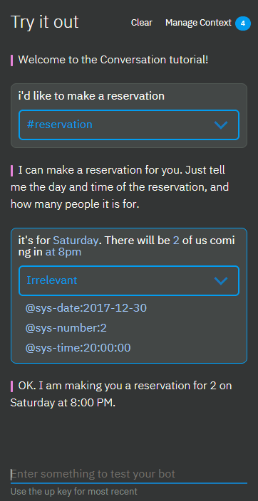
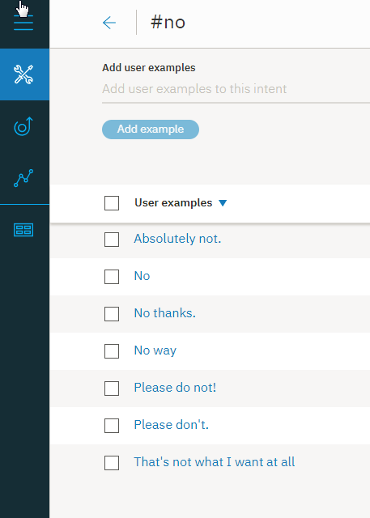
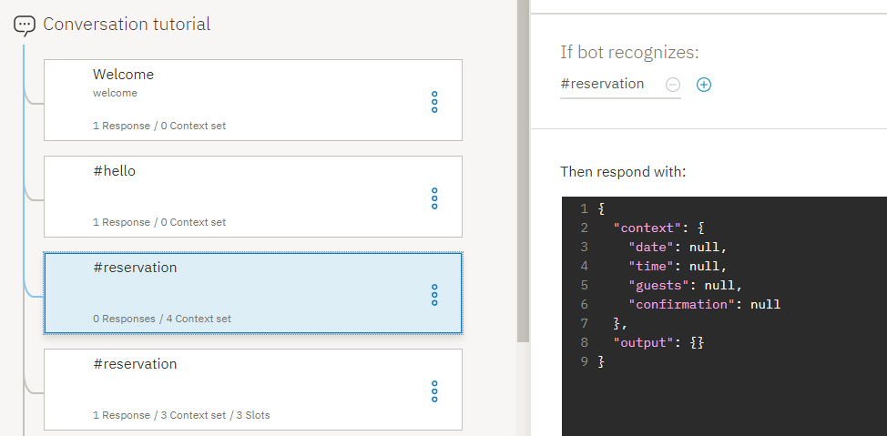

---

copyright:
  years: 2015, 2018
lastupdated: "2018-09-14"

---

{:shortdesc: .shortdesc}
{:new_window: target="_blank"}
{:tip: .tip}
{:pre: .pre}
{:codeblock: .codeblock}
{:screen: .screen}
{:javascript: .ph data-hd-programlang='javascript'}
{:java: .ph data-hd-programlang='java'}
{:python: .ph data-hd-programlang='python'}
{:swift: .ph data-hd-programlang='swift'}

# Tutorial: Improving a node with slots
{: #tutorial-slots-complex}

In this tutorial, you will enhance a simple node with slots that collects the information necessary to make a restaurant reservation.
{: shortdesc}

## Learning objectives

By the time you finish the tutorial, you will understand how to:

- Test a node with slots
- Add slot response conditions that address common user interactions
- Anticipate and address unrelated user input
- Handle unexpected user responses

### Duration
This tutorial will take approximately 2 to 3 hours to complete.

### Prerequisite

Before you begin, complete the [Adding a node with slots to a dialog](tutorial-slots.html). You must complete the first slots tutorial before you begin this one because you will build on the node with slots that you create in the first tutorial.

## Step 1: Improve the format of the responses
{: #fix-format}

When the date and time system entity values are saved, they are converted into a standardized format. This standardized format is useful for performing calculations on the values, but you might not want to expose this reformatting to users. In this step, you will reformat the date (`2017-12-29`) and time (`17:00:00`) values that are referenced by the dialog.

1.  To reformat the $date context variable value, click the **Edit response**  icon for the @sys-date slot.

1.  From the **More**  menu, select **Open JSON editor**, and then edit the JSON that defines the context variable. Add a method that reformats the date so that it converts the `2017-12-29` value into a full day of the week, followed by the full month and day. Edit the JSON as follows:

    ```json
    {
      "context": {
        "date": "<? @sys-date.reformatDateTime('EEEE, MMMM d') ?>"
      }
    }
    ```
    {: codeblock}

    The EEEE indicates that you want to spell out the day of the week. If you use 3 Es (EEE), the day of the week will be shortened to Fri instead of Friday, for example. The MMMM indicates that you want to spell out the month. Again, if you use only 3 Ms (MMM), the month is shortened to Dec instead of December.

1.  Click **Save**.

1.  To change the format in which the time value is stored in the $time context variable to use the hour, minutes and indicate AM or PM, click the **Edit response**  icon for the @sys-time slot.

1.  From the **More**  menu, select **Open JSON editor**, and then edit the JSON that defines the context variable so that it reads as follows:

    ```json
    {
      "context": {
        "time": "<? @sys-time.reformatDateTime('h:mm a') ?>"
      }
    }
    ```
    {: codeblock}

1.  Click **Save**.

1.  Test the node again. Open the "Try it out" pane, and click **Clear** to delete the slot context variable values that you specified when you tested the node with slots earlier. To see the impact of the changes you made, use the following script:

    <table>
    <caption>Script details</caption>
    <tr>
      <th>Speaker</th>
      <th>Utterance</th>
    </tr>
    <tr>
      <td>You</td>
      <td>i want to make a reservation</td>
    </tr>
    <tr>
      <td>Watson</td>
      <td>What day would you like to come in?</td>
    </tr>
    <tr>
      <td>You</td>
      <td>Friday</td>
    </tr>
    <tr>
      <td>Watson</td>
      <td>What time do you want the reservation to be made for?</td>
    </tr>
    <tr>
      <td>You</td>
      <td>5pm</td>
    </tr>
    <tr>
      <td>Watson</td>
      <td>How many people will be dining?</td>
    </tr>
    <tr>
      <td>You</td>
      <td>6</td>
    </tr>
    </table>

    This time Watson responds with, `OK. I am making you a reservation for 6 on Friday, December 29 at 5:00 PM.`

You have successfully improved the format that the dialog uses when it references context variable values in its responses. The dialog now uses `Friday, December 29` instead of the more technical, `2017-12-29`. And it uses `5:00 PM` instead of `17:00:00`. To learn about other SpEL methods you can use with date and time values, see [Methods to process values](dialog-methods.html#date-time).

## Step 2: Ask for everything at once
{: #ask-for-everything}

Now that you have tested the dialog more than once, you might have noticed that it can be annoying to have to answer one slot prompt at a time. To prevent users from having to provide one piece of information at a time, you can ask for every piece of information that you need up front. Doing so gives the user a chance to provide all or some of the information in a single input.

The node with slots is designed to find and save any and all slot values that the user provides while the current node is being processed. You can help users to take advantage of the design by letting them know what values to specify.

In this step, you will learn how to prompt for everything at once.

1.  From the main node with slots, click **Customize**.

1.  Select the **Prompt for everything** checkbox to enable the intial prompt, and then click **Apply**.

   

1.  Back in the node edit view, scroll down to the newly-added **If no slots are pre-filled, ask this first** field. Add the following initial prompt for the node, `I can make a reservation for you. Just tell me the day and time of the reservation, and how many people it is for.`

1.  Click  to close the node edit view.

1.  Test this change from the "Try it out" pane. Open the pane, and then click **Clear** to nullify the slot context variable values from the previous test.

1.  Enter `i'd like to make a reservation.`

    The dialog now responds with, `I can make a reservation for you. Just tell me the day and time of the reservation, and how many people it is for.`

1.  Enter, `it's for Saturday. There will be 2 of us coming in at 8pm`

    The dialog responds with, `OK. I am making you a reservation for 2 on Saturday at 8:00 PM.`

    

**Note**: If the user provides any one of the slot values in their initial input, then the prompt that asks for everything is not displayed. For example, the initial input from the user might be, `I want to make a reservation for this Friday night.` In this case, the initial prompt is skipped because you do not want to ask for information that the user already provided - the date (`Friday`), in this example. The dialog shows the prompt for the next empty slot instead.

## Step 3: Treat zeros properly
{: #recognize-zero}

When you use the `sys-number` system entity in a slot condition, it does not deal with zeros properly. Instead of setting the context variable that you define for the slot to 0, the service sets the context variable to false. As a result, the slot does not think it is full and prompts the user for a number again and again until the user specifies a number other than zero.

1.  Test the node so you can better understand the problem. Open the "Try it out" pane, and click **Clear** to delete the slot context variable values that you specified when you tested the node with slots earlier. Use the following script:

    <table>
    <caption>Script details</caption>
    <tr>
      <th>Speaker</th>
      <th>Utterance</th>
    </tr>
    <tr>
      <td>You</td>
      <td>i want to make a reservation</td>
    </tr>
    <tr>
      <td>Watson</td>
      <td>I can make a reservation for you. Just tell me the day and time of the reservation, and how many people it is for.</td>
    </tr>
    <tr>
      <td>You</td>
      <td>We want to dine May 23 at 8pm. There will be 0 guests.</td>
    </tr>
    <tr>
      <td>Watson</td>
      <td>How many people will be dining?</td>
    </tr>
    <tr>
      <td>You</td>
      <td>0</td>
    </tr>
    <tr>
      <td>Watson</td>
      <td>How many people will be dining?</td>
    </tr>
    </table>

    You will be stuck in this loop until you specify a number other than 0.

1.  To ensure that the slot treats zeros properly, change the slot condition from `@sys-number` to `@sys-number || @sys-number:0`.

1.  Click the **Edit response**  icon for the slot.

1.  When the context variable is created, it automatically uses the same expression that is specified for the slot condition. However, the context variable must save a number only. Edit the value that was saved as the context variable to remove the `OR` operator from it. From the **More**  menu, select **Open JSON editor**, and then edit the JSON that defines the context variable. Change the variable from `"guests":"@sys-number || @sys-number:0"` to use the following syntax:

    ```json
    {
      "context": {
        "guests": "@sys-number"
      }
    }
    ```
    {: codeblock}

1.  Click **Save**.

1.  Test the node again. Open the "Try it out" pane, and click **Clear** to delete the slot context variable values that you specified when you tested the node with slots earlier. To see the impact of the changes you made, use the following script:

    <table>
    <caption>Script details</caption>
    <tr>
      <th>Speaker</th>
      <th>Utterance</th>
    </tr>
    <tr>
      <td>You</td>
      <td>i want to make a reservation</td>
    </tr>
    <tr>
      <td>Watson</td>
      <td>I can make a reservation for you. Just tell me the day and time of the reservation, and how many people it is for.</td>
    </tr>
    <tr>
      <td>You</td>
      <td>We want to dine May 23 at 8pm. There will be 0 guests.</td>
    </tr>
    </table>

    This time Watson responds with, `OK. I am making you a reservation for 0 on Wednesday, May 23 at 8:00 PM.`

You have successfully formatted the number slot so that it treats zeros properly. Of course, you might not want the node to accept a zero as a valid number of guests. You will learn how to validate values that are specified by users in the next step.

## Step 4: Validate user input
{: #slot-conditions}

So far, we have assumed that the user will provide the appropriate value types for the slots. That is not always the case in reality. You can account for times when users might provide an invalid value by adding conditional responses to slots. In this step, you will use conditional slot responses to perform the following tasks:

- Ensure that the date requested is not in the past.
- Check whether a requested reservation time falls within the seating time window.
- Confirm the user's input.
- Ensure that the number of guests provided is larger than zero.
- Indicate that you are replacing one value with another.

To validate user input, complete the following steps:

1.  From the edit view of the node with slots, click the **Edit slot**  icon for the `@sys-date` slot.

1.  From the **Options**  menu in the *Configure slot 1* header, select **Enable conditional responses**.

1.  In the **Found** section, add a conditional response by clicking the **Edit response**  icon.

1.  Add the following condition and response to check whether the date that the user specifies falls before today:

    <table>
    <caption>Slot 1 conditional response 1 details</caption>
    <tr>
      <th>Condition</th>
      <th>Response</th>
      <th>Action</th>
    </tr>
    <tr>
      <td>`@sys-date.before(now())`</td>
      <td>You cannot make a reservation for a day in the past.</td>
      <td>Clear slot and prompt again</td>
    </tr>
    </table>

1.  Add a second conditional response that is displayed if the user provides a valid date. This type of simple confirmation lets the user know that her response was understood.

    <table>
    <caption>Slot 1 conditional response 2 details</caption>
    <tr>
      <th>Condition</th>
      <th>Response</th>
      <th>Action</th>
    </tr>
    <tr>
      <td>`true`</td>
      <td>$date it is</td>
      <td>Move on</td>
    </tr>
    </table>

1.  From the edit view of the node with slots, click the **Edit slot**  icon for the `@sys-time` slot.

1.  From the **Options**  menu in the *Configure slot 2* header, select **Enable conditional responses**.

1.  In the **Found** section, add a conditional response by clicking the **Edit response**  icon.

1.  Add the following conditions and responses to check whether the time that the user specifies falls within the allowed time window:

    <table>
    <caption>Slot 2 conditional response details</caption>
    <tr>
      <th>Condition</th>
      <th>Response</th>
      <th>Action</th>
    </tr>
    <tr>
      <td>`@sys-time.after('21:00:00')`</td>
      <td>Our last seating is at 9 PM.</td>
      <td>Clear slot and prompt again</td>
    </tr>
    <tr>
      <td>`@sys-time.before('09:00:00')`</td>
      <td>Our first seating is at 9 AM.</td>
      <td>Clear slot and prompt again</td>
    </tr>
    </table>

1.  Add a third conditional response that is displayed if the user provides a valid time that falls within the window. This type of simple confirmation lets the user know that her response was understood.

    <table>
    <caption>Slot 2 conditional response 3 details</caption>
    <tr>
      <th>Condition</th>
      <th>Response</th>
      <th>Action</th>
    </tr>
    <tr>
      <td>`true`</td>
      <td>Ok, the reservation is for $time.</td>
      <td>Move on</td>
    </tr>
    </table>

1.  Edit the @sys-number slot to validate the value provided by the user in the following ways:

    - Check that the number of guests specified is larger than zero.
    - Anticipate and address the case when the user changes the number of guests.

      If, at any point while the node with slots is being processed, the user changes a slot value, the corresponding slot context variable value is updated. However, it can be useful to let the user know that the value is being replaced, both to give clear feedback to the user and to give the user a chance to rectify it if the change was not what she intended. 

1.  From the edit view of the node with slots, click the **Edit slot**  icon for the `@sys-number` slot.

1.  From the **Options**  menu in the *Configure slot 3* header, select **Enable conditional responses**.

1.  In the **Found** section, add a conditional response by clicking the  icon, and then add the following condition and response:

    <table>
    <caption>Slot 3 conditional response details</caption>
    <tr>
      <th>Condition</th>
      <th>Response</th>
      <th>Action</th>
    </tr>
    <tr>
      <td>`entities['sys-number']?.value == 0`</td>
      <td>Please specify a number that is larger than 0.</td>
      <td>Clear slot and prompt again</td>
    </tr>
    <tr>
      <td>`(event.previous_value != null) && (event.previous_value != event.current_value)`</td>
      <td>Ok, updating the number of guests from `<? event.previous_value ?>` to `<? event.current_value ?>`.</td>
      <td>Move on</td>
    </tr>
    <tr>
      <td>`true`</td>
      <td>Ok. The reservation is for $guests guests.</td>
      <td>Move on</td>
    </tr>
    </table>

## Step 5: Add a confirmation slot
{: #confirmation-slot}

You might want to design your dialog to call an external reservation system and actually book a reservation for the user in the system. Before your application takes this action, you probably want to confirm with the user that the dialog has understood the details of the reservation correctly. You can do so by adding a confirmation slot to the node.

1.  The confirmation slot will expect a Yes or No answer from the user. You must teach the dialog to be able to recognize a Yes or No intent in the user input first.

1.  Click the **Intents** tab to return to the Intents page. Add the following intents and example utterances.

- `#yes`

   ```json
   Yes
   Sure
   I'd like that
   Please do
   Yes please.
   Ok
   That sounds good.
   ```
   {: screen}

   

- `#no`

   ```json
   No
   No thanks.
   Please don't.
   Please do not!
   That's not what I want at all
   Absolutely not.
   No way
   ```
   {: screen}

   

1.  Return to the **Dialog** tab, and then click to edit the node with slots. Click **Add slot** to add a fourth slot, and then specify the following values for it:

    <table>
    <caption>Confirmation slot details</caption>
    <tr>
      <th>Check for</th>
      <th>Save it as</th>
      <th>If not present, ask</th>
    </tr>
    <tr>
      <td>`(#yes || #no) && slot_in_focus`</td>
      <td>$confirmation</td>
      <td>I'm going to reserve you a table for $guests on $date at $time. Should I go ahead?</td>
    </tr>
    </table>

    This condition checks for either answer. You will specify what happens next depending on whether the user answer Yes or No by using conditional slot responses. The `slot_in_focus` property forces the scope of this condition to apply to the current slot only. This setting prevents random statements that could match against a `#yes` or `#no` intent that the user might make from triggering this slot.

    For example, the user might be answering the number of guests slot, and say something like, `Yes, there will be 5 of us.` You do not want the `Yes` included in this response to accidentally fill the confirmation slot. By adding the `slot_in_focus` property to the condition, a yes or no indicated by the user is applied to this slot only when the user is answering the prompt for this slot specifically.

1.  Click the **Edit slot**  icon. From the **Options**  menu in the *Configure slot 4* header, select **Enable conditional responses**.

1.  In the **Found** prompt, add a condition that checks for a No response (`#no`). Use the response, `Alright. Let's start over. I'll try to keep up this time.` Otherwise, you can assume the user confirmed the reservation details and proceed with making the reservation.

    When the `#no` intent is found, you also must reset the context variables that you saved earlier to null, so you can ask for the information again. You can reset the context variable values by using the JSON editor. Click the **Edit response**  icon for the conditional response you just added. From the **Options**   menu, click **Open JSON editor**. Add a `context` block that sets the slot context variables to `null`, as shown below.

    ```json
    {
      "output":{
        "text": {
          "values": [
            "Alright. Let's start over. I'll try to keep up this time."
          ]
        }
      },
      "context":{
        "date": null,
        "time": null,
        "guests": null
      }
    }
    ```
    {: codeblock}

1.  Click **Back**, and then click **Save**.

1.  Click the **Edit slot**  icon for the confirmation slot again. In the **Not found** prompt, clarify that you are expecting the user to provide a Yes or No answer. Add a response with the following values.

    <table>
    <caption>Not found response details</caption>
    <tr>
      <th>Condition</th>
      <th>Response</th>
    </tr>
    <tr>
      <td>`true`</td>
      <td>Respond with Yes to indicate that you want the reservation to be made as-is, or No to indicate that you do not.</td>
    </tr>
    </table>

1.  Click **Save**.

1.  Now that you have confirmation responses for slot values, and you ask for everything at once, you might notice that the individual slot responses are displayed before the confirmation slot response is displayed, which can appear repetitive to users. Edit the slot found responses to prevent them from being displayed under certain conditions.

1.  Replace the `true` condition that is specified in the JSON snippet for the last conditional response in the @sys-date slot with `!($time && $guests)`. For example:

    <table>
    <caption>Slot 1 conditional response 2 details</caption>
    <tr>
      <th>Condition</th>
      <th>Response</th>
      <th>Action</th>
    </tr>
    <tr>
      <td>`!($time && $guests)`</td>
      <td>$date it is</td>
      <td>Move on</td>
    </tr>
    </table>

1.  Replace the `true` condition that is specified in the JSON snippet for the last conditional response in the @sys-time slot with `!($date && $guests)`. For example:

    <table>
    <caption>Slot 2 conditional response 3 details</caption>
    <tr>
      <th>Condition</th>
      <th>Response</th>
      <th>Action</th>
    </tr>
    <tr>
      <td>`!($date && $guests)`</td>
      <td>Ok, the reservation is for $time.</td>
      <td>Move on</td>
    </tr>
    </table>

1.  Replace the `true` condition that is specified in the JSON snippet for the last conditional response in the @sys-number slot with `!($date && $time)`. For example:

    <table>
    <caption>Slot 3 conditional response 2 details</caption>
    <tr>
      <th>Condition</th>
      <th>Response</th>
      <th>Action</th>
    </tr>
    <tr>
      <td>`!($date && $time)`</td>
      <td>Ok. The reservation is for $guests guests.</td>
      <td>Move on</td>
    </tr>
    </table>

If you add more slots later, you must edit these conditions to account for the associated context variables for the additional slots. If you do not include a confirmation slot, you can specify `!all_slots_filled` only, and it would remain valid no matter how many slots you add later.

## Step 6: Reset the slot context variable values
{: #reset-variables}

You might have noticed that before each test, you must clear the context variable values that were created during the previous test. You must do so because the node with slots only prompts users for information that it considers to be missing. If the slot context variables are all filled with valid values, no prompts are displayed. The same is true for the dialog at run time. You must build into the dialog a mechanism by which you reset the slot context variables to null so that the slots can be filled anew by the next user. To do so, you are going to add a parent node to the node with slots that sets the context variables to null.

1.  From the tree view of the dialog, click the **More**  icon on the node with slots, and then select **Add node above**.

1.  Specify `#reservation` as the condition for the new node. (This is the same condition that is used by the node with slots, but you will change the condition for the node with slots later in this procedure.)

1.  Click the **Options**  icon next to the node response, and then click **Open JSON editor**. Add an entry for each slot context variable that you defined in the node with slots, and set it equal to `null`.

    ```json
    {
      "context": {
        "date": null,
        "time": null,
        "guests": null,
        "confirmation": null
      },
      "output": {}
    }
    ```
    {: codeblock}

    

1.  Click to edit the other #reservation node, the one you created previously and to which you added the slots.

1.  Change the node condition from `#reservation` to `($date == null && $time == null)`, and then close the node edit view by clicking .

1.  Click the **More**  icon on the node with slots, and then select **Move**.

    

1.  Select the `#reservation` node as the move-to location target, and then choose **As child node** from the menu.

1.  Click to edit the `#reservation` node. In the *And finally* section, change the action from *Wait for user input* to **Skip user input**.

    

    When a user input matches the `#reservation` intent, this node is triggered. The slot context variables are all set to null, and then the dialog jumps directly to the node with slots to process it.

## Step 7: Give users a way to exit the process
{: #handler}

Adding a node with slots is powerful because it keeps users on track with providing the information you need to give them a meaningful response or perform an action on their behalf. However, there might be times when a user is in the middle of providing reservation details, but decides to not go through with placing the reservation. You must give users a way to exit the process gracefully. You can do so by adding a slot handler that can detect a user's desire to exit the process, and exit the node without saving any values that were collected.

1.  You must teach the dialog to be able to recognize an #exit intent in the user input first.

1.  Click the **Intents** tab to return to the Intents page. Add the #exit intent with the following example utterances.

    ```json
    I want to stop
    Exit!
    Cancel this process
    I changed my mind. I don't want to make a reservation.
    Stop the reservation
    Wait, cancel this.
    Nevermind.
    ```
    {: screen}

    

1.  Return to the dialog by clicking the **Dialog** tab. Click to open the node with slots, and then click **Manage handlers**.

    

1.  Add the following values to the fields.

    <table>
    <caption>Node-level handler details</caption>
    <tr>
      <th>Condition</th>
      <th>Response</th>
      <th>Action</th>
    </tr>
    <tr>
      <td>`#exit`</td>
      <td>Ok, we'll stop there. No reservation will be made.</td>
      <td>Skip to response</td>
    </tr>
    </table>

    The **Skip to response** action jumps directly to the node-level response without displaying the prompts associated with any of the remaining unfilled slots.

1.  Click **Back**, and then click **Save**.

1.  Now, you need to edit the node-level response to make it recognize when a user wants to exit the process rather than make a reservation. Add a conditional response for the node.

    From the edit view of the node with slots, click **Customize**, click the **Multiple responses** toggle to turn it **on**, and then click **Apply**.

    

1.  Scroll down to the response section for the node with slots, and then click **Add response**.

1.  Add the following values to the fields.

    <table>
    <caption>Node-level conditional response details</caption>
    <tr>
      <th>Condition</th>
      <th>Response</th>
    </tr>
    <tr>
      <td>`has_skipped_slots`</td>
      <td>I look forward to helping you with your next reservation. Have a good day.</td>
    </tr>
    </table>

    The `has_skipped_slots` condition checks the properties of the slots node to see if any of the slots were skipped. The `#exit` handler skips all remaining slots to go directly to the node response. So, when the `has_skipped_slots` property is present, you know the `#exit` intent was triggered, and the dialog can display an alternate response.

    **Note**: If you configure more than one slot to skip other slots, or configure another node-level event handler to skip slots, then you must use a different approach to check whether the #exit intent was triggered. See [Handling requests to exit a process](dialog-slots.html#slots-node-level-handler) for an alternate way to do so.

1.  You want the service to check for the `has_skipped_slots` property before it displays the standard node-level response. Move the `has_skipped_slots` conditional response up so it gets processed before the original conditional response or it will never be triggered. To do so, click the response you just added, use the **up arrow** to move it up, and then click **Save**.

1.  Test this change by using the following script in the "Try it out" pane.

    <table>
    <caption>Script details</caption>
    <tr>
      <th>Speaker</th>
      <th>Utterance</th>
    </tr>
    <tr>
      <td>You</td>
      <td>i want to make a reservation</td>
    </tr>
    <tr>
      <td>Watson</td>
      <td>I can make a reservation for you. Just tell me the day and time of the reservation, and how many people it is for.</td>
    </tr>
    <tr>
      <td>You</td>
      <td>it's for 5 people</td>
    </tr>
    <tr>
      <td>Watson</td>
      <td>Ok. The reservation is for 5 guests.  What day would you like to come in?</td>
    </tr>
    <tr>
      <td>You</td>
      <td>Nevermind</td>
    </tr>
    <tr>
      <td>Watson</td>
      <td>Ok, we'll stop there. No reservation will be made.  I look forward to helping you with your next reservation. Have a good day.</td>
    </tr>
    </table>

## Step 8: Apply a valid value if the user fails to provide one after several attempts

In some cases, a user might not understand what you are asking for. They might respond again and again with the wrong types of values. To plan for this possibility, you can add a counter to the slot, and after 3 failed attempts by the user to provide a valid value, you can apply a value to the slot on the user's behalf and move on.

For the $time information, you will define a follow-up statement that is displayed when the user does not provide a valid time.

1.  Create a context variable that can keep track of how many times the user provides a value that does not match the value type that the slot expects. You want the context variable to be initialized and set to 0 before the node with slots is processed, so you will add it to the parent `#reservation` node.

1.  Click to edit the `#reservation` node. Open the JSON editor associated with the node response, by clicking the **Options**  icon in the response section, and choosing **Open JSON editor**. Add a context variable called `counter` to the bottom of the existing `"context"` block, below the `confirmation` variable. Set the `counter` variable equal to `0`.

       ```json
       {
         "context": {
           "date": null,
           "time": null,
           "guests": null,
           "confirmation": null,
           "counter": 0
         },
         "output": {}
       }
       ```
       {: codeblock}

1.  From the tree view, expand the `#reservation` node, and then click to edit the node with slots. 

1.  Click the **Edit slot**  icon for the `@sys-time` slot.

1.  From the **Options**  menu in the *Configure slot 2* header, select **Enable conditional responses**.

1.  In the **Not found** section, add a conditional response.

    <table>
    <caption>Not found response details</caption>
    <tr>
      <th>Condition</th>
      <th>Response</th>
    </tr>
    <tr>
      <td>`true`</td>
      <td>Please specify the time that you want to eat. The restaurant seats people between 9AM and 9PM.</td>
    </tr>
    </table>

1.  Add a 1 to the `counter` variable each time this response is triggered. Remember, this response is only triggered when the user does not provide a valid time value. Click the **Edit response**  icon.

1.  Click the **Options**  icon, and select **Open JSON editor**. Add the following context variable definition.

    ```json
    {
      "output": {
        "text": {
          "values": [
            "Please specify the time that you want to eat.
              The restaurant seats people between 9AM and 9PM."
          ]
        }
      },
      "context": {
        "counter": "<? context['counter'] + 1 ?>"
      }
    }
    ```
    {: codeblock}

    This expression adds a 1 to the current counter tally.

1.  Click **Back**, and then click **Save**.

1.  Reopen the @sys-time slot by clicking the **Edit slot**  icon.

    You will add a second conditional response to the **Not found** section that checks whether the counter is greater than 1, which indicates that the user has provided an invalid response 3 times previously. In this case, the dialog assigns the time value on the user's behalf to the popular dinner reservation time of 8 PM. Don't worry; the user will have a chance to change the time value when the confirmation slot is triggered. Click **Add a response**.

1.  Add the following condition and response.

    <table>
    <caption>Not found response details</caption>
    <tr>
      <th>Condition</th>
      <th>Response</th>
    </tr>
    <tr>
      <td>`$counter > 1`</td>
      <td>You seem to be having trouble choosing a time. I will make the reservation at 8PM for you.</td>
    </tr>
    </table>

    You must set the $time variable to 8PM, so click the **Edit response**  icon. Select **Open JSON editor**, add the following context variable definition, and then click **Back**.

    ```json
    {
      "output": {
        "text": {
          "values": [
            "You seem to be having trouble choosing a time.
              I will make the reservation at 8 PM for you."
          ]
        }
      },
      "context": {
        "time": "<? '20:00:00'.reformatDateTime('h:mm a') ?>"
      }
    }
    ```
    {: codeblock}

1.  The conditional response that you just added has a more precise condition than the true condition that is used by the first conditional response. You must move this response so it comes before the original conditional response or it will never be triggered. Click the response you just added, and use the up arrow to move it up, and then click **Save**.

1.  Test your changes by using the following script.

| Speaker | Utterance |
|---------|-----------|
| You     | i want to make a reservation |
| Watson  | I can make a reservation for you. Just tell me the day and time of the reservation, and how many people it is for. |
| You     | tomorrow |
| Watson  | Friday, December 29 it is.  What time do you want the reservation to be made for? |
| You     | orange |
| Watson  | Please specify the time that you want to eat. The restaurant seats people between 9AM and 9PM. |
| You     | pink |
| Watson  | Please specify the time that you want to eat. The restaurant seats people between 9AM and 9PM. |
| You     | purple |
| Watson  | You seem to be having trouble choosing a time. I will make the reservation at 8PM for you.  How many people will be dining? |

## Step 9: Connect to an external service
{: #action}

Now that your dialog can collect and confirm a user's reservation details, you can call an external service to actually reserve a table in the restaurant's system or through a multi-restaurant online reservations service. See [Making programmatic calls from a dialog node](dialog-actions.html) for more details.

In the logic that calls the reservation service, be sure to check for `has_skipped_slots` and do not continue with the reservation if it is present.

### Summary

In this tutorial you tested a node with slots and made changes that optimize how it interacts with real users. For more information about this subject, see [Gathering information with slots](dialog-slots.html).

## Next steps
{: #deploy}

Deploy your dialog skill by first connecting it to an assistant, and then deploying the assistant. There are several ways you can do this. See [Adding integrations](add-integrations.html) for more details.