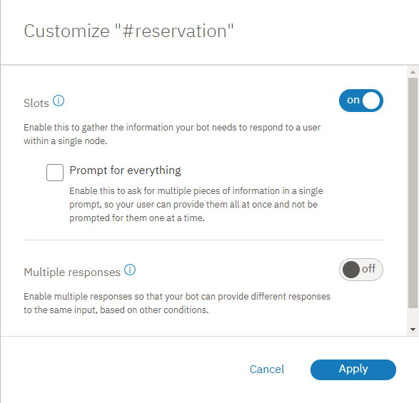
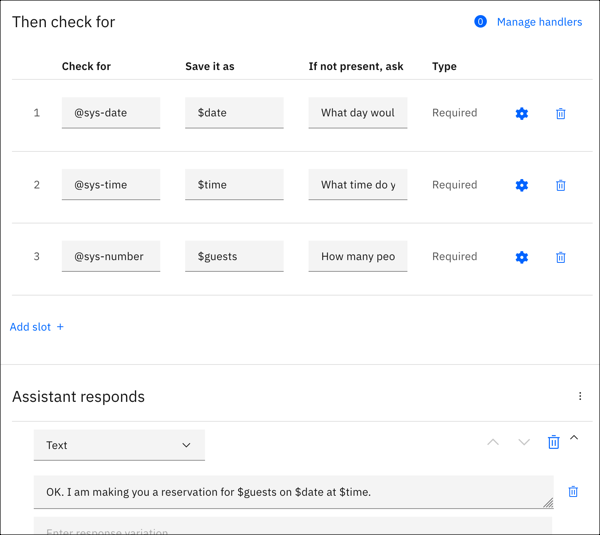

---

copyright:
  years: 2015, 2019
lastupdated: "2018-12-21"

---

{:shortdesc: .shortdesc}
{:new_window: target="_blank"}
{:deprecated: .deprecated}
{:important: .important}
{:note: .note}
{:tip: .tip}
{:pre: .pre}
{:codeblock: .codeblock}
{:screen: .screen}
{:javascript: .ph data-hd-programlang='javascript'}
{:java: .ph data-hd-programlang='java'}
{:python: .ph data-hd-programlang='python'}
{:swift: .ph data-hd-programlang='swift'}

# Tutorial: Adding a node with slots to a dialog
{: #tutorial-slots}

In this tutorial, you will add slots to a dialog node to collect multiple pieces of information from a user within a single node. The node you create will collect the information that is needed to make a restaurant reservation.
{: shortdesc}

## Learning objectives

By the time you finish the tutorial, you will understand how to:

- Define the intents and entities that are needed by your dialog
- Add slots to a dialog node
- Test the node with slots

### Duration
This tutorial will take approximately 30 minutes to complete.

### Prerequisite

Before you begin, complete the [Getting Started tutorial](getting-started.html). You will use the {{site.data.keyword.conversationshort}} tutorial skill that you created, and add nodes to the simple dialog that you built as part of the getting started exercise.

You can also start with a new dialog skill if you want. Just be sure to create the skill before you begin this tutorial.
{: note}

## Step 1: Add intents and examples
{: #add-intent}

Add an intent on the Intents tab. An intent is the purpose or goal that is expressed in user input. You will add a #reservation intent that recognizes user input that indicates that the user wants to make a restaurant reservation.

1.  On the Intents page of the tutorial skill, click **Add intent**.
1.  Add the following intent name, and then click **Create intent**:

    ```json
    reservation
    ```
    {: screen}

    The #reservation intent is added. A number sign (`#`) is prepended to the intent name to label it as an intent. This naming convention helps you and others recognize the intent as an intent. It has no example user utterances associated with it yet.
1.  In the **Add user examples** field, type the following utterance, and then click **Add example**:

    ```json
    i'd like to make a reservation
    ```
    {: screen}

1.  Add these additional examples to help Watson recognize the `#reservation` intent.

    ```json
    I want to reserve a table for dinner
    Can 3 of us get a table for lunch?
    do you have openings for next Wednesday at 7?
    Is there availability for 4 on Tuesday night?
    i'd like to come in for brunch tomorrow
    can i reserve a table?
    ```
    {: screen}

1.  Click the **Close**  icon to finish adding the `#reservation` intent and its example utterances.

## Step 2: Add entities
{: #add-entity}

An entity definition includes a set of entity *values* that represent vocabulary that is often used in the context of a given intent. By defining entities, you can help the service identify references in the user input that are related to intents of interest. In this step, you will enable system entities that can recognize references to time, date, and numbers.

1.  Click **Entities** to open the Entities page.
1.  Enable system entities that can recognize date, time, and number references in user input. Click the **System entities** tab, and then turn on these entities:

    - `@sys-time`
    - `@sys-date`
    - `@sys-number`

You have successfully enabled the @sys-date, @sys-time, and @sys-number system entities. Now you can use them in your dialog.

## Step 3: Add a dialog node with slots
{: #add-dialog-with-slots}

A dialog node represents the start of a thread of dialog between the service and the user. It contains a condition that must be met for the node to be processed by the service. At a minimum, it also contains a response. For example, a node condition might look for the `#hello` intent in user input, and respond with, `Hi. How can I help you?` This example is the simplest form of a dialog node, one that contains a single condition and a single response. You can define complex dialogs by adding conditional responses to a single node, adding child nodes that prolong the exchange with the user, and much more. (If you want to learn more about complex dialogs, you can complete the [Building a complex dialog](tutorial.html) tutorial.)

The node that you will add in this step is one that contains slots. Slots provide a structured format through which you can ask for and save multiple pieces of information from a user within a single node. They are most useful when you have a specific task in mind and need key pieces of information from the user before you can perform it. See [Gathering information with slots](dialog-slots.html) for more information.

The node you add will collect the information required to make a reservation at a restaurant.

1.  Click the **Dialogs** tab to open the dialog tree.
1.  Click the More icon  on the **#General_Greetings** node, and then select **Add node below**.
1.  Start typing `#reservation` in the condition field, and then select it from the list.
    This node will be evaluated if the user input matches the `#reservation` intent.
1.  Click **Customize**, click the **Slots** toggle to turn it **on**, and then click **Apply**.

    
1.  Define the following slots:

    <table>
    <caption>Slot details</caption>
    <tr>
      <th>Check for</th>
      <th>Save it as</th>
      <th>If not present, ask</th>
    </tr>
    <tr>
      <td>@sys-date</td>
      <td>$date</td>
      <td>What day would you like to come in?</td>
    </tr>
    <tr>
      <td>@sys-time</td>
      <td>$time</td>
      <td>What time do you want the reservation to be made for?</td>
    </tr>
    </tr>
    <tr>
      <td>@sys-number</td>
      <td>$guests</td>
      <td>How many people will be dining?</td>
    </tr>
    </table>

1.  As the response, specify `OK. I am making you a reservation for $guests on $date at $time.`

    

1.  Click  to close the node edit view.

## Step 4: Test the dialog

1.  Select the  icon to open the chat pane.
1.  Type `i want to make a reservation`.

    The assistant recognizes the #reservation intent, and it responds with the prompt for the first slot, `What day would you like to come in?`.

1.  Type `Friday`.

    The assistant recognizes the value, and uses it to fill the $date context variable for the first slot. It then shows the prompt for the next slot, `What time do you want the reservation to be made for?`

1.  Type `5pm`.

    The assistant recognizes the value, and uses it to fill the $time context variable for the second slot. It then shows the prompt for the next slot, `How many people will be dining?`

1.  Type `6`.

    The assistant recognizes the value, and uses it to fill the $guests context variable for the third slot. Now that all of the slots are filled, it shows the node response, `OK. I am making you a reservation for 6 on 2017-12-29 at 17:00:00.`


It worked! Congratulations. You have successfully created a node with slots.

## Summary

In this tutorial you created a node with slots that can capture the information necessary to reserve a table at a restaurant.

## Next steps

Improve the experience of users who interact with the node. Complete the follow-on tutorial, [Improving a node with slots](tutorial-slots-complex.html). It covers simple improvements, such as how to reformat the date (2017-12-28) and time (17:00:00) values that are returned by the system. It also covers more complex tasks, such as what to do if the user does not provide the type of value that your dialog expects for a slot.
