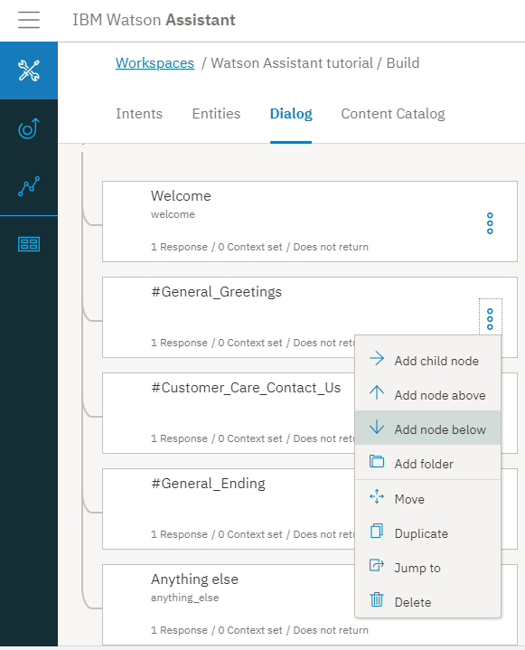
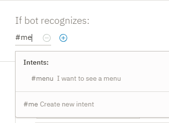
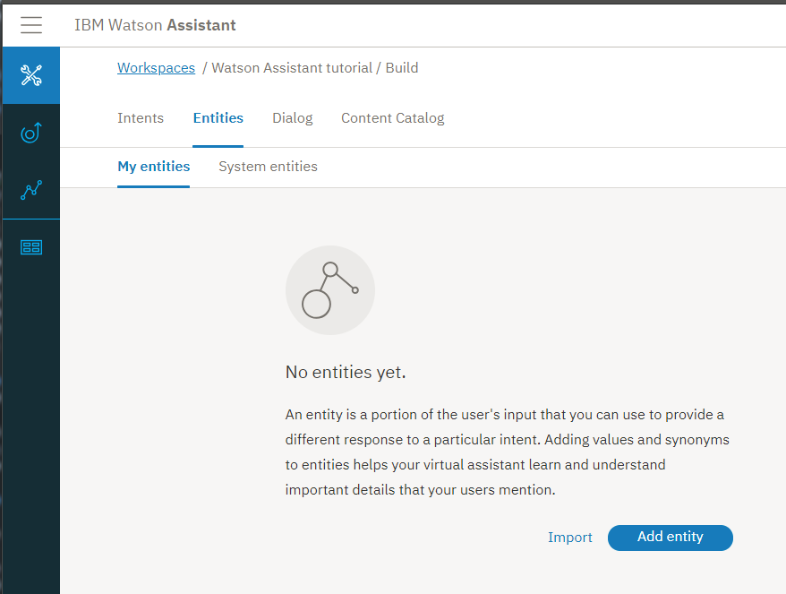
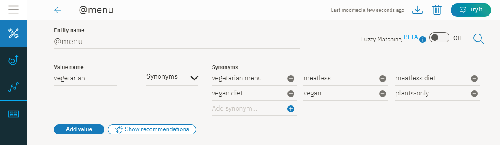
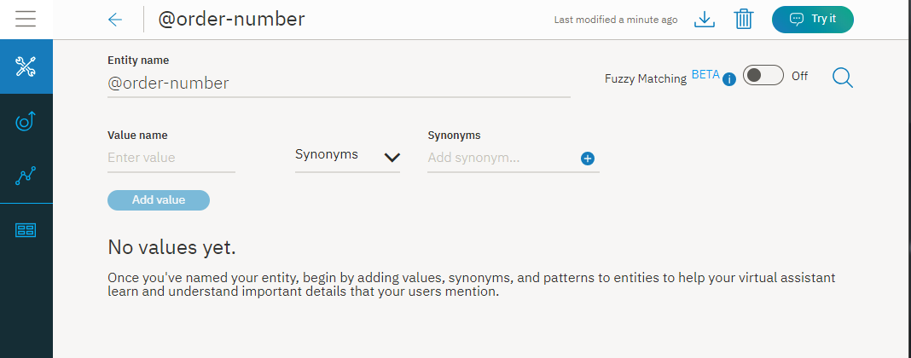
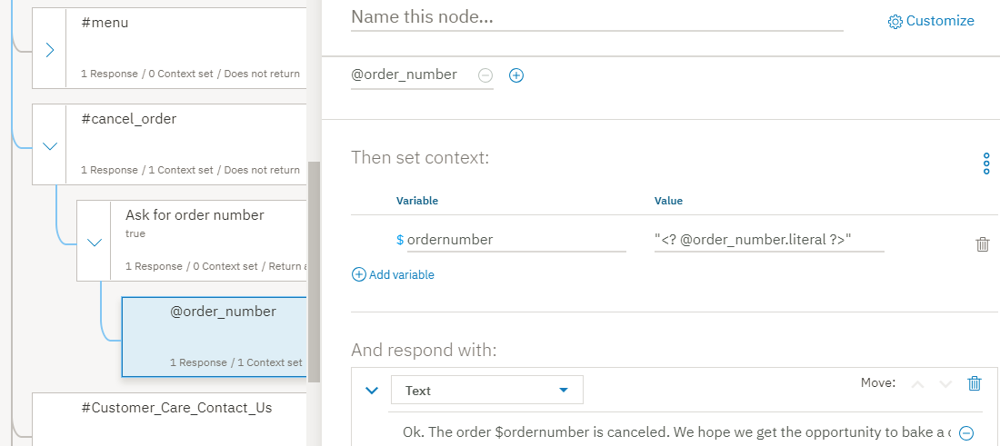

---

copyright:
  years: 2015, 2021
lastupdated: "2021-01-05"

subcollection: assistant
content-type: tutorial
account-plan: lite
completion-time: 2h

---

{:shortdesc: .shortdesc}
{:new_window: target="_blank"}
{:deprecated: .deprecated}
{:important: .important}
{:note: .note}
{:tip: .tip}
{:pre: .pre}
{:codeblock: .codeblock}
{:screen: .screen}
{:javascript: .ph data-hd-programlang='javascript'}
{:java: .ph data-hd-programlang='java'}
{:python: .ph data-hd-programlang='python'}
{:swift: .ph data-hd-programlang='swift'}
{:gif: data-image-type='gif'}
{:step: data-tutorial-type='step'}

# Building a complex dialog
{: #tutorial}
{: toc-content-type="tutorial"}
{: toc-completion-time="2h"}

In this tutorial, you will use the {{site.data.keyword.conversationshort}} service to create a dialog for an assistant that helps users with inquiries about a fictitious restaurant called *Truck Stop Gourmand*.
{: shortdesc}

## Learning objectives
{: #tutorial-objectives}

By the time you finish the tutorial, you will understand how to:

- Plan a dialog
- Define custom intents
- Add dialog nodes that can handle your intents
- Add entities to make your responses more specific
- Add a pattern entity, and use it in the dialog to find patterns in user input
- Set and reference context variables

### Duration
{: #tutorial-duration}

This tutorial will take approximately 2 to 3 hours to complete.

### Prerequisite
{: #tutorial-prereqs}

Before you begin, complete the [Getting Started tutorial](/docs/assistant?topic=assistant-getting-started).

You will use the dialog skill that you created, and add nodes to the simple dialog that you built as part of the getting started exercise.

## Plan the dialog
{: #tutorial-plan}
{: step}

You are building an assistant for a restaurant named *Truck Stop Gourmand* that has one location and a thriving cake-baking business. You want the simple assistant to answer user questions about the restaurant, its menu, and to cancel customer cake orders. Therefore, you need to create intents that handle inquiries related to the following subjects:

- Restaurant information
- Menu details
- Order cancellations

You'll start by creating intents that represent these subjects, and then build a dialog that responds to user questions about them.

## Answer questions about the restaurant
{: #tutorial-add-about-intent}
{: step}

Add an intent that recognizes when customers ask for details about the restaurant itself. An intent is the purpose or goal expressed in user input. The `#General_About_You` intent that is provided with the *General* content catalog serves a similar function, but its user examples are designed to focus on queries about the assistant as opposed to the business that is using the assistant to help its customers. So, you will add your own intent.

### Add the #about_restaurant intent
{: #tutorial-add-about-restaurant}

1.  From the **Intents** tab, click **Create intent**.

    
1.  Enter `about_restaurant` in the *Intent name* field, and then click **Create intent**.

    
1.  Add the following user examples:

    ```
    Tell me about the restaurant
    i want to know about you
    who are the restaurant owners and what is their philosophy?
    What's your story?
    Where do you source your produce from?
    Who is your head chef and what is the chef's background?
    How many locations do you have?
    do you cater or host functions on site?
    Do you deliver?
    Are you open for breakfast?
    ```
    {: screen}

1.  Click the **Close**  icon to finish adding the `#about_restaurant` intent.

You added an intent and provided examples of utterances that real users might enter to trigger this intent.

### Add a dialog node that is triggered by the #about_restaurant intent
{: #tutorial-trigger-about-intent}

Add a dialog node that recognizes when the user input maps to the intent that you created in the previous step, meaning its condition checks whether your assistant recognized the `#about_restaurant` intent from the user input.

1.  Click the **Dialog** tab.
1.  Find the `#General_Greetings` node in the dialog tree.

    You will add a node that checks for questions about the restaurant after this initial greeting node to reflect the flow you might expect to encounter in a normal conversation. For example, `Hello.` then `Tell me about yourself.`

1.  Click the **More**  icon on the `#General_Greetings` node, and then select **Add node below**.

    
1.  Start to type `#about_restaurant` into the **If assistant recognizes** field of this node. Then select the `#about_restaurant` option.
1.  Add the following text as the response.

   To copy the text, click the copy icon that is associated with the text block :

    ```
    Truck Stop Gourmand is the brain child of Gloria and Fred Smith. What started out as a food truck in 2004 has expanded into a thriving restaurant. We now have one brick and mortar restaurant in downtown Portland. The bigger kitchen brought with it new chefs, but each one is faithful to the philosophy that made the Smith food truck so popular to begin with: deliver fresh, local produce in inventive and delicious ways. Join us for lunch or dinner seven days a week. Or order a cake from our bakery.
    ```
    {: codeblock}

1.  Let's add an image to the response also.

    Click **Add response type**. Select **Image** from the drop-down list. In the **Image source** field, add `https://www.ibmlearningcenter.com/wp-content/uploads/2018/02/IBM-Learning-Center-Food4.jpg`.
1.  Move the image response type up, so it is displayed in the response before the text is displayed. Click the **Move** up arrow to reorder the two response types.

    

1.  Click  to close the edit view.

### Test the #about_restaurant dialog node
{: #tutorial-test-about-intent}

Test the intent by checking whether user utterances that are similar to, but not exactly the same as, the examples you added to the training data have successfully trained your assistant to recognize input with an `#about_restaurant` intent.

1.  Click the  icon to open the "Try it out" pane.

1.  Enter, `I want to learn more about your restaurant.`

    Your assistant indicates that the `#about_restaurant` intent is recognized, and returns a response with the image and text that you specified for the dialog node.

    

Congratulations! You have added a custom intent, and a dialog node that knows how to handle it.

The `#about_restaurant` intent is designed to recognize a variety of general questions about the restaurant. You added a single node to capture such questions. The response is long, but it is a single statement that can potentially answer questions about all of the following topics:

- The restaurant owners
- The restaurant history
- The philosophy
- The number of sites
- The days of operation
- The meals served
- The fact that the restaurant bakes cakes to order

For general, low-hanging fruit types of questions, a single, general answer is suitable.

## Answer questions about the menu
{: #tutorial-menu}
{: step}

A key question from potential restaurant customers is about the menu. The Truck Stop Gourmand restaurant changes the menu daily. In addition to its standard menu, it has vegetarian and cake shop menus. When a user asks about the menu, the dialog needs to find out which menu to share, and then provide a hyperlink to the menu that is kept up to date daily on the restaurant's website. You never want to hard-code information into a dialog node if that information changes regularly.

### Add a #menu intent
{: #tutorial-add-menu-intent}

1.  Click the **Intents** tab.
1.  Click **Create intent**.

    

1.  Enter `menu` in the *Intent name* field, and then click **Create intent**.

    

1.  Add the following user examples:

    ```
    I want to see a menu
    What do you have for food?
    Are there any specials today?
    where can i find out about your cuisine?
    What dishes do you have?
    What are the choices for appetizers?
    do you serve desserts?
    What is the price range of your meals?
    How much does a typical dish cost?
    tell me the entree choices
    Do you offer a prix fixe option?
    ```
    {: screen}

1.  Click the **Close**  icon to finish adding the `#menu` intent.

### Add a dialog node that is triggered by the #menu intent
{: #tutorial-trigger-menu-intent}

Add a dialog node that recognizes when the user input maps to the intent that you created in the previous step, meaning its condition checks whether your assistant recognized the `#menu` intent from the user input.

1.  Click the **Dialog** tab.
1.  Find the `#about_restaurant` node in the dialog tree.

    You will add a node that checks for questions about the menu after this node.

1.  Click the **More**  icon on the `#about_restaurant` node, and then select **Add node below**.

    

1.  Start to type `#menu` into the **If assistant recognizes** field of this node. Then select the `#menu` option.

    

1.  Add the following text as the response:

    `In keeping with our commitment to giving you only fresh local ingredients, our menu changes daily to accommodate the produce we pick up in the morning. You can find today's menu on our website.`

1.  Add an *option* response type that provides a list of options for the user to choose from. In this case, the list of options includes the different versions of the menu that are available.

    Click **Add response type**. Select **Option** from the drop-down list.

    

1.  In the **Title** field, add *Which menu do you want to see?*

    

1.  Click **Add option**.

1.  In the **List label** field, add `Standard`. The text you add as the label is displayed in the response to the user as a selectable option.

1.  In the **Value** field, add `standard menu`. The text you specify as the value is what gets sent to your assistant as new user input when a user chooses this option from the list, and clicks it.

1.  Repeat the previous two steps to add label and value information for the remaining menu types:

    <table>
    <caption>Option response type details</caption>
    <tr>
      <th>List label</th>
      <th>Value</th>
    </tr>
    <tr>
      <td>Vegetarian</td>
      <td>vegetarian menu</td>
    </tr>
    <tr>
      <td>Cake shop</td>
      <td>cake shop menu</td>
    </tr>
    </table>

    

1.  Click  to close the edit view.

### Add a @menu entity
{: #tutorial-add-menu-entity}

To recognize the different types of menus that customers indicate they want to see, you will add a `@menu` entity. Entities represent a class of object or a data type that is relevant to a user's purpose. By checking for the presence of specific entities in the user input, you can add more responses, each one tailored to address a distinct user request. In this case, you will add a `@menu` entity that can distinguish among different menu types.

1.  Click the **Entities** tab.

    

1.  Click **Create entity**.

1.  Enter `menu` into the entity name field.

    

1.  Click **Create entity**.

1.  Add `standard` to the **Value name** field, and then add `standard menu` to the **Synonyms** field, and press Enter.

1.  Add the following additional synonyms:

    - bill of fare
    - cuisine
    - carte du jour

    

1.  Click **Add value** to add the `@menu:standard` value.

1.  Add `vegetarian` to the **Value name** field, and then add `vegetarian menu` to the **Synonyms** field, and press Enter.

1.  Click **Show recommendations**, and then click the checkbox for *vegan diet*.

1.  Click **Add selected**.

1.  Click the empty *Add synonym* field, and then add these additional synonyms:

    - vegan
    - plants-only

    

1.  Click **Add value** to add the `@menu:vegetarian` value.

1.  Add `cake` to the **Value name** field, and then add `cake menu` to the **Synonyms** field, and press Enter.

1.  Add the following additional synonyms:

    - cake shop menu
    - dessert menu
    - bakery offerings

    

1.  Click **Add value** to add the `@menu:cake` value.

1.  Click the **Close**  icon to finish adding the `@menu` entity.

### Add child nodes that are triggered by the @menu entity types
{: #tutorial-trigger-menu-entity}

In this step, you will add child nodes to the dialog node that checks for the `#menu` intent. Each child node will show a different response depending on the `@menu` entity type the user chooses from the options list.

1.  Click the **Dialog** tab.
1.  Find the `#menu` node in the dialog tree.

    You will add a child node to handle each menu type option that you added to the `#menu` node.

1.  Click the **More**  icon on the `#menu` node, and then select **Add child node**.

    

1.  Start to type `@menu:standard` into the **If assistant recognizes** field of this node. Then select the `@menu:standard` option.

1.  Add the following message in the response text field, `To see our menu, go to the <a href="https://www.example.com/menu.html" target="blank">menu</a> page on our website.`

    

1.  Click  to close the edit view.

1.  Click the **More**  icon on the `@menu:standard` node, and then select **Add node below**.

1.  Start to type `@menu:vegetarian` into the **If assistant recognizes** field of this node. Then select the `@menu:vegetarian` option.

1.  Add the following message in the response text field, `To see our vegetarian menu, go to the <a href="https://www.example.com/vegetarian-menu.html" target="blank">vegetarian menu</a> page on our website.`

    

1.  Click  to close the edit view.

1.  Click the **More**  icon on the `@menu:vegetarian` node, and then select **Add node below**.

1.  Start to type `@menu:cake` into the **If assistant recognizes** field of this node. Then select the `@menu:cake` option.

1.  Add the following message in the response text field, `To see our cake shop menu, go to the <a href="https://www.example.com/menu.html" target="blank">cake shop menu</a> page on our website.`

    

1.  Click  to close the edit view.

1.  The standard menu is likely to be requested most often, so move it to the end of the child nodes list. Placing it last can help prevent it from being triggered accidentally when someone asks for a specialty menu instead the standard menu. 

    Click the **More**  icon on the `@menu:standard` node, and then select **Move**.

    

1.  Select the `@menu:cake` node, and then choose **Below node**.

    

You have added nodes that recognize user requests for menu details. Your response informs the user that there are three types of menus available, and asks them to choose one. When the user chooses a menu type, a response is displayed that provides a hypertext link to a web page with the requested menu details.

### Test the menu options dialog nodes
{: #tutorial-test-menu-options-intent}

Test the dialog nodes that you added to recognize menu questions.

1.  Click the  icon to open the "Try it out" pane.

1.  Enter, `What type of food do you serve?`

    Your assistant indicates that the `#menu` intent is recognized, and displays the list of menu options for the user to choose from.

    
1.  Click the `Cake shop` option.

    Your assistant recognizes the `#menu` intent and `@menu:cake` entity reference, and displays the response, `To see our cake shop menu, go to the cake shop page on our website.`

    
1.  Click the *cake shop* hyperlink in the response.

    A new web browser page opens and displays the example.com website.

1.  Close the example.com web page.

Well done. You have succesfully added an intent and entity that can recognize user requests for menu details, and can direct users to the appropriate menu.

The `#menu` intent represents a common, key need of potential restaurant customers. Due to its importance and popularity, you added a more complex section to the dialog to address it well.

## Manage cake orders
{: #tutorial-manage-orders}
{: step}

Customers place orders in person, over the phone, or by using the order form on the website. After the order is placed, users can cancel the order through the virtual assistant. First, define an entity that can recognize order numbers. Then, add an intent that recognizes when users want to cancel a cake order.

### Adding an order number pattern entity
{: tutorial-add-pattern-entity}

You want the assistant to recognize order numbers, so you will create a pattern entity to recognize the unique format that the restaurant uses to identify its orders. The syntax of order numbers used by the restaurant's bakery is two uppercase letters followed by 5 numbers. For example, `YR34663`. Add an entity that can recognize this character pattern.

1.  Click the **Entities** tab.
1.  Click **Create entity**.
1.  Enter `order_number` into the entity name field.
1.  Click **Create entity**.

    
1.  Add `order_syntax` to the *Value name* field, and then click the down arrow next to **Synonyms** to change the type to **Patterns**.

    
1.  Add the following regular expression to the Pattern field: `[A-Z]{2}\d{5}`

    

1.  Click **Add value**.

    

1.  Click the **Close**  icon to finish adding the `@order_number` entity.

    

### Add a cancel order intent
{: #tutorial-cancel-order-intent}

1.  Click the **Intents** tab.
1.  Click **Create intent**.
1.  Enter `cancel_order` in the *Intent name* field, and then click **Create intent**.
1.  Add the following user examples:

    ```
    I want to cancel my cake order
    I need to cancel an order I just placed
    Can I cancel my cake order?
    I'd like to cancel my order
    There's been a change. I need to cancel my bakery order.
    please cancel the birthday cake order I placed last week
    The party theme changed; we don't need a cake anymore
    that order i placed, i need to cancel it.
    ```
    {: screen}

    
1.  Click the **Close**  icon to finish adding the `#cancel_order` intent.

### Add a yes intent
{: #tutorial-yes-intent}

Before you perform an action on the user's behalf, you must get confirmation that you are taking the proper action. Add a #yes intent to the dialog that can recognize when a user agrees with what your assistant is proposing.

1.  Click the **Intents** tab.
1.  Click **Create intent**.
1.  Enter `yes` in the *Intent name* field, and then click **Create intent**.
1.  Add the following user examples:

    ```
    Yes
    Correct
    Please do.
    You've got it right.
    Please do that.
    that is correct.
    That's right
    yeah
    Yup
    Yes, I'd like to go ahead with that.
    ```
    {: screen}

    
1.  Click the **Close**  icon to finish adding the `#yes` intent.

### Add dialog nodes that can manage requests to cancel an order
{: #tutorial-cancel-order-dialog}

Now, add a dialog node that can handle requests to cancel a cake order.

1.  Click the **Dialog** tab.
1.  Find the `#menu` node. Click the **More**  icon on the `#menu` node, and then select **Add node below**.
1.  Start to type `#cancel_order` into the **If assistant recognizes** field of this node. Then select the `#cancel_order` option.
1.  Add the following message in the response text field:

    ```
    If the pickup time is more than 48 hours from now, you can cancel your order.
    ```
    {: codeblock}

    

    Before you can actually cancel the order, you need to know the order number. The user might specify the order number in the original request. So, to avoid asking for the order number again, check for a number with the order number pattern in the original input. To do so, define a context variable that would save the order number if it is specified.

1.  You define a context variable in the context editor. From the response section of the node, click the **More**  icon, and then select **Open context editor**.

    
1.  Enter the following context variable name and value pair:

    <table>
    <caption>Order number context variable details</caption>

    <tr>
      <th>Variable</th>
      <th>Value</th>
    </tr>
    <tr>
      <td>$ordernumber</td>
      <td><? @order_number.literal ?></td>
    </tr>
    </table>

    The context variable value (`<? @order_number.literal ?>`) is a SpEL expression that captures the number that the user specifies that matches the pattern defined by the @order_number pattern entity. It saves it to the `$ordernumber` variable.

    
1.  Click  to close the edit view.

    Now, add child nodes that either ask for the order number or get confirmation from the user that she wants to cancel an order with the detected order number.
1.  Click the **More**  icon on the `#cancel_order` node, and then select **Add child node**.

    
1.  Add a label to the node to distinguish it from other child nodes you will be adding. In the name field, add `Ask for order number`. Type `true` into the **If assistant recognizes** field of this node.

1.  Add the following message in the response text field:

    ```
    What is the order number?
    ```
    {: codeblock}

    
1.  Click  to close the edit view.

    Now, add another child node that informs the user that you are canceling the order.
1.  Click the **More**  icon on the `Ask for order number` node, and then select **Add child node**.
1.  Type `@order_number` into the **If assistant recognizes** field of this node.
1.  Open the context editor. Click the **More**  icon, and select **Open context editor**.
1.  Enter the following context variable name and value pair:

    <table>
    <caption>Order number context variable details</caption>

    <tr>
      <th>Variable</th>
      <th>Value</th>
    </tr>
    <tr>
      <td>$ordernumber</td>
      <td><? @order_number.literal ?></td>
    </tr>
    </table>

    The context variable value (`<? @order_number.literal ?>`) is a SpEL expression that captures the number that the user specifies that matches the pattern defined by the @order_number pattern entity. It saves it to the `$ordernumber` variable.
1.  Add the following message in the response text field:

    ```
    Ok. The order $ordernumber is canceled. We hope we get the opportunity to bake a cake for you sometime soon.
    ```
    {: codeblock}

    
1.  Click  to close the edit view.
1.  Add another node to capture the case where a user provides a number, but it is not a valid order number. Click the **More**  icon on the `@order_number` node, and then select **Add node below**.
1.  Type `true` into the **If assistant recognizes** field of this node.
1.  Add the following message in the response text field:

    ```
    I need the order number to cancel the order for you. If you don't know the order number, please call us at 958-234-3456 to cancel over the phone.
    ```
    {: codeblock}

    
1.  Click  to close the edit view.

1.  Add a node after the initial order cancellation request node that responds in the case where the user provides the order number in the initial request, so you don't have to ask for it again. Click the **More**  icon on the `#cancel_order` node, and then select **Add child node**.
1.  Add a label to the node to distinguish it from other child nodes. In the name field, add `Number provided`. Type `@order_number` into the **If assistant recognizes** field of this node.
1.  Add the following message in the response text field:

    ```
    Just to confirm, you want to cancel order $ordernumber?
    ```
    {: codeblock}

    
1.  Click  to close the edit view.

    You must add child nodes that check for the user's response to your confirmation question.
1.  Click the **More**  icon on the `Number provided` node, and then select **Add child node**.
1.  Type `#yes` into the **If assistant recognizes** field of this node.

1.  Add the following message in the response text field:

    ```
    Ok. The order $ordernumber is canceled. We hope we get the opportunity to bake a cake for you sometime soon.
    ```
    {: codeblock}

    
1.  Click  to close the edit view.

1.  Click the **More**  icon on the `#yes` node, and then select **Add node below**.

1.  Type `true` into the **If assistant recognizes** field of this node.

    Do not add a response. Instead, you will redirect users to the branch that asks for the order number details that you created earlier.

1.  In the *And finally* section, choose **Jump to**.

    
1.  Select the *Ask for order number* node's condition.

    
1.  Click  to close the edit view.
1.  Move the *Number provided* node before the *Ask for order number* node. Click the **More**  icon on the `Number provided` node, and then select **Move**. Select the *Ask for order number* node, and then click **Above node**.

    
1.  Force the conversation to evaluate the child nodes under the `#cancel_order` node at run time. Click to open the `#cancel_order` node in the edit view, and then, in the `And finally` section, select `Skip user input`.

    

### Test order cancellations
{: #tutorial-test-cancel-order}

Test whether your assistant can recognize character patterns that match the pattern used for product order numbers in user input.

1.  Click the  icon to open the "Try it out" pane.

1.  Enter, `i want to cancel my order number TW12345.`

    Your assistant recognizes both the `#cancel_order` intent and the `@order_number` entity. It responds with, `If the pickup time is more than 48 hours from now, you can cancel your order. Just to confirm, you want to cancel order TW12345?`

1.  Enter, `Yes`.

    Your assistant recognizes the `#yes` intent and responds with, `Ok. The order TW12345 is canceled. We hope we get the opportunity to bake a cake for you sometime soon.`

    

    Now, try it when you don't know the order number.
1.  Click **Clear** in the "Try it out" pane to start over. Enter, `I want to cancel my order.`

    Your assistant recognizes the `#cancel_order` intent, and responds with, `If the pickup time is more than 48 hours from now, you can cancel your order. What is the order number?`

1.  Enter, `I don't know.`

    Your assistant responds with, `I need the order number to cancel the order for you. If you don't know the order number, please call us at 958-234-3456 to cancel over the phone.`

    

### Add nodes to clarify order number format
{: #tutorial-clarify-order-number format}

If you do more testing, you might find that the dialog isn't very helpful in scenarios where the user does not remember the order number format. The user might include only the numbers or the letters too, but forget that they are meant to be uppercase. So, it would be a nice touch to give them a hint in such cases, correct? If you want to be kind, add another node to the dialog tree that checks for numbers in the user input.

1.  Find the `@order_number` node that is a child of the *Ask order number* node.

1.  Click the **More**  icon on the `@order_number` node, and then select **Add node below**.

1.  In the condition field, add `input.text.find('\d')`, which is a SpEL expression that says if you find one or more numbers in the user input, trigger this response.

1.  In the text response field, add the following response:

    ```
    The correct format for our order numbers is AAnnnnn. The A's represents 2 uppercase letters, and the n's represent 5 numbers. Do you have an order number in that format?
    ```
    {: codeblock}

1.  Click  to close the edit view.

1.  Click the **More**  icon on the `input.text.find('\d')` node, and then select **Add child node**.

1.  Type `true` into the **If assistant recognizes** field of this node.

1.  Enable conditional responses by clicking **Customize**, scrolling down, and then setting the **Multiple conditioned responses** switch to **On**.

1.  Click **Apply**.

1.  In the newly-added *If assistant recognizes* field, type `@order_number`, and in the *Respond with* field, type:

    ```
    Ok. The order $ordernumber is canceled. We hope we get the opportunity to bake a cake for you sometime soon.
    ```
    {: codeblock}

1.  Click **Add response**.

1.  In the *If assistant recognizes* field, type `true`, and in the *Respond with* field, type:

    ```
    I need the order number to cancel the order for you. If you don't know the order number, please call us at 958-234-3456 to cancel over the phone.
    ```
    {: codeblock}

    
1.  Click  to close the edit view.

Now, when you test, you can provide a set of number or a mix of numbers and text as input, and the dialog reminds you of the correct order number format. You have successfully tested your dialog, found a weakness in it, and corrected it.

Another way you can address this type of scenario is to add a node with slots. See the [Adding a node with slots to a dialog](/docs/assistant?topic=assistant-tutorial-slots) tutorial to learn more about using slots.
{:tip}

## Add the personal touch
{: #tutorial-get-username}
{: step}

If the user shows interest in the bot itself, you want the virtual assistant to recognize that curiosity and engage with the user in a more personal way. You might remember the `#General_About_You` intent, which is provided with the *General* content catalog, that we considered using earlier, before you added your own custom `#about_restaurant` intent. It is built to recognize just such questions from the user. Add a node that conditions on this intent. In your response, you can ask for the user's name and save it to a $username variable that you can use elsewhere in the dialog, if available.

### Add a node that handles questions about the bot
{: #tutorial-add-about-you-node}

Add a dialog node that can recognize the user's interest in the bot, and respond.

1.  Click the **Dialog** tab.
1.  Find the `Welcome` node in the dialog tree.
1.  Click the **More**  icon on the `Welcome` node, and then select **Add node below**.
1.  Start to type `#General_About_You` into the **If assistant recognizes** field of this node. Then select the `#General_About_You` option.
1.  Add the following message in the response text field:

    ```
    I am a virtual assistant that is designed to answer your questions 
    about the Truck Stop Gourmand restaurant. What should I call you?
    ```
    {: codeblock}

    
1.  Click  to close the edit view.
1.  Click the **More**  icon on the `#General_About_You` node, and then select **Add child node**.
1.  In the **If assistant recognizes** field of this node, enter `true`.
1.  Add the following message in the response text field:

    ```
    Hello, <? input.text ?>! It's lovely to meet you. How can I help you today?
    ```
    {: codeblock}

1.  To capture the name that the user provides, add a context variable to the node. Click the **More**  icon, and select **Open context editor**.
1.  Enter the following context variable name and value pair:

    <table>
    <caption>User name context variable details</caption>

    <tr>
      <th>Variable</th>
      <th>Value</th>
    </tr>
    <tr>
      <td>username</td>
      <td><? input.text ?></td>
    </tr>
    </table>

    The context variable value (`<? input.text ?>`) is a SpEL expression that captures the user name as it is specified by the user, and then saves it to the `$username` context variable.

1.  Click  to close the edit view.

If, at run time, the user triggers this node and provides a name, then you will know the user's name. If you know it, you should use it! Add conditional responses to the greeting dialog node you added previously to include a conditional response that uses the user name, if it is known.

### Add the user name to the greeting
{: #tutorial-add-username-to-greeting}

If you know the user's name, you should include it in your greeting message. To do so, add conditional responses, and include a variation of the greeting that includes the user's name.

1.  Find the `#General_Greetings` node in the dialog tree, and click to open it in the edit view.
1.  Click **Customize**, scroll down, and then set the **Multiple conditioned responses** switch to **On**.

    
1.  Click **Apply**.

    
1.  Click **Add response**.
1.  In the *If assistant recognizes* field, type `$username`, and in the *Respond with* field, add a new response:

    ```
    Good day to you, $username!
    ```
    {: codeblock}

1.  Click the up arrow for response number 2 to move it so it is listed before response number 1 (`Good day to you!`).

    
1.  Click  to close the edit view.

### Test personalization
{: #tutorial-test-personalize}

Test whether your assistant can recognize and save a user's name, and then refer to the user by it later.

1.  Click the  icon to open the "Try it out" pane.

1.  Click **Clear** to restart the conversation session.

1.  Enter, `Who are you?`

    Your assistant recognizes the `#General_About_You` intent. Its response ends with the question, `What should I call you?`
1.  Enter, `Jane`.

    Your assistant saves `Jane` in the `$username` variable.
1.  Enter, `Hello.`

    Your assistant recognizes the `#General_Greetings` intent and says, `Good day to you, Jane!` It uses the conditional response that includes the user's name because the `$username` context variable contains a value at the time that the greeting node is triggered.

You can add a conditional response that conditions on and includes the user's name for any other responses where personalization would add value to the conversation.

## Test the assistant from your web page integration
{: #tutorial-integrate-assistant}
{: step}

Now that you have built a more sophisticated version of the assistant, return to the public web page that you deployed as part of the previous tutorial, and then test the new capabilities you added.

1.  Open the assistant.
1.  From the *Integrations* area, click **Preview link**.
1.  Click the URL that is displayed on the page.

    The page opens in a new tab.
1.  Repeat a few of the test utterances that you submited to the "Try it out" pane to see how the assistant behaves in a real integration.

    Unlike when you send test utterances to your assistant from the "Try it out" pane, standard usage charges apply to API calls that result from utterances that are submited to the chat widget.
    {: note}

## Next steps
{: #tutorial-deploy}

Now that you have built and tested your dialog skill, you can share it with customers. Deploy your skill by first connecting it to an assistant, and then deploying the assistant. There are several ways you can do this. See [Adding integrations](/docs/assistant?topic=assistant-deploy-integration-add) for more details.
