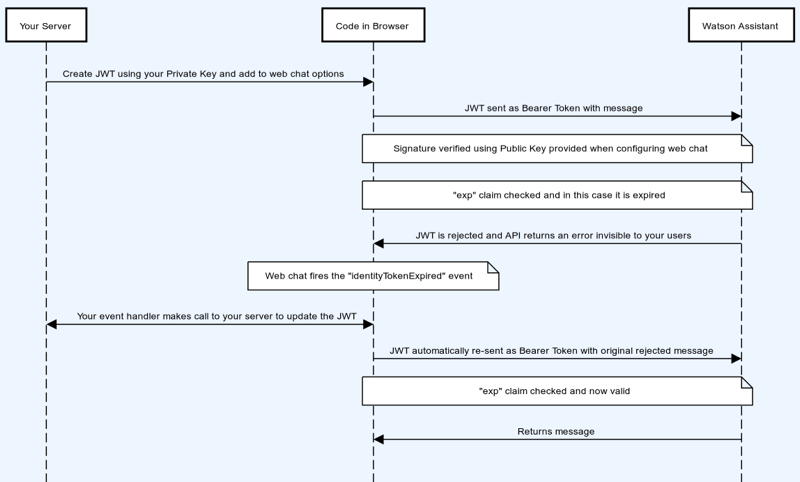

---

copyright:
  years: 2019, 2023
lastupdated: "2023-10-18"

subcollection: assistant

---

{{site.data.keyword.attribute-definition-list}}

Documentation for the **classic {{site.data.keyword.assistant_classic_short}}** experience has moved. For the most up-to-date version, see [Overview: Securing a web chat](/docs/watson-assistant?topic=watson-assistant-web-chat-security){: external}.
{: attention}

# Securing the web chat
{: #web-chat-security}

Understand what you need to do to secure your web chat integration.
{: shortdesc}

Configure the web chat to authenticate users and send private data from your embedded web chat.

All messages that are sent from the web chat are encrypted. When you enable security, your assistant takes an additional step to verify that messages originate from the web chat that is embedded in your website only.

The web chat uses an RSA signature with SHA-256 (RS256) to encrypt communication. RS256 signatures use a sophisticated type of RSA encryption. An RSA key pair includes a private and a public key. The RSA private key is used to generate digital signatures, and the RSA public key is used to verify digital signatures. The complexity of the RSA algorithm that is used to scramble the message makes it nearly impossible to unscramble the message without the key.

The following diagram illustrates the requests that are sent back and forth to authenticate a request.



You can implement the following security measures:

- Ensure that messages sent from the web chat to your assistant come from your customers only
- Send private data from the web chat to your assistant

## Before you begin
{: #web-chat-security-prereq}

The process you use to add the web chat to your website is simple. Its simplicity also means it can be misused. That's why it's important to verify that the messages sent to your assistant are coming from authorized users only.

Before you enable security, complete the following steps:

1. Create a RS256 private/public key pair. {: #deploy-web-chat-security-origin}

    You can use a tool such as the OpenSSL command line or PuTTYgen.

    - For example, to create the key pair: `openssl genrsa -out key.pem 2048`
    
1. Use your private key to sign a JSON Web Token (JWT). You will pass the token with the messages that are sent from your website as proof of their origin.

    The JWT payload must specify values for the following claims:

    - `iss`: Represents the issuer of the JWT. This value is a case-sensitive string.
    - `sub`: Represents the principal that is the subject of the JWT. This value must either be scoped to be locally unique in the context of the issuer or be globally unique. The value you specify for `sub` is used as the `user_id`. 
    
      The user ID that is specified in the `sub` claim is also sent in the `customer_id` section of the `X-Watson-Metadata` HTTP header. The `customer_id` can be used to make requests to delete user data. Because the ID is sent in a header field, the syntax must meet the requirements for header fields as defined in [RFC 7230](https://tools.ietf.org/html/rfc7230#section-3.2){: external} (all visible ASCII characters). For more information about deleting user data, see [Labeling and deleting data](/docs/assistant?topic=assistant-information-security#information-security-gdpr-wa).

    - `exp`: Represents the expiration time on or after which the JWT cannot be accepted for processing. Many libraries set this value for you automatically. Set a short-lived `exp` claim with whatever library you use.

    For more information about JSON Web Tokens, see the [RFC7519](https://tools.ietf.org/html/rfc7519){: external} and [OpenID Connect 1.0](https://openid.net/specs/openid-connect-core-1_0.html){: external} specifications.
    
    Most programming languages offer JWT libraries that you can use to generate a token. The following NodeJS code sample illustrates how to generate a JWT token.

    ```javascript
    // Sample NodeJS code on your server.
    const jwt = require('jsonwebtoken');
    
    /**
     * Returns a signed JWT generated by RS256 algorithm.
     */
    function mockLogin() {
        const payload = {
            /*
             * Even if this is an unauthenticated user, add a userID in the sub claim that can be used 
             * for billing purposes.
             * This ID will help us keep track "unique users". For unauthenticated users, drop a
             * cookie in the browser so you can make sure the user is counted uniquely across visits.
             */
            sub: 'some-user-id', // Required
            iss: 'yourdomain.com' // Required
        };
        // The "expiresIn" option adds an "exp" claim to the payload.
        return jwt.sign(payload, process.env.YOUR_PRIVATE_RSA_KEY, { algorithm: 'RS256', expiresIn: '10000ms' });
    }
    ```
    {: codeblock}

## Enable security
{: #web-chat-security-task}

To enable security, complete the following steps:

1. From the **Security** tab of the web chat integration setup page in {{site.data.keyword.assistant_classic_short}}, set the **Secure your web chat** switch to **On**.

1. Add your public key to the **Your public key** field.
    
    The public key that you add is used to verify that data that claims to come from your web chat instance *is* coming from your web chat instance. 
    
1. To prove that a message is coming from your website, each message that is submitted from your web chat implementation must include the JSON Web Token (JWT) that you created earlier.

    Add the token to the web chat code snippet that you embed in your website page. Specify the token in the `identityToken` property.

    Starting with web chat version **3.2.0**, this step is optional. You do not have to add the `identityToken` property initially. You can skip this step as long as you perform the next step where you add the `identityTokenExpired` event. The event is fired when the web chat is first opened, and if a token wasn't provided, it obtains one from your handler at that time.
    {: note}

    For example:

    ```html
    <script>
      window.watsonAssistantChatOptions = {
          integrationID: 'YOUR_INTEGRATION_ID',
          region: 'YOUR_REGION', 
          serviceInstanceID: 'YOUR_SERVICE_INSTANCE',
          identityToken: 'YOUR_JWT',
          onLoad: function(instance) {
            instance.render(); 
            }
        };
      setTimeout(function(){
        const t=document.createElement('script');
        t.src="https://web-chat.global.assistant.watson.appdomain.cloud/loadWatsonAssistantChat.js";
        document.head.appendChild(t);
      });
    </script>
    ```
    {: codeblock}
    
    The JSON Web Token is automatically included on each subsequent request that is sent from the web chat until it expires.

1. You can add an event that is triggered when your token expires, or (starting with web chat version 3.2.0) when no token is specified initially. The event has a callback you can use to update the token and to process any messages that were queued for processing during the time the token was expired.

    For example:

    ```html
    <script>
    window.watsonAssistantChatOptions = {
      integrationID: 'YOUR_INTEGRATION_ID',
      region: 'YOUR_REGION',
      serviceInstanceID: 'YOUR_SERVICE_INSTANCE',
      identityToken: 'YOUR_JWT',
      onLoad: function(instance) {
        instance.on({ type: 'identityTokenExpired', handler: function(event) {
          // Perform whatever actions you need to take on your system to get a new token.
          return new Promise(function(resolve, reject) {
            // And then pass the new JWT into the callback and the service will resume processing messages.
            event.identityToken = 'YOUR NEW JWT';
            resolve();
          });
        }});
        instance.render();
      }
    };
    setTimeout(function(){
        const t=document.createElement('script');
        t.src="https://web-chat.global.assistant.watson.appdomain.cloud/loadWatsonAssistantChat.js";
        document.head.appendChild(t);
      });
    </script>
    ```
    {: codeblock}

### Passing sensitive data
{: #web-chat-security-encrypt}

You can optionally copy the public key that is provided by IBM, and use it to add an additional level of encryption to support passing sensitive data from the web chat.

Use this method to send sensitive information in messages that come from your website, such as a information about a customer's loyalty level, a user ID, or security tokens to use in webhooks that you call from your dialog. Information that is passed to your assistant in this way is stored in a private variable in your assistant. Private variables cannot be seen by customers and are never sent back to the web chat.

For example, you might start a business process for a VIP customer that is different from the process you start for less important customers. You likely do not want non-VIPs to know that they are categorized as such. But you must pass this informataion to your dialog because it changes the route of the conversation. You can pass the customer MVP status as an encrypted variable. This private context variable will be available for use by the dialog, but not by anything else.

1. From the web chat configuration page, copy the public key from the **IBM provided public key** field.
1. From your website, write a function that signs a JSON Web Token.

    For example, the following NodeJS code snippet shows a function that accepts a userID and payload content and sends it to the web chat. If a payload is provided, its content is encrypted and signed with the IBM public key.

    ```javascript
    
    // Sample NodeJS code on your server.
    const jwt = require('jsonwebtoken');
    const RSA = require('node-rsa');

    const rsaKey = new RSA(process.env.PUBLIC_IBM_RSA_KEY);

    /**
    * Returns a signed JWT. Optionally, also adds an encrypted user_payload. 
    * The userPayload is stringified JSON.
    */
    function mockLogin(userID, userPayload) {
    const payload = {
      sub: userID, // Required
      // The exp claim is automatically added by the jsonwebtoken library. 
      // We recommend you set a short lived exp claim
      // with whatever library you are using.
    };
    if (userPayload) {
        // If there is a user payload we encrypt it using the IBM public key. 
        // Should be encrypted to base64 format.
        payload.user_payload = rsaKey.encrypt(userPayload, 'base64');
    }
    const token = jwt.sign(payload, process.env.YOUR_PRIVATE_RSA_KEY, { algorithm: 'RS256', expiresIn: '10000ms' });
    return token;
    }
    ```
    {: codeblock}

1. The encrypted user payload is decrypted and then saved to the `context.integrations.chat.private.user_payload` object. 

    For information about how to access the payload data from the dialog, see [Web chat: Accessing sensitive data](/docs/assistant?topic=assistant-dialog-integrations#dialog-integrations-chat-private). You might want to access the payload, for example, to get the customer importance information or single sign-on credentials that you can subsequently use to authenticate a webhook.

### Authenticating users
{: #web-chat-security-authenticate}

To authenticate and specify a unique ID for each customer, add the user ID information to the token.

1. From the web chat configuration page, copy the public key from the **IBM provided public key** field. You will specify this value as the `PUBLIC_IBM_RSA_KEY` later.
1. From your website, write a function that signs a JSON Web Token.

    The function must accept a UserID parameter and set the userID as the `sub` claim value.

    For example, the following NodeJS code snippet set the user's ID to `L12345`.

    ```javascript
    // Sample NodeJS code on your server.
    const jwt = require('jsonwebtoken');
    const RSA = require('node-rsa');

    const rsaKey = new RSA(process.env.PUBLIC_IBM_RSA_KEY);

    /**
    * Returns a signed JWT. Optionally, adds an encrypted user payload in stringified JSON.
    */
    function mockLogin() {
      const payload = {
        sub: 'L12345', // Required
        iss: 'www.example.com' // Required
      };
      const token = jwt.sign(payload, process.env.YOUR_PRIVATE_RSA_KEY, { algorithm: 'RS256', expiresIn: '10000ms' });
    return token;
    }
    ```
    {: codeblock}

    After you set the value of the `sub` claim to be the user's userID, you cannot change the claim to another user. The userID that you specify with this method is used for billing purposes and can be used to delete customer data upon request.

    The userID is stored in the context object as `context.global.system.user_id`.

    The user ID that is specified in the `sub` claim is also sent in the `customer_id` section of the `X-Watson-Metadata` HTTP header. The `customer_id` can be used to make requests to delete user data. Because the ID is sent in a header field, the syntax must meet the requirements for header fields as defined in [RFC 7230](https://tools.ietf.org/html/rfc7230#section-3.2){: external} (all visible ASCII characters). For more information about deleting user data, see [Labeling and deleting data](/docs/assistant?topic=assistant-information-security#information-security-gdpr-wa).

If you disable security, then you can use the `instance.updateUserID()` method to specify user IDs. For more information, see [Adding user identity information](/docs/assistant?topic=assistant-web-chat-config#web-chat-config-userid).

## Logging out
{: #web-chat-security-logout}

To log out a customer, you must destroy the web chat.

If you reload the page when a customer logs out, you must call the `instance.destroySession()` method to remove any reference to the current session from the browser's cookies and storage. If you forget to call this method, information that is protected by the `identityToken` is not at risk, but the web chat will try to connect to the previous session and fail.

If you do not perform a full page reload when a customer logs out, call the `instance.destroy()` method. The `destroy` method removes the current instance of the web chat that is configured for the current userID from the DOM and browser memory. Next, call the `instance.destroySession()` method.

## Updating site security policies
{: #web-chat-security-csp}

If your website uses a Content Security Policy (CSP), you must update it to grant permission to the web chat.

The following table lists the values to add to your CSP.

| Property | Additional values |
|----------|-------------------|
| default-src	| 'self' *.watson.appdomain.cloud fonts.gstatic.com 'unsafe-inline' |
| connect-src |	*.watsonplatform.net *.watson.appdomain.cloud |
{: caption="CSP properties" caption-side="top"}

The following example shows a complete CSP metadata tag:

```html
<meta
  http-equiv="Content-Security-Policy"
  content="default-src 'self' *.watson.appdomain.cloud fonts.gstatic.com 'unsafe-inline';connect-src *.watsonplatform.net *.watson.appdomain.cloud" />
```
{: codeblock}

### Allowing elements

If your CSP uses a nonce to add elements, such as `<script>` and `<style>` tags, to an allowlist, do not use `unsafe-inline` to allow all such elements. Instead, provide a nonce value to the web chat widget as a configuration option. The web chat will then set the nonce on any of the `<script>` and `<style>` elements that it generates dynamically.

A CSP that passes a nonce to the web chat widget might look like this:

<meta
  http-equiv="Content-Security-Policy"
  content="default-src 'self' *.watson.appdomain.cloud fonts.gstatic.com 'nonce-<server generated value>';connect-src *.watsonplatform.net *.watson.appdomain.cloud"
>

You can pass the nonce to the web chat by editing the embed script as follows:

```javascript
window.watsonAssistantChatOptions = {
  integrationID: "YOUR_INTEGRATION_ID",
  region: "YOUR_REGION",
  serviceInstanceID: "YOUR_SERVICE_INSTANCE",
  
  cspNonce: "<server generated value>",
  
  onLoad: function(instance) {
    instance.render();
  }
};
```
{: codeblock}

## Security measures
{: #web-chat-security-measures}

The web chat integration undergoes tests and scans on a regular basis to find and address potential security issues, such as cross-site scripting (XSS) vulnerabilities.

Be sure to run your own security reviews to see how the web chat fits in with your current website structure and policies. The web chat is hosted on your site and can inherit any vulnerabilities that your site has. Only serve content over HTTPS, use Content Security Policy (CSP), and implement other basic web security precautions.
