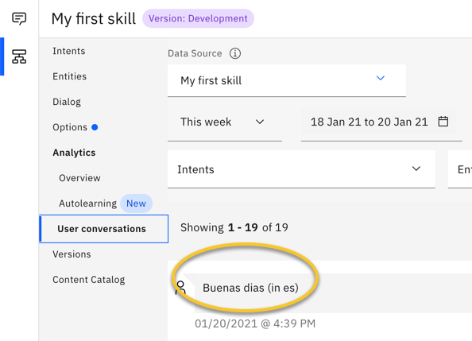

---

copyright:
  years: 2019, 2021
lastupdated: "2021-01-21"

subcollection: assistant

---

{:shortdesc: .shortdesc}
{:new_window: target="_blank"}
{:external: target="_blank" .external}
{:deprecated: .deprecated}
{:important: .important}
{:note: .note}
{:tip: .tip}
{:pre: .pre}
{:codeblock: .codeblock}
{:screen: .screen}
{:javascript: .ph data-hd-programlang='javascript'}
{:java: .ph data-hd-programlang='java'}
{:python: .ph data-hd-programlang='python'}
{:swift: .ph data-hd-programlang='swift'}
{:video: .video}

# Making a call before processing a message
{: #webhook-pre}

Make a call to an external service or application every time a customer submits input. The external service can process the message before it is processed by your assistant.
{: shortdesc}

A webhook is a mechanism that allows you to call out to an external program based on events in your program. Add a premessage webhook to your assistant if you want the webhook to be triggered before each incoming message is processed by your assistant.

The premessage webhook works with the v2 `/message` API only (stateless and stateful). For more information, see the [API reference](https://cloud.ibm.com/apidocs/assistant/assistant-v2#message).
{: important}

You can use a premessage webhook to do the following types of things:

- Translate the customer's input to the language that is used by your skill.
- Check for and remove any personally identifiable information, such as an email address or social security number that a customer might submit.

You can use this webhook in coordination with the postmessage webhook. For example, the postmessage webhook can do things like translate the response back into the customer's native language or add back information that was removed for privacy reasons, if necessary. For more information, see [Making a call after processing a message](/docs/assistant?topic=assistant-webhook-post).

If you want to perform a one-time action when certain conditions are met during a conversation, use a dialog webhook instead. For more information about the dialog webhook, see [Making a programmatic call from dialog](/docs/assistant?topic=assistant-dialog-webhooks).

 For environments where private endpoints are in use, keep in mind that a webhook sends traffic over the internet. For more information, see [Private network endpoints](/docs/assistant?topic=assistant-security#security-private-endpoints).
{: note}

## Defining the webhook
{: #webhook-pre-create}

You can define one webhook URL to use for preprocessing every incoming message.

The programmatic call to the external service must meet these requirements:

- The call must be a POST HTTP request.
- The format of the request and response must be in JSON. For example: `Content-Type: application/json`.

Do not set up and test your webhook in a production environment where the assistant is deployed and is interacting with customers.
{: important}

Use an external service that can execute and return a result in less than 8 seconds. Otherwise, the customer will experience a lag in the conversational exchange.
{: tip}

To add the webhook details, complete the following steps:

1.  From your assistant, click the  icon, and then choose **Settings**.

1.  Click **Webhooks > Pre-message webhook**.

    The premessage webhook is enabled by default.

1.  Decide whether to return an error if the webhook call fails.

    When enabled, everything stops until the preprocessing step is completed successfully.
    {: important}

    If you have a critical preprocessing step that must be taken before you want to allow the message to be processed by the assistant, then keep this setting enabled.

    Take steps to test the process that you are calling on a regular basis so you will know if it's down, and can change this setting to prevent all of your message calls from failing.

    If you disable this setting, then the assistant ignores any errors it encounters and continues to process the incoming message without taking the preprocessing step.

    If the preprocessing step is helpful but not critical, consider disabling this setting.

1.  In the **URL** field, add the URL for the external application to which you want to send HTTP POST request callouts.

    For example, you might write a Cloud Functions web action that checks whether a message is in a language other than English, and if so, send it to the Language Translator service to covert it to English. Specify the URL for your web action.

    ```bash
    https://us-south.functions.cloud.ibm.com/api/v1/web/my_org_dev/default/translateToEnglish.json
    ```
    {: codeblock}

    You must specify a URL that uses the SSL protocol, so specify a URL that begins with `https`.

    You cannot use a webhook to call a {{site.data.keyword.openwhisk_short}} action that uses token-based Identity and Access Management (IAM) authentication. However, you can make a call to a secured {{site.data.keyword.openwhisk_short}} web action.
    {: important}

1.  In the **Secret** field, add a private key to pass with the request that can be used to authenticate with the external service.

    The key must be specified as a text string, such as `purple unicorn`. Maximum length is 1,024 characters. You cannot specify a context variable.

    It is the responsibility of the external service to check for and verify the secret. If the external service does not require a token, specify any string you want. You cannot leave this field empty.

    For more information about how this field is used, see [Webhook security](#webhook-pre-security).

1.  In the Headers section, add any headers that you want to pass to the service one at a time by clicking **Add header**.

    For example, if the external application that you call returns a response, it might be able to send a response in multiple different formats. The webhook requires that the response is formatted in JSON. The following table illustrates how to add a header that indicates that you want the resulting value to be returned in JSON format.

    <table>
    <caption>Header example</caption>
      <tr>
      <th>Header name</th>
      <th>Header value</th>
      </tr>
      <tr>
      <td>Content-Type</td>
      <td>application/json</td>
      </tr>
    </table>

    The service automatically sends an `Authorization` header with a JWT; you do not need to add one.

Your webhook details are saved automatically.

## Webhook security
{: #webhook-pre-security}

To authenticate the webhook request, verify the JSON Web Token (JWT) that is sent with the request. The webhook microservice automatically generates a JWT and sends it in the `Authorization` header with each webhook call. It is your responsibility to add code to the external service that verifies the JWT.

For example, if you specify `purple unicorn` in the **Secret** field, you might add code similar to this:

```javascript
const jwt = require('jsonwebtoken');
...
const token = request.headers.authentication; // grab the "Authentication" header
try {
  const decoded = jwt.verify(token, 'purple unicorn');
} catch(err) {
  // error thrown if token is invalid
}
```
{: codeblock}

## Example request body
{: #webhook-pre-request-body}

It is useful to know the format of the request body of the premessage webhook so that your external code can process it.

The payload contains the request body of the `/message` (stateful and stateless) v2 API request. The event name `message_received` indicates that the request is generated by the premessage webhook. For more information about the message request body, see the [API reference](https://cloud.ibm.com/apidocs/assistant/assistant-v2#message){: external}.

```
{
  "payload" : { Copy of request body sent to /message }
  "event": {
      "name": "message_received"
   }
}
```
{: codeblock}

## Example 1
{: #webhook-pre-example1}

This example shows you how to check the language of the input text, and append the language info to the input text string.

In the premessage webhook configuration page, the following values are specified:

- **URL**: https://us-south.functions.appdomain.cloud/api/v1/web/e97d2516-5ce4-4fd9-9d05-acc3dd8ennn/default/check_language
- **Secret**: none
- **Header name**: Content-Type
- **Header value**: application/json

The premessage webhook calls an IBM Cloud Functions web action name `check_language`.

The node.js code in the `check_language` web action looks as follows.

```javascript
let rp = require("request-promise");

function main(params) {
console.log(JSON.stringify(params))
if (params.payload.input.text !== '') {
  // Send a request to the Watson Language Translator service to check the language of the input text.
const options = { method: 'POST',
  url: 'https://api.us-south.language-translator.watson.cloud.ibm.com/instances/572b37be-09f4-4704-b693-3bc63869nnnn/v3/identify?version=2018-05-01',
  auth: {
           'username': 'apikey',
           'password': 'nnn'
       },
headers: {
    "Content-Type":"text/plain"
},
  body: [
          params.payload.input.text
  ],
  json: true,
};
     return rp(options)
    .then(res => {
        params.payload.context.skills["main skill"].user_defined["language"] = res.languages[0].language;
        console.log(JSON.stringify(params))
        //Append "in" plus "the language code" to the input text, surrounded by parentheses.
        const response = {
            body : {
                payload : {
                    input : {
                        text : params.payload.input.text + ' ' + '(in ' + res.languages[0].language + ')'
                    },
                },
            },
        };
        return response;
})
}
return { 
    body : params
}
};
```
{: codeblock}

To test the webhook, open an integration such as the preview link or web chat integration. Submit the text `Buenas dias`. The assistant probably won't understand the input, and will return the response from your *Anything else* node. However, if you go to the Analytics page of your skill and open the User conversation page, you can see what was submitted. Check the most recent user conversation. The log will show that the user input is `Buenas dias (in es)`. `es` is the language code for Spanish.



## Example 2
{: webhook-pre-example2}

This example shows you how to check the language of the incoming message, and it it's not English, translate it into English before submitting it to the assistant.

Define a sequence of web actions in IBM Cloud Functions. The first action checks the language of the incoming text. The second action in the sequence translates the text from into English.

In the premessage webhook configuration page, the following values are specified:

- **URL**: https://us-south.functions.appdomain.cloud/api/v1/web/e97d2516-5ce4-4fd9-9d05-acc3dd8ennn/default/translation_sequence
- **Secret**: none
- **Header name**: Content-Type
- **Header value**: application/json

You can reuse the code that checks the language of input from the previous example, with one small edit, as the first action in your sequence.

The node.js code for the first action in your sequence looks as follows:

```javascript
let rp = require("request-promise");

function main(params) {
console.log(JSON.stringify(params))
if (params.payload.input.text !== '') {
const options = { method: 'POST',
  url: 'https://api.us-south.language-translator.watson.cloud.ibm.com/instances/572b37be-09f4-4704-b693-3bc63869nnnn/v3/identify?version=2018-05-01',
  auth: {
           'username': 'apikey',
           'password': 'nnn'
       },
headers: {
    "Content-Type":"text/plain"
},
  body: [
          params.payload.input.text
  ],
  json: true,
};
     return rp(options)
    .then(res => {
      //Set the language property of the incoming message to the language that was identified by Watson Language Translator. 
        params.payload.context.skills["main skill"].user_defined["language"] = res.languages[0].language;
        console.log(JSON.stringify(params))
        return params;
})
}
else {
    params.payload.context.skills["main skill"].user_defined["language"] = 'none'
    return params
}
};
```
{: codeblock}

The second action in the sequence sends the text to the Watson Language Translator service to translate the input text from the language that was identified in the previous web action into English. The translated string is then sent to your assistant instead of the original text in the non-English language.

The node.js code for the second action in your sequence looks as follows:

```javascript
let rp = require("request-promise");

function main(params) {
console.log(JSON.stringify(params))
//If the the incoming message is not null and is not English, translate it.
if ((params.payload.input.text !== '') && (params.payload.context.skills["main skill"].user_defined.language !== 'en')) {
const options = { method: 'POST',
  url: 'https://api.us-south.language-translator.watson.cloud.ibm.com/instances/572b37be-09f4-4704-b693-3bc63869nnnn/v3/translate?version=2018-05-01',
  auth: {
           'username': 'apikey',
           'password': 'nnn'
       },
       //The body includes the parameters that are required by the Language Translator service, the text to translate and the target language to translate it into.
  body: { 
      text: [ 
          params.payload.input.text
          ],
          target: 'en' 
  },
  json: true 
};
     return rp(options)
    .then(res => {
        params.payload.context.skills["main skill"].user_defined["original_input"] = params.payload.input.text;
        //Build the response body by setting the result from the translation as the new input text value.
        const response = {
            body : {
                payload : {
                    input : {
                        text : res.translations[0].translation
                    },
                },
            },
        };
    return response;
})
}
return { 
    body : params
}
};
```
{: codeblock}

When you test the webhook in the web chat or preview link integration, you can submit `Buenas dias`, and the assistant responds as if you said `Good day` in English.

## Troubleshooting the webhook
{: #webhook-pre-ts}

The following error codes can help you track down the cause of issues you might encounter. If you have a web chat integration, for example, you will know that your webhook has an issue if every test message you submit returns a message such as, `There is an error with the message you just sent, but feel free to ask me something else.` If this message is displayed, use a REST API tool, such as cURL, to send a test `/message` API request, so you can see the error code and full message that is returned.

| Error code and message | Description |
|------------|-------------|
| 422 Webhook responded with invalid JSON body | The webhook's HTTP response body could not be parsed as JSON. |
| 422 Error validating webhook response | The webhook's HTTP response body was not a valid `/message` body. |
| 422 Webhook responded with `[500]` status code | There's a problem with the external service you called. The code failed or the external server refused the request. |
| 500 Processor Exception : `[connections to all backends failing]` | An error occurred in the webhook microservice. It could not connect to backend services. |
{: caption="Error code details" caption-side="top"}

## Removing the webhook
{: #webhook-pre-delete}

If you decide you do not want to preprocess customer input, complete the following steps:

1.  From the assistant overview page, click the  icon, and then choose **Settings**.

1.  Click **Webhooks > Pre-message webhook**.

1.  Do one of the following things:

    - To change the webhook that you want to call, click **Delete webhook** to delete the currently specified URL and secret. You can then add a new URL and other details.
    - To stop calling a webhook to process every incoming message, click the *Pre-message webhook* switch to disable the webhook altogether.
